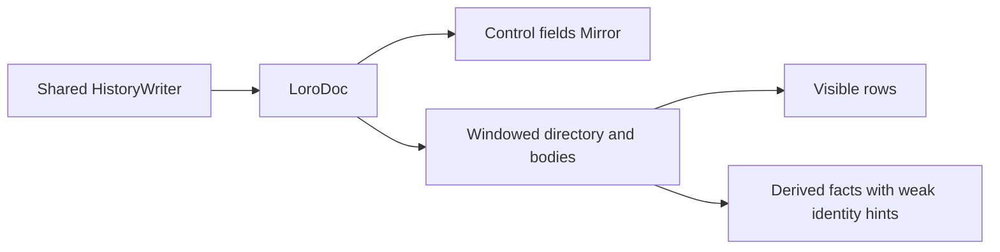

# Windowed conversation reads with one shared writer

Status: implemented
Translation: pending

## Abstract

Long conversations still materialize their entire history through the full Mirror reader.
PR #376 now composes a windowed reader with the shared HistoryWriter introduced by #460;
the rollback switch changes only readers. Derived facts use weak turn identity hints and
clear their caches on disposal, so the identity cache cannot retain evicted turn bodies.
Cold snapshot import and the initial directory still scale with total history, and real
desktop/mobile performance acceptance remains outstanding.

## Ownership

`createConversationSession` composes the readers. In windowed mode the writer receives
no full-history callback; it reads its target from the document. Rollback uses
`createSessionMirror`, whose writer is the same shared implementation. The component-local
writer and materializer are removed. Input validation, opaque history preservation and
rollback remain shared-package responsibilities, independent of this read optimization.

Review found that two target-local commands still used the shared writer's whole-history
fallback: permission responses and renderer task-proposal decisions. Permissions now
inspect stored request metadata from newest to oldest (or restrict lookup to a supplied
turn id), then call `updateEntry` for the match. Proposal decisions also use `updateEntry`.
This retains the single validation/write owner rather than disabling either command or
passing the incomplete read projection as a baseline. Generic cross-turn `update` remains
explicitly whole-history. Missing-id permission lookup still scans metadata; legacy JSON
fields are read in their existing representation, without storage migration.

The append test no longer treats raw `Mirror.setState` container layout and operation bytes
as the new-write oracle. That equality becomes false when #584 intentionally adopts
storage hints only the shared materializer consumes. Instead it checks authored values
through both readers after snapshot reload, plus actual editable streaming Text and CID
preservation. Storage-policy-specific assertions remain owned by the shared package; the
reference is not a second invocation of the same writer.

The old derivation identity Map retained complete turns after range release. Its values
are now WeakRefs, used only to skip repeated derivation while the object still exists.
Derived facts remain consumer-owned values and can themselves retain selected payloads;
this is not a hard total-memory bound. Disposal clears facts and identity hints. The idle
summary cursor advances across chunks instead of rescanning the completed suffix each time;
document changes restart the cursor against current positions.

Markdown export and image sharing explicitly acquire full ranges and release them when
finished. They are deliberately not claimed to have window-sized peak memory. Pinned
ranges and the tail may exceed the LRU target; a single giant turn is still indivisible.
No persisted history is migrated or rewritten by reading.

Range ownership was corrected after review reproduced positional cleanup releasing
another reader's pins. `acquireRange` now returns an idempotent release handle over
captured container ids; releasing it also stops pending hydration chunks. Explicit
`structure` events distinguish list edits from token and summary updates. Mounted
viewports reacquire their positional range, derivations restart missing coverage and
invalidate replaced facts, and open search acquires current membership. Search cache
entries also include the current position so a surviving turn cannot retain an old
jump target. These changes preserve the shared writer and existing persisted history.

## Verification

The control-plane suite runs both modes with opaque stored history and the shared writer.
Existing mixed-event and derivation tests cover invalidation and disposal; fixtures now
use the current authored-input schema. Timing assertions are kept out of unit tests.
See the PR for the current executed commands and outcomes; browser layout, mobile memory,
and 3000-user-round end-to-end acceptance are not established by these unit tests.

Regression coverage uses real Loro documents, peer update imports and controlled
React scheduling: 100-turn bulk appends, same-length replacements, overlapping
range owners after insertion, cancellation/failure during hydration, and search
positions after insertion/deletion. Timing and whole-device memory acceptance remain
separate from these correctness checks.

Target-local write regressions reject whole-history body reads while asserting the final
permission/proposal state, missing-target and invalid-command no-ops, legacy JSON support,
opaque-field preservation and concurrent peer edits. The follow-up passed 31 shared writer
tests, the 3428-test component suite, and both package typechecks. Full root validation
remains blocked by uninitialized ACP submodules (CLI manifest imports and documentation
links); this is not a claim of full repository or end-to-end acceptance.
An isolated combination with #584 (`33177fda`) and #586 (`10cc1333`) passed all
3459 component tests, 92 shared writer/storage/ACP tests and both package typechecks.
The only integration conflict was in shared `AGENTS.md`; both contracts were retained.

The fix passed the components suite (457 files / 3428 tests), history-import's
39 tests, both package typechecks, type-aware lint, i18n, Code Collab imports
and the platform guard. The repair checkout's uninitialized ACP submodules
prevent the public-boundary and documentation-link checks from completing;
the root check also encountered missing documentation-site dependencies.

Related: [shared writer](2026-09-07-single-history-writer.md),
[PR #376](https://github.com/LodyAI/Lody/pull/376).
