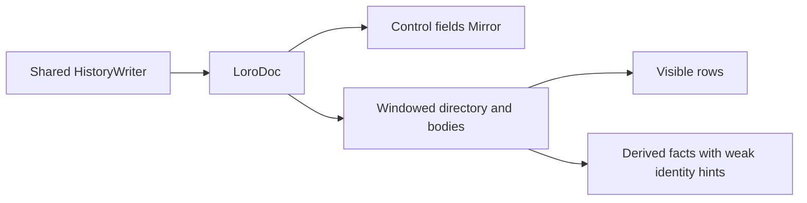

# Windowed conversation reads with one shared writer

Status: implemented
Translation: pending

## Abstract

Long conversations still materialize their entire history through the full Mirror reader.
PR #376 now composes a windowed reader with the shared HistoryWriter introduced by #460;
the rollback switch changes only readers. Derived facts use weak turn identity hints and
clear their caches on disposal, so the identity cache cannot retain evicted turn bodies.
Cold snapshot import and the initial directory still scale with total history, and real
desktop/mobile performance acceptance remains outstanding.

## Ownership

`createConversationSession` composes the readers. In windowed mode the writer receives
no full-history callback; it reads its target from the document. Rollback uses
`createSessionMirror`, whose writer is the same shared implementation. The component-local
writer and materializer are removed. Input validation, opaque history preservation and
rollback remain shared-package responsibilities, independent of this read optimization.

Review found that two target-local commands still used the shared writer's whole-history
fallback: permission responses and renderer task-proposal decisions. Permissions now
inspect stored request metadata from newest to oldest (or restrict lookup to a supplied
turn id), then call `updateEntry` for the match. Proposal decisions also use `updateEntry`.
This retains the single validation/write owner rather than disabling either command or
passing the incomplete read projection as a baseline. Generic cross-turn `update` remains
explicitly whole-history. Missing-id permission lookup still scans metadata; legacy JSON
fields are read in their existing representation, without storage migration.

The append test no longer treats raw `Mirror.setState` container layout and operation bytes
as the new-write oracle. That equality becomes false when #584 intentionally adopts
storage hints only the shared materializer consumes. Instead it checks authored values
through both readers after snapshot reload, plus actual editable streaming Text and CID
preservation. Storage-policy-specific assertions remain owned by the shared package; the
reference is not a second invocation of the same writer.

The old derivation identity Map retained complete turns after range release. Its values
are now WeakRefs, used only to skip repeated derivation while the object still exists.
Derived facts remain consumer-owned values and can themselves retain selected payloads;
this is not a hard total-memory bound. Disposal clears facts and identity hints. The idle
summary cursor advances across chunks instead of rescanning the completed suffix each time;
document changes restart the cursor against current positions.

Markdown export and image sharing explicitly acquire full ranges and release them when
finished. They are deliberately not claimed to have window-sized peak memory. Pinned
ranges and the tail may exceed the LRU target; a single giant turn is still indivisible.
No persisted history is migrated or rewritten by reading.

Range ownership was corrected after review reproduced positional cleanup releasing
another reader's pins. `acquireRange` now returns an idempotent release handle over
captured container ids; releasing it also stops pending hydration chunks. Explicit
`structure` events distinguish list edits from token and summary updates. Mounted
viewports reacquire their positional range, derivations restart missing coverage and
invalidate replaced facts, and open search acquires current membership. Search cache
entries also include the current position so a surviving turn cannot retain an old
jump target. These changes preserve the shared writer and existing persisted history.

Role readiness review found a separate durable failure: the composer could send after
store load but before the idle pass reached an older explicit Role. It then froze a
fallback Role/None into the next turn, which later index completion could not correct.
User index rows now read the shallow Role-selection config synchronously, including
legacy JSON config and explicit None. Config replacement/deletion, nested peer edits
and inserted user rows update that metadata before notifying consumers. Summaries and
body counts remain deferred; old turn bodies are not hydrated for Role lookup. This
adds one small config read per user row to initial indexing instead of blocking the
composer on the entire idle pass. Reads neither migrate storage nor change the shared
writer. Regression tests control idle scheduling and assert the Role written by an
immediate send survives snapshot reload, with an old-body materialization guard.

## Session data port

Session business code (renderer hooks, `WorkspaceWriter`, CLI `SessionDocument`, MCP) named
Loro containers, the Mirror and `HistoryWriter` callbacks directly, so a future database CRDT
would force an edit at every consumer. `packages/shared/src/session-data` now owns a
CRDT-neutral seam. Its DTOs come from `domain.ts` and never import the storage schema; the port
names Loro, Mirror or a CID nowhere. The reader is fully async: `count`, `readAt`/`readTurn`/
`readRange`, `readDirectory` (identity/state only) and a gap-free `observe` whose initial
directory is captured at the same moment the listener goes live. Identity lookups read `id`
shallowly and materialize only the target body. Read states separate missing / invalid /
unavailable (`incomplete`/`unsupported`/`failed`). Display paging is business logic, not a
storage method: `pageVisibleTranscript` scans raw rows through the reader, counts displayable
turns, keeps the cursor a raw position and never reports an empty tail as the end, so no
caller-supplied predicate crosses a backend boundary.

Three rules distinguish this from a renamed CRDT API. A field change is explicit (`set`/`clear`),
never an `undefined`-means-delete contract that cannot cross JSON/worker/Rust. A command result
states its phase: `accepted` (retrying duplicates it), `rejected` (validated and refused before
storage; safe to fix and retry) or `indeterminate` (never auto-retry); an accepted write whose
post-accept side effect failed carries `postAcceptError` and is never re-issued or reported as a
pre-write rejection. Local acceptance stays separate from local durability: `waitDurable` rejects
with `SessionDurabilityError('unavailable')` when no barrier exists and `'invalid_receipt'` for a
receipt the store did not issue, so a public promise never silently stands in for persistence it
did not perform.

`createLoroSessionData` is the only Loro implementation and delegates to the one shared
`HistoryWriter`; the session entrypoint injects `mirror.historyWriter`, so no second writer exists.
Domain command rules live once in `planner.ts` and are applied by both adapters; the permission
outcome rule is shared with `history-writer.ts` too. `createMemorySessionData` is an independent
array/Map implementation with no Loro, Mirror or CID import, and both run the same contract
(`tests/session-data-contract.ts`) for hidden-row paging, shifted byte-trim reachability, bad raw
slots, unknown-field preservation, the accepted/durability split and a forged receipt.
`tests/session-data-consumer.test.ts` drives the real `createDirectWorkspaceWriter` against the
in-memory implementation, which is what proves the renderer consumer depends on the port.

Migrated callers: the renderer `WorkspaceWriter` routes
append/replace/permission/task-proposal/assistant-open through the port and surfaces a rejected
command instead of dropping it; `SessionDocument` composes the control-plane Mirror, the one shared
writer and `createLoroSessionData` through `composeSessionData`, so `init`/`initOffline` no longer
build the full `sessionMirror`; its assistant reopen/create, permission outcome and bound ACP batch
use port commands, and dispatch/reconcile wakeups plus the structured `session output` wait use
`subscribeSessionChanges`/`readHistorySnapshot`. `markTurnSeen` now has its production caller in the
async auto-read policy. MCP `session_history` pages through `pageVisibleTranscript`, and its pure
response builder recomputes `hasOlder` after the 128 KiB byte cap so entries shifted off a page stay
reachable. `applyAgentBatch` is the domain command for a bound ACP batch (notifications or
already-materialized contents): it is applied by both adapters, reuses
`applyNotificationOnHistory`/`applyMessageContentsBatch`, and keeps the historical "bound target
missing, create it under that id" fallthrough. The CLI's control-plane Mirror function updaters use
Immer (`useStrictShallowCopy`) because loro-mirror's queue identity is a non-enumerable `$cid` that
`structuredClone` drops; a regression lives in
`packages/shared/tests/session-control-plane-mirror.test.ts`. The async auto-read re-runs one scan
when an observation lands during an in-flight scan, so a turn written after the scan's count read is
still acknowledged.

The control plane moved to `@lody/shared/session-control-plane` (`sessionControlPlaneSchema`,
`createControlPlaneDoc`, `createSessionControlPlaneMirror`) so the CLI and renderer can build one
history-less control plane; the component copies are re-exports.

Not migrated in this change: `ConversationView` still reads the raw list as the UI display cache;
queue/fork/import still use whole-history `updateHistory`; and the Mirror `WeakMap` copy provenance
is not yet a storage-owned handle. `readHistorySnapshot`/`readFullHistory` remain deliberate
bottom-level exposures owned by `SessionDocument` (synchronous dispatch output and explicit full
reads); they are not a second writer. Owner/seal mapping and old-format migration remain separate.

Verification: the shared suite (99 files / 1164 tests), components (469 files / 3538 tests) and
CLI (2700 tests, 4 skipped, run with a redirected `HOME` because the sandbox blocks `~/.lody`
writes) all pass, with shared/components/CLI typechecks. These are library-level checks; they do
not establish device-scale cold-open, memory or owner/seal behaviour.

## Verification

The control-plane suite runs both modes with opaque stored history and the shared writer.
Existing mixed-event and derivation tests cover invalidation and disposal; fixtures now
use the current authored-input schema. Timing assertions are kept out of unit tests.
See the PR for the current executed commands and outcomes; browser layout, mobile memory,
and 3000-user-round end-to-end acceptance are not established by these unit tests.

Regression coverage uses real Loro documents, peer update imports and controlled
React scheduling: 100-turn bulk appends, same-length replacements, overlapping
range owners after insertion, cancellation/failure during hydration, and search
positions after insertion/deletion. Timing and whole-device memory acceptance remain
separate from these correctness checks.

Target-local write regressions reject whole-history body reads while asserting the final
permission/proposal state, missing-target and invalid-command no-ops, legacy JSON support,
opaque-field preservation and concurrent peer edits. Role-readiness coverage adds an
immediate pre-idle send with explicit Role/None, Map/legacy JSON config, snapshot reload,
and synchronous peer config replacement/deletion/insertion without old-body hydration.

The Role fix passed the component suite (457 files / 3433 tests), history-import's
39 tests, both package typechecks, type-aware lint, i18n, Code Collab imports and the
platform guard. Its isolated combination with #584 (`33177fda`) and #586 (`10cc1333`)
passed all 3464 component tests and both package typechecks. The earlier combination
also passed 92 shared writer/storage/ACP tests; those unchanged suites were not rerun
for this reader-only fix. The only integration conflict was the earlier shared
`AGENTS.md` wording; both contracts were retained.
Full root validation remains blocked by uninitialized ACP submodules (CLI manifest
imports, public-boundary resolution and documentation links). This is not a claim of
full repository or end-to-end acceptance.

Related: [shared writer](2026-09-07-single-history-writer.md),
[PR #376](https://github.com/LodyAI/Lody/pull/376).
