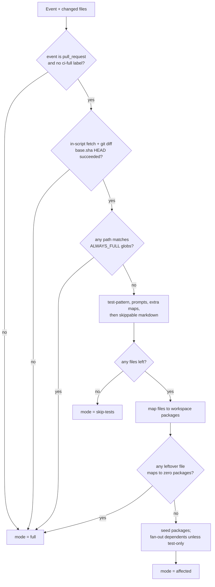

# CI affected tests and docs-only skip

Status: implemented
Translation: pending
PR: https://github.com/LodyAI/Lody/pull/499

English | [中文](2026-09-07-ci-affected-tests.zh.md)

## Abstract

`CI` (`.github/workflows/ci.yml`) always runs the full workspace typecheck, `check:quick`, and `pnpm test:ci` on every `pull_request`, `push` to `main`, and `workflow_dispatch`. `test:ci` is a full recursive Vitest/`node --test` sweep excluding only `@lody/electron` from the parallel pass (then running it last) and excluding `acp-extension-claude` / `acp-extension-codex`. That is correct for `main` and for hub-package changes, and it is wasted work for docs-only PRs and for leaf-package PRs. A components-only PR currently still runs ~264 CLI tests; an `apps/cli`-only PR currently still runs ~451 components tests.

This plan adds a unit-tested in-repo selector (`.github/scripts/select-ci-scope.mjs`) that classifies a PR as `skip-tests`, `affected`, or `full`. Docs/notes/specs/most markdown PRs skip Tests (no `pnpm install`) and skip typecheck/`check:quick` inside Static checks. `site-docs/content/**` (and `public/**` / `context/**`) seed `@lody/site-docs` as test-only so FAQ tests still run; they do not fan out to CLI/components. Remaining PRs run tests and typecheck only for changed packages plus transitive workspace dependents (`...pkg`, not `pkg...`). `main` pushes and `workflow_dispatch` stay on the existing full commands. Required GitHub check names stay `Static checks` and `Tests`.

Fail-open is enforced in **three** places, not only in the script: (1) the selector writes `full` on git/graph/unknown failure; (2) YAML skips expensive steps only when outputs are the literal `'false'` (missing/empty outputs run the suite); (3) a tiny bash allowlist independently forces `pnpm test:ci` / `pnpm typecheck` / `pnpm check:quick` when CI-definition paths change, so a PR-head classifier cannot skip its own gate.

## Background & Motivation

### Current workflow

`.github/workflows/ci.yml` today:

- Triggers: `pull_request` (all paths), `push` to `main`, `workflow_dispatch`. No `paths` / `paths-ignore`.
- Permissions: `contents: read`.
- Concurrency: `ci-${{ github.workflow }}-${{ github.event.pull_request.number || github.ref }}`, cancel-in-progress on PRs only.
- Checkout: `actions/checkout@v4` with `submodules: recursive`, `persist-credentials: false`, default `fetch-depth: 1`.
- Both jobs: `pnpm/action-setup@v4`, `actions/setup-node@v4` (`NODE_VERSION: 22`, `cache: pnpm`), `pnpm install --frozen-lockfile`.
- **Static checks** (`jobs.static`): contribution-policy tests, `pnpm run docs check` (already fetches `github.event.pull_request.base.sha` when present), `pnpm format:check`, `pnpm typecheck`, `pnpm check:quick`.
- **Tests** (`jobs.tests`): `pnpm --filter lody prepare:acp-adapters`, then `pnpm test:ci`.

Root `package.json` commands that matter:

```text
typecheck  = prepare:acp-adapters && pnpm -r --workspace-concurrency=1
             --filter '!acp-extension-claude' --filter '!acp-extension-codex' run typecheck
test:ci    = test:scripts
             && pnpm -r --workspace-concurrency=2
                  --filter '!@lody/electron'
                  --filter '!acp-extension-codex'
                  --filter '!acp-extension-claude'
                  run test --maxWorkers=2
             && pnpm --filter @lody/electron run test
test:scripts = node --test scripts/*.test.mjs scripts/docs/*.test.mjs
check:quick  = lint (oxlint --type-aware) && lint:i18n && check:code-collab-imports
               && check:platform-boundaries && check:public-boundary
```

Static checks already runs `node --test .github/scripts/*.test.mjs`. New selector tests hook into that glob with no extra workflow step.

### Why the current suite is expensive

Approximate test-file counts in this worktree (2026-09-07):

| Area | Files | Notes |
| --- | ---: | --- |
| `packages/components/tests` | 451 | Vitest, `maxWorkers` 8 locally / 2 in CI |
| `apps/cli` (`src/**/*.test.ts` + `tests/`) | 264 | Vitest |
| `packages/shared/tests` | 94 | Vitest |
| `apps/electron` `*.test.mjs` | 22 | `node --test`, not Vitest |
| others | single digits | platform, ignore, turn-diff-store, loro-streams-rpc, cli-supervisor, code-review-helper, site-docs |

`@lody/e2e` has no `test` script, so it is already absent from `test:ci` (desktop E2E is `.github/workflows/e2e-smoke.yml`). `site-docs` does have a `test` script and is in `test:ci`.

Both CI jobs have `timeout-minutes: 30`. Hub-package PRs (`@lody/shared`, `@lody/components`) will remain slow after this change; that is accepted.

### Constraints that bind this design

- `.github/AGENTS.md`: **Preserve the stable `Static checks` and `Tests` jobs used as required checks.**
- `.github/workflow-security.md`: code CI stays `pull_request` with read-only permissions; do not add untrusted write-capable flows; pin third-party Actions that receive signing keys to full SHA. This change adds no third-party Actions.
- GitHub: a workflow skipped by `on.pull_request.paths` / `paths-ignore` or `[skip ci]` never reports the required checks (they stay Pending). A job skipped by `jobs.<id>.if` reports Success. **Do not add workflow-level `paths`. Do not honor `[skip ci]`.**
- GitHub: if job B `needs` job A and A fails, B is skipped, and a skipped required check is Success. **Do not put the required jobs behind a selector job such that selector failure skips Tests as green.** Inline the selector in `Static checks` and `Tests`.
- pnpm 10.20.0 `[since]` uses two-dot `git diff` (pnpm/pnpm#9907), not merge-base. GitHub `pull_request` checkout is a merge commit (`github.sha`); default `fetch-depth: 1` does not have the base tree. **Do not call `pnpm --filter "...[origin/main]"`.** Compute the file list with `git diff --name-status <base.sha> <head>` after fetching `github.event.pull_request.base.sha`, then map files → packages → dependents ourselves.
- Mixed runners: Vitest in most packages, `node --test` in `apps/electron` and root/`site-docs` scripts. **Do not use Vitest `--changed` or Jest `--findRelatedTests` as the CI gate.**
- **Do not introduce Nx or Turborepo.** Layer 3 (sharding, remote cache, Nx/Turbo, Vitest `--changed` as gate) is out of scope.
- E2E already path-gates in `.github/workflows/e2e-smoke.yml` via `actions/github-script@v7` + `pulls.listFiles` (explicit file list + prefixes + `e2e` / `e2e-full` labels). That gate is **not** fail-closed-to-run: if `listFiles` throws, `gate` fails and `regression` is skipped. Prefer a testable Node script in `.github/scripts/*.mjs` that uses **git** so the script is pure (`contents: read` only, no 3000-file API cap). Do not add `dorny/paths-filter`.

### Existing path lists to reuse as input, not as the gate

`.github/labeler.yml` already enumerates product scopes (`scope: docs`, `scope: cli`, `scope: repository`, …). Labels are not the test selector. The glob lists are a useful cross-check when writing always-full / skippable prefixes. `scope: repository` is strictly larger than this plan's always-full set (it includes all of `.github/**`); do not copy it verbatim or docs-only PRs that only touch `.github/PULL_REQUEST_TEMPLATE.md` would go full.

## Goals & Non-Goals

### Goals

1. Docs-only / notes / specs / most markdown PRs skip Tests (including `pnpm install` in that job) and skip typecheck + `check:quick` in Static checks. Keep contribution-policy tests, `pnpm run docs check`, and `pnpm format:check`. Install remains in Static checks. `site-docs/content/**`, `site-docs/public/**`, and `site-docs/context/**` are **not** skip-tests: they seed `@lody/site-docs` as test-only (`docs-faq.test.ts` reads MDX).
2. Code PRs run tests and typecheck only for changed packages plus transitive workspace **dependents** (pnpm `...pkg`).
3. Test-only edits seed the owning package and do **not** fan out to dependents. Markdown under `tests/`, `test/`, `__tests__/`, `fixtures/`, and `stories/` is test-pattern, not skippable.
4. Other markdown inside packages does not seed the package, except runtime markdown (`packages/code-review-helper/prompts/**` is source and fans out).
5. Fail open to the existing full suite whenever the selector cannot resolve the graph, git range, or an unknown/global path; **and** whenever YAML outputs are missing; **and** whenever a bash allowlist sees CI-definition paths. Missing `GITHUB_OUTPUT` keys must not skip.
6. Required check names remain `Static checks` and `Tests`. `main` and `workflow_dispatch` remain full.
7. Selector logic is unit-tested Node, matching `.github/scripts/*.mjs`. Skip rules cannot silently widen without a failing test.
8. Job logs print mode, reason, changed files (capped), seeds, fan-out, and the exact pnpm filters.

### Non-goals

- Nx, Turborepo, remote cache, test sharding.
- Vitest `--changed` / Jest `--findRelatedTests` as the CI gate.
- Workflow-level `paths` / `paths-ignore`, `[skip ci]`, `dorny/paths-filter`.
- Changing `pnpm check` / local `test:ci` to affected (local full suite stays full).
- Scoping `oxlint` / `check:quick` by package (all-or-nothing: skip only in `skip-tests`).
- Speeding hub-package PRs (`@lody/shared`, `@lody/components`). Accepted that they still fan out.
- Changing E2E path gating (already separate).
- Renaming jobs, adding a required `Select CI scope` check, or altering permissions beyond `contents: read`.

## Key Decisions

1. **Three modes, one classifier script.** `skip-tests` | `affected` | `full`. Classification lives in `.github/scripts/select-ci-scope.mjs`. YAML may **force full**; YAML must **not** skip unless the selector wrote the literal `run_*=false` **and** the allowlist did not force full. Rationale: YAML-only globs silently widen; missing outputs must not skip; the existing `.github/scripts/*.test.mjs` harness already runs in Static checks.

2. **Inline the selector in both required jobs; do not add a selector job that Tests `needs`.** Skip predicates (both jobs, every expensive step):

   - **Skip** only when `force_full != 'true' && run_* == 'false'`
   - **Run** when `force_full == 'true' || run_* != 'false'`

   `force_full == 'true'` therefore **runs** the suite (allowlist), it does not skip it. Missing/empty `run_*` is not `'false'`, so the suite runs. Rationale: a failed needed job skips dependents, and a skipped required check is Success; `== 'true'` treats empty outputs as skip. Docs-only still saves the Tests `pnpm install` when the selector **explicitly** writes `run_tests=false` and the allowlist did not force full. Static checks always installs.

3. **Do not use pnpm `[since]`. Fetch the PR base inside the selector.** Compute `git diff --name-status <base.sha> HEAD` ourselves (two-dot against the PR base / merge first parent, which on GitHub's merge-commit checkout is the PR's net tree). Catch fetch/diff failure → `mode=full`, exit 0. Expand dependents from workspace `package.json` `workspace:*` edges. Rationale: pnpm#9907; a YAML `git fetch` step without `continue-on-error` fails the job red before the selector can fail-open; we need skip/test-pattern/runtime-markdown rules pnpm cannot express.

4. **Transitive dependents, including `components → code-review-helper → lody`.** pnpm **`...pkg`** semantics (package + dependents), **not** `pkg...` (package + dependencies). An implementer who “simplifies” to `pnpm --filter @lody/components... run test` would run shared/platform and **miss** helper/CLI — that is under-selection. A components source PR still runs CLI tests *because of that graph edge*, not because CI is unfiltered. The real wins are docs-only skip, leaf packages, CLI-only (no dependents), test-only (no fan-out), and markdown-only inside a package. Hub-package slowness is accepted.

5. **`mode=full` calls the existing `pnpm typecheck` / `pnpm test:ci` / `pnpm check:quick` unchanged.** Affected mode is a separate runner. Invalid/missing `ci-scope.json` also execs those full commands. Rationale: zero behavioral drift on `main`, dispatch, lockfile, and fail-open paths.

6. **Always-full is an explicit glob allowlist, not "anything outside a package".** Unknown paths fail open to `full`, never to `skip-tests`. A **YAML bash allowlist** independently forces full when `.github/scripts/**`, `.github/workflows/**`, `pnpm-lock.yaml`, `pnpm-workspace.yaml`, or root `package.json` change, so the PR-head classifier cannot skip those paths.

7. **Escape hatch: PR label `ci-full`, then a push / empty commit.** Default `pull_request` types are `opened` / `synchronize` / `reopened` — not `labeled`. Do **not** add `labeled`/`unlabeled`: `pr-scope.yml` applies `scope:*` on every sync and would re-run this workflow and eat the savings. `workflow_dispatch` is always full but reports on the selected ref, **not** as the PR’s required `Tests` check. Rollback is revert of `ci.yml` + the scripts. Do not implement `[skip ci]`.

8. **Ship selector tests first (no workflow change), then one `ci.yml` change that enables both layers.** Two edits to required-check YAML are riskier than one. PR 2 must not merge until inverted skip predicates, in-script fetch fail-open, and the YAML allowlist are in the snippets. Do not split Layer 1 vs Layer 2 across two `ci.yml` edits.

9. **Preserve electron last-run and the claude/codex exclusions.** Affected recursive `run test` still `--filter '!@lody/electron' --filter '!acp-extension-codex' --filter '!acp-extension-claude'` and only then `--filter @lody/electron run test` if electron is selected.

10. **`check:quick` is not affected-scoped.** Skip it only when the selector writes `run_check_quick=false` (docs-only / skip-tests). Boundary/i18n/oxlint scans are repo-wide and cheap to get wrong if path-sliced.

11. **When Tests or typecheck actually run after install, always run `pnpm --filter lody prepare:acp-adapters` first.** Same as today’s Tests job. Do not skip prepare on test-only hub edits: components/helper/shared tests import ACP/shared surfaces. Ignore-only typecheck also pays this (cheap vs Vitest).

## Proposed Design

### Architecture

```mermaid
flowchart TD
  trigger["pull_request / push main / workflow_dispatch"]
  trigger --> staticJob["Job: Static checks"]
  trigger --> testsJob["Job: Tests"]

  subgraph staticJob
    sCheckout["checkout fetch-depth 1"]
    sSetup["setup pnpm + node"]
    sSelect["select-ci-scope.mjs fetches base; fail-open"]
    sOverride["bash allowlist may force full"]
    sInstall["pnpm install --frozen-lockfile"]
    sPolicy["node --test .github/scripts/*.test.mjs"]
    sDocs["pnpm run docs check"]
    sFormat["pnpm format:check"]
    sType["typecheck: full or affected"]
    sQuick["pnpm check:quick"]
    sCheckout --> sSetup --> sSelect --> sOverride --> sInstall --> sPolicy --> sDocs --> sFormat
    sFormat --> sType
    sFormat --> sQuick
  end

  subgraph testsJob
    tCheckout["checkout fetch-depth 1"]
    tSetup["setup pnpm + node"]
    tSelect["select-ci-scope.mjs fetches base; fail-open"]
    tOverride["bash allowlist may force full"]
    tSkip["skip only if run_tests==false and not forced"]
    tInstall["pnpm install --frozen-lockfile"]
    tPrep["always prepare:acp-adapters"]
    tRun["test:ci or affected runner"]
    tCheckout --> tSetup --> tSelect --> tOverride
    tOverride -->|run_tests is false and not forced| tSkip
    tOverride -->|forced full, missing outputs, or run_tests != false| tInstall --> tPrep --> tRun
  end
```



`Static checks` and `Tests` stay siblings. They each run the selector. Duplicate cost is checkout + node setup + a git diff (seconds). They must not `needs:` each other.

### Mode decision



### Git range per event

| Event | Range | Mode override |
| --- | --- | --- |
| `pull_request` | Selector runs `git fetch --no-tags --depth=1 origin <github.event.pull_request.base.sha>` then `git diff --name-status -z --diff-filter=ACDMRT <base.sha> <github.sha>`. Fetch/diff failure → `full`, exit 0. | `ci-full` label → `full` (takes effect on the next `synchronize` / push; labeling alone does not retrigger) |
| `push` to `main` | not computed | always `full` |
| `workflow_dispatch` | not computed | always `full` |

On `pull_request`, `actions/checkout@v4` checks out the merge commit (`github.sha`). Two-dot diff against `base.sha` is the merge commit's tree vs current base: the PR's net files. That is the same comparison the existing docs-check step already intends (`DOCS_BASE_SHA: ${{ github.event.pull_request.base.sha }}`).

Do **not** use `HEAD^1` unless `fetch-depth >= 2` *and* the commit is a merge; `base.sha` is the stable input. Do **not** checkout `pull_request.head.sha` for this workflow (would make two-dot vs `origin/main` wrong if main moved). Do **not** use GitHub `pulls.listFiles` in v1: it needs `pull-requests: read`, 3000-file truncation, and is harder to unit-test. The e2e gate may keep using it; CI will use git so the script is pure. `git diff` is not truncated; there is no file-count cap (a leftover from the rejected API approach). Empty successful diff → `skip-tests` is the one intentional empty skip.

Rename handling: parse `-z --name-status`. For `R*`, take **both** old and new paths so a cross-package rename seeds both packages. Copies (`C*`) same. Deletions seed the old path's package.

If `base.sha` is missing, in-script fetch fails, `git diff` fails: write a complete `full` `CiScope` (`run_tests=true`, `run_typecheck=true`, `run_check_quick=true`), log `reason=git_diff_failed`, **exit 0**. Never `skip-tests`. A selector *crash* (uncaught throw, missing required output keys) still fails the step so the required job goes red — YAML inverted predicates then also fail-open if a later edit exits 0 without keys. **Do not** put `git fetch` in a YAML step that can fail the job before the selector runs. Keep the existing docs-check inner fetch as a fallback for `pnpm run docs check --base`.

Empty file list after a successful diff: `skip-tests` with `reason=empty_diff` (empty commit / no tree change). This is the one "empty" case that may skip. A failed empty (couldn't list files) is `full`.

### Selector module

Add:

| File | Role |
| --- | --- |
| `.github/scripts/select-ci-scope.mjs` | Pure functions + CLI |
| `.github/scripts/select-ci-scope.test.mjs` | `node:test` fixtures (picked up by existing Static checks step) |
| `.github/scripts/run-ci-tests.mjs` | Affected test runner (CLI) |
| `.github/scripts/run-ci-typecheck.mjs` | Affected typecheck runner (CLI) |

Match existing style (see `.github/scripts/check-pr-body.mjs`, `.github/scripts/e2e-daily-policy.mjs`):

- ESM, `node:` imports only, **no new dependencies**.
- Named exports for tests; `import.meta.url === pathToFileURL(process.argv[1]).href` main guard.
- Deterministic: no network, no real sleeps, injectable `execFileSync` / `fs` in tests.

#### Public API (implement exactly)

```js
export const MODES = Object.freeze({
  SKIP_TESTS: 'skip-tests',
  AFFECTED: 'affected',
  FULL: 'full',
});

/**
 * Match `filePath` (repo-relative posix) against `pattern`.
 * Patterns are rooted: `package.json` matches only that exact path,
 * never `apps/cli/package.json` (not minimatch `matchBase`).
 * `*` does not cross `/`. `**` matches zero or more path segments.
 * Brace expansion is required: `{md,mdx}` and `{test,spec}`.
 */
export function matchGlob(filePath, pattern) {}

/** Load workspace packages and dependents graph from disk. */
export function loadWorkspace(root, io = defaultIo) {}

/** Classify one posix repo-relative path. */
export function classifyPath(filePath) {}
// returns { kind: 'always-full' | 'skippable' | 'test' | 'source', packages?: string[] }

/** Main entry. */
export function selectCiScope(input) {}
// input: {
//   eventName, labels, files, workspace,
//   gitError, // if set, force full
// }
// output: CiScope (see below)

export function formatCiScopeLog(scope) {} // human + JSON
export function writeGithubOutput(scope, stream) {}
```

`CiScope` (serialize as JSON to `$RUNNER_TEMP/ci-scope.json` and to `GITHUB_OUTPUT`):

```js
{
  mode: 'skip-tests' | 'affected' | 'full',
  reason: string,              // stable token, e.g. always_full:pnpm-lock.yaml
  runTests: boolean,
  runTypecheck: boolean,
  runCheckQuick: boolean,
  prepareAcpAdapters: boolean, // true whenever runTests || runTypecheck; YAML always prepares if those steps run
  runScriptTests: boolean,     // true on full; false on affected (scripts/ is always-full)
  testPackages: string[],      // packages with a "test" script, minus excluded
  typecheckPackages: string[], // packages with a "typecheck" script, minus excluded
  seedPackages: string[],
  fanoutPackages: string[],
  changedFiles: string[],      // input, possibly capped in logs at 200 with a remainder count
}
```

CLI:

```text
node .github/scripts/select-ci-scope.mjs
  --event pull_request|push|workflow_dispatch
  --base-sha <sha>
  --head-sha <sha>
  --workspace-root <dir>
  --labels <comma-separated>
  --files-json <path>          # skip git; used by tests
  --github-output <path>       # default: env GITHUB_OUTPUT
  --json-out <path>            # default: $RUNNER_TEMP/ci-scope.json or --workspace-root/.ci-scope.json in tests
```

When `--files-json` is absent and event is `pull_request`, the CLI **fetches** `base.sha` then diffs. When fetch or diff fails, it still writes a **complete** `full` scope (every required key) and exits 0 unless `--strict` (tests only) is set. **CI must not use `--strict`.** `writeGithubOutput` must write all of: `mode`, `reason`, `run_tests`, `run_typecheck`, `run_check_quick`, `prepare_acp_adapters`, `test_packages`, `typecheck_packages`. If it cannot, **exit 1** (do not write a partial file). A selector *crash* still fails the step (required job goes red). Missing keys in YAML still fail-open because skip is only `== 'false'`.

GitHub outputs (use `EOF` delimiters for multiline JSON arrays):

```text
mode=affected
reason=source:packages/components/src/foo.ts
run_tests=true
run_typecheck=true
run_check_quick=true
prepare_acp_adapters=true
test_packages=["@lody/components","@lody/code-review-helper","lody","@lody/electron","@lody/site-docs"]
typecheck_packages=[...]
```

Also append `formatCiScopeLog(scope)` to stdout and, if present, `$GITHUB_STEP_SUMMARY`.

### Workspace discovery and dependents graph

Do not shell out to `pnpm list` (requires install; selector runs *before* Tests install).

Discover packages:

1. Read `pnpm-workspace.yaml` with a tiny line parser (no YAML library). Read **only** the `packages:` sequence until the next top-level key (`catalog:`, `overrides:`, `packageExtensions:`, `patchedDependencies:`, `ignoredBuiltDependencies:`, `onlyBuiltDependencies:`, `managePackageManagerVersions:`, `packageManagerStrictVersion:`). Skip comments (`#`). Strip single and double quotes. Honor this tree’s list: `packages/*`, `!packages/acp-extension-kimi`, `apps/cli`, `apps/electron`, `e2e`, `site-docs`. If parsing fails → `full`. A greedy parser that treats `catalog:` entries as package globs is a bug; lock it with a test.
2. For each directory matching those globs that contains `package.json`, read `name`, `scripts.test`, `scripts.typecheck`, and `dependencies` / `devDependencies` / `optionalDependencies` / `peerDependencies`. Missing `package.json` (uninitialized ACP submodule) must **not** throw: keep the prefix fallback.
3. ACP submodules may be absent in a selector-only checkout (this worktree’s `packages/acp-extension-*` dirs have no readable `package.json`). Still map path prefixes from directory names. Names below match `.gitmodules` paths and CLI `workspace:*` deps; **do not treat `scripts.test` as verified** until PR 1’s `loadWorkspace(realRepoRoot)` sees a recursive checkout:

| Path prefix | Package name |
| --- | --- |
| `packages/acp-extension-claude` | `acp-extension-claude` |
| `packages/acp-extension-codex` | `acp-extension-codex` |
| `packages/acp-extension-core` | `acp-extension-core` |
| `packages/acp-extension-dsh` | `acp-extension-dsh` |
| `packages/acp-extension-grok` | `acp-extension-grok` |
| `packages/acp-extension-kimi` | *(always-full; not in workspace)* |

Verified workspace names from `package.json` files:

| Dir | Name | `test` | `typecheck` |
| --- | --- | --- | --- |
| `apps/cli` | `lody` | yes (vitest) | yes |
| `apps/electron` | `@lody/electron` | yes (`node --test`) | yes |
| `packages/shared` | `@lody/shared` | yes | yes |
| `packages/components` | `@lody/components` | yes | yes |
| `packages/platform` | `@lody/platform` | yes | yes |
| `packages/cli-supervisor` | `@lody/cli-supervisor` | yes | yes |
| `packages/cloud-api` | `@lody/cloud-api` | **no** | yes |
| `packages/code-review-helper` | `@lody/code-review-helper` | yes | yes |
| `packages/code-review-viewer` | `lody-code-review-viewer` | **no** | yes |
| `packages/configs` | `@lody/configs` | **no** | **no** (always-full) |
| `packages/ignore` | `@loro-dev/ignore` | yes | yes |
| `packages/loro-streams-rpc` | `@lody/loro-streams-rpc` | yes | yes |
| `packages/turn-diff-store` | `@lody/turn-diff-store` | yes | yes |
| `site-docs` | `@lody/site-docs` | yes | yes (`pretypecheck` generate is heavy) |
| `e2e` | `@lody/e2e` | **no** | **no** |
| `packages/acp-extension-claude` | `acp-extension-claude` | **excluded** (`!acp-extension-claude`) | **excluded** |
| `packages/acp-extension-codex` | `acp-extension-codex` | **excluded** (`!acp-extension-codex`) | **excluded** |
| `packages/acp-extension-core` | `acp-extension-core` | discover at runtime; missing `package.json` must not throw | same |
| `packages/acp-extension-dsh` | `acp-extension-dsh` | discover at runtime; missing `package.json` must not throw | same |
| `packages/acp-extension-grok` | `acp-extension-grok` | discover at runtime; missing `package.json` must not throw | same |

Today’s root scripts exclude **only** claude and codex. core/dsh/grok stay in the recursive `test`/`typecheck` *if* they expose those scripts. Names are prefix fallbacks matching `.gitmodules` and CLI `workspace:*` deps; do not treat `scripts.test` as verified until a recursive checkout exists.

Workspace `workspace:*` edges (direct), confirmed from manifests:

```text
@lody/shared            → (no workspace deps except acp-extension-core, acp-extension-dsh)
@lody/platform          → shared
@lody/cli-supervisor    → shared
@lody/cloud-api         → shared, acp-extension-core
@lody/loro-streams-rpc  → shared
@lody/components        → cloud-api, loro-streams-rpc, platform, shared  (+ @lody/configs dev)
@lody/code-review-helper→ components
lody-code-review-viewer → (no workspace:* dep; `build` shells `pnpm --filter @lody/code-review-helper build:standalone`. **Ignored on purpose in v1:** helper source does not typecheck the viewer. Viewer *source* still fans out to `lody` via CLI’s `workspace:*` dep. Do not “fix” this as a graph bug.)
lody (cli)              → cli-supervisor, code-review-helper, cloud-api, loro-streams-rpc,
                          platform, shared, turn-diff-store, lody-code-review-viewer,
                          acp-extension-{claude,codex,dsh,grok,core}
@lody/electron          → cli-supervisor, platform, shared, components (dev), configs (dev)
@lody/site-docs         → components, shared
@loro-dev/ignore        → (no workspace dependents)
@lody/e2e               → (no workspace deps)
```

**Transitive fan-out examples the tests must lock:**

| Seed (source change) | Must include in tests (testable subset) |
| --- | --- |
| `@loro-dev/ignore` | ignore only |
| `lody` (CLI) | `lody` only (no workspace dependents) |
| `@lody/turn-diff-store` | turn-diff-store + `lody` |
| `@lody/components` | components, code-review-helper, electron, site-docs, **and `lody`** (via helper) |
| `@lody/shared` | shared + platform, cli-supervisor, cloud-api, loro-streams-rpc, components, electron, cli, site-docs, helper (almost full; accepted) |
| `@lody/cli-supervisor` source | `lody`, `@lody/electron` |
| `@lody/cloud-api` source | no own tests; test packages = components, helper, `lody`, electron, site-docs |
| `@lody/code-review-helper` test-only | helper only (no `lody` fan-out) |
| `@lody/shared` test-only | shared only |

`@lody/e2e` and `@lody/cloud-api` / `lody-code-review-viewer` have no `test` script: they may appear in `typecheckPackages` (if they have `typecheck`) and in fan-out seeds, but never in `testPackages`. Filter `testPackages` with `Boolean(scripts.test)` and exclude `acp-extension-claude`, `acp-extension-codex`. Filter `typecheckPackages` with `Boolean(scripts.typecheck)` and the same exclusions.

`prepareAcpAdapters === true` whenever `runTests || runTypecheck`. YAML always runs `pnpm --filter lody prepare:acp-adapters` before those steps (today’s Tests job always does this; ACP `package.json` mains were not readable in this worktree). Do not skip prepare for components/helper/shared test-only PRs.

### Path classification

All paths are repo-relative posix (`packages/foo/bar.ts`). Classification is **first match** in this order. Extra maps and runtime-markdown **must run before** the general `**/*.{md,mdx}` skip, or FAQ MDX and `prompts/*.md` become skip-tests:

1. Always-full
2. Test-pattern (including markdown under tests/fixtures/stories)
3. Runtime-markdown `packages/code-review-helper/prompts/**` → `source` (fan-out)
4. Extra maps: `site-docs/content|public|context/**` → `@lody/site-docs` test-only; `locales/**` → components+electron source; `e2e/**` → `@lody/e2e`
5. Named skippable trees (`specs/**`, `.agents/**`, `**/AGENTS.md`, …)
6. Remaining `**/*.{md,mdx}` → skippable
7. Longest workspace-directory prefix → `source`; unknown → `full`

`matchGlob` is rooted (see Public API). Fixture 29 plus `locales/en.json` and `patches/loro-repo.patch` lock drift. Do **not** add `.github/**` wholesale. Fixture **14a** is MDX-only (no favicon) so a first-match bug cannot hide behind a non-markdown sibling.

#### 1. Always-full (any match ⇒ `mode=full`)

Exact or glob, rooted at repo root. These are the conservative inputs after reading the tree:

```text
package.json                          # root only (exact)
pnpm-lock.yaml
pnpm-workspace.yaml
patches/**
.github/workflows/**
.github/scripts/**
scripts/**
packages/configs/**
.oxlintrc.json
.eslintignore
.prettierrc
.prettierignore
.gitignore
.gitmodules
tsconfig.json                         # none at root today; keep for future
tsconfig.*.json
packages/acp-extension-kimi
packages/acp-extension-kimi/**
```

Notes:

- Root `package.json` is always-full; `apps/cli/package.json` is a `lody` source seed, not always-full.
- `.github/scripts/**` and `.github/workflows/**` are always-full **and** listed in the YAML bash allowlist (defense in depth: the PR-head classifier is untrusted on `pull_request`). Unit tests are not the only gate.
- Root `package.json`, `pnpm-lock.yaml`, and `pnpm-workspace.yaml` are in that same YAML allowlist.
- Other `.github/**` (`PULL_REQUEST_TEMPLATE.md`, `labeler.yml`, `AGENTS.md`, `workflow-security.md`, `ISSUE_TEMPLATE/**`, `codex-review.md`) is **skippable**, not always-full.
- `packages/configs/**` is always-full (shared tsconfig/tailwind; no test script; dependents would be components+electron anyway).
- ACP registry *inputs* are `scripts/generate-acp-registry.mjs` (+ its test), already under `scripts/**`. Generated outputs (`packages/shared/src/acp/registry-generated.ts`, `packages/components/src/components/icons/registry-assets/**`, `registry-agent-icons.ts`) are ordinary package source.

#### 2. Test-pattern (seed package, do not fan out dependents)

Applied **before** markdown skip. A file matching any of these is `test`, never skippable:

```text
**/*.{test,spec}.{ts,tsx,js,mjs,cjs,mts,cts}
**/*.test.{ts,tsx,js,mjs,cjs}
**/__tests__/**
**/tests/**
**/test/**
**/*.test.mjs
**/fixtures/**
**/stories/**
```

This covers Vitest suites, colocated `*.test.ts`, electron `*.test.mjs`, site-docs tests, **and** imported fixtures such as `packages/code-review-helper/src/stories/fixtures/grouped-refactor.review.md` (`snapshot.test.ts` and `ReviewRenderer.stories.tsx` import `*.review.md?raw`). Markdown under those trees is test-only (helper tests, **no** `lody` fan-out).

PR 1 must `grep` the repo for `?raw` and `from '…md'` imports and add any other imported markdown/svg/json under `src/` that is not already test-pattern or source. Missing an import fails toward skip (P0).

`vitest.config.ts`, `playwright.config.ts`, `tsconfig*.json` inside a package are `source` (fan-out).

#### 3. Runtime-markdown (source, fan-out) — before the general markdown skip

```text
packages/code-review-helper/prompts/**
```

`prompts/review-helper-agent.md` is a package export (`"./prompt": "./prompts/review-helper-agent.md"`). Classify as `source` of `@lody/code-review-helper` (fans out to `lody`). If this step is after `**/*.{md,mdx}`, fixture 10 fails.

#### 4. Extra maps — also before the general markdown skip

| Path | Kind | Seeds |
| --- | --- | --- |
| `site-docs/content/**`, `site-docs/public/**`, `site-docs/context/**` | **test-only** (no fan-out) | `@lody/site-docs`. Required because `lib/docs-faq.test.ts` reads `content/docs/en/(features)/session-handoff.mdx` and the zh counterpart. MDX must hit this row **before** `**/*.{md,mdx}`. |
| `locales/**` | source (fan-out) | `@lody/components`, `@lody/electron` |
| `e2e/**` | seed only | `@lody/e2e` (no `test`/`typecheck` scripts → may yield empty those sets; `runCheckQuick=true`) |

#### 5. Skippable named trees (does not seed, does not fail-open)

```text
# documentation trees
specs/**
.agents/**
README.md
README.zh-CN.md
CONTRIBUTING.md
DEV.md
LICENSE
SECURITY.md
THIRD_PARTY_NOTICES.md
AGENTS.md
CLAUDE.md
**/AGENTS.md
**/CLAUDE.md
**/README.md
**/README.*.md
**/CHANGELOG.md

# GitHub non-executable metadata
.github/PULL_REQUEST_TEMPLATE.md
.github/ISSUE_TEMPLATE/**
.github/labeler.yml
.github/AGENTS.md
.github/CLAUDE.md
.github/codex-review.md
.github/workflow-security.md

# site-docs package index only (content/public/context are extra maps, not skippable)
site-docs/README.md

# editor / license noise
.vscode/**
.eslintignore                         # already always-full; listed there first
```

#### 6. Remaining markdown (anything not already classified)

```text
**/*.{md,mdx}
```

Skippable. `apps/cli/src/**/*.md` in this tree are only `AGENTS.md` / `CLAUDE.md` / `README.md` (35 files) and already match named trees in step 5. Do not add a blanket "markdown under src is source".

#### 7. File → package mapping

Longest matching workspace directory prefix. Anything else unmatched → **unknown → `full`**.

A package fans out dependents iff **at least one** classified-`source` file maps to it. If every file for that package is `test` (or skippable), it is a seed only.

### Combining with existing `test:ci` filters

`run-ci-tests.mjs` reads `ci-scope.json`. If the file is missing, unreadable, or missing required keys: **exec `pnpm test:ci`** (fail open), do not skip.

```text
if mode == full OR scope invalid:
  exec exactly: pnpm test:ci
  (env GIT_CONFIG_* already set by the workflow)

if runTests == false:          # YAML should not even invoke the runner in this case
  print skip reason; exit 0    # defensive only

# affected
if runScriptTests:  # only full, so this branch is unused; keep the flag for clarity
  pnpm test:scripts

nonElectron = testPackages.filter(p => p !== '@lody/electron')
if nonElectron.length > 0:
  pnpm -r --workspace-concurrency=2
    --filter '!@lody/electron'
    --filter '!acp-extension-codex'
    --filter '!acp-extension-claude'
    --filter <each nonElectron>
    run test --maxWorkers=2

if testPackages includes '@lody/electron':
  pnpm --filter @lody/electron run test
```

Never pass `--maxWorkers=2` to the electron command (today it is a `node --test` argv list; extra args would error or be ignored depending on Node version).

If `nonElectron` is empty and electron is selected, skip the recursive `pnpm -r` invocation entirely (`pnpm -r --filter <none>` is not defined to succeed).

`run-ci-typecheck.mjs`:

```text
if mode == full OR scope invalid:
  exec exactly: pnpm typecheck     # includes prepare:acp-adapters

if runTypecheck == false:
  print skip; exit 0               # defensive; YAML should not invoke

pnpm --filter lody prepare:acp-adapters   # always when this runner does affected typecheck

pnpm -r --workspace-concurrency=1
  --filter '!acp-extension-claude'
  --filter '!acp-extension-codex'
  --filter <each typecheckPackages>
  run typecheck
```

Guard empty `typecheckPackages` the same way.

### Static checks internal branching (job name unchanged)

```yaml
jobs:
  static:
    name: Static checks
    runs-on: ubuntu-latest
    timeout-minutes: 30
    steps:
      - uses: actions/checkout@v4
        with:
          submodules: recursive
          persist-credentials: false
          # fetch-depth remains 1

      # No YAML git-fetch step. The selector fetches base.sha internally and
      # fail-opens to full on fetch/diff errors (exit 0). A failing YAML fetch
      # would go red before that path can run.

      - uses: pnpm/action-setup@v4
      - uses: actions/setup-node@v4
        with:
          node-version: ${{ env.NODE_VERSION }}
          cache: pnpm

      - name: Select CI scope
        id: scope
        env:
          PR_BASE_SHA: ${{ github.event.pull_request.base.sha }}
          PR_LABELS: ${{ join(github.event.pull_request.labels.*.name, ',') }}
        run: |
          node .github/scripts/select-ci-scope.mjs \
            --event "${{ github.event_name }}" \
            --base-sha "${PR_BASE_SHA}" \
            --head-sha "${{ github.sha }}" \
            --workspace-root . \
            --labels "${PR_LABELS}" \
            --json-out "$RUNNER_TEMP/ci-scope.json"

      - name: YAML fail-open override
        id: override
        env:
          PR_BASE_SHA: ${{ github.event.pull_request.base.sha }}
        run: |
          # Identical block in Static checks and Tests. Write force_full once.
          # Default fail-open; only a successful allowlist miss may set false.
          force=true
          if [ "${{ github.event_name }}" = "pull_request" ]; then
            if git fetch --no-tags --depth=1 origin "$PR_BASE_SHA" \
              && git diff -z --name-only "$PR_BASE_SHA" HEAD >/tmp/ci-changed-files; then
              force=false
              while IFS= read -r -d '' f; do
                [ -z "$f" ] && continue
                case "$f" in
                  package.json|pnpm-lock.yaml|pnpm-workspace.yaml|.github/scripts/*|.github/workflows/*)
                    force=true
                    break
                    ;;
                esac
              done < /tmp/ci-changed-files
            fi
          fi
          echo "force_full=${force}" >> "$GITHUB_OUTPUT"

      - name: Install dependencies
        run: pnpm install --frozen-lockfile

      - name: Test contribution policy
        run: node --test .github/scripts/*.test.mjs

      - name: Check document maintenance
        env:
          DOCS_BASE_SHA: ${{ github.event.pull_request.base.sha }}
        run: |
          if [ -n "$DOCS_BASE_SHA" ]; then
            git fetch --no-tags --depth=1 origin "$DOCS_BASE_SHA"
            pnpm run docs check --base "$DOCS_BASE_SHA"
          else
            pnpm run docs check
          fi

      - name: Check formatting
        run: pnpm format:check

      - name: Typecheck (forced full)
        if: steps.override.outputs.force_full == 'true'
        run: pnpm typecheck

      - name: Typecheck
        if: steps.override.outputs.force_full != 'true' && steps.scope.outputs.run_typecheck != 'false'
        run: node .github/scripts/run-ci-typecheck.mjs --scope "$RUNNER_TEMP/ci-scope.json"

      - name: Lint and check repository boundaries
        if: steps.override.outputs.force_full == 'true' || steps.scope.outputs.run_check_quick != 'false'
        run: pnpm check:quick
```

Keep the docs-check inner `git fetch` (do **not** delete it). The selector’s fetch is independent; docs-check must still be able to see `DOCS_BASE_SHA` if the override/selector fetches were skipped.

Contribution-policy tests **always** run (they are cheap and they cover the selector).

**Skip rule:** skip only when `force_full != 'true' && run_* == 'false'`. Run when `force_full == 'true' || run_* != 'false'`. Missing `GITHUB_OUTPUT` keys must not skip (`'' != 'false'`). `force_full == 'true'` **runs** the full commands; it never skips.

### Tests job internal branching (job name unchanged)

```yaml
  tests:
    name: Tests
    runs-on: ubuntu-latest
    timeout-minutes: 30
    steps:
      - uses: actions/checkout@v4
        with:
          submodules: recursive
          persist-credentials: false

      - uses: pnpm/action-setup@v4
      - uses: actions/setup-node@v4
        with:
          node-version: ${{ env.NODE_VERSION }}
          cache: pnpm

      - name: Select CI scope
        id: scope
        env:
          PR_BASE_SHA: ${{ github.event.pull_request.base.sha }}
          PR_LABELS: ${{ join(github.event.pull_request.labels.*.name, ',') }}
        run: |
          node .github/scripts/select-ci-scope.mjs \
            --event "${{ github.event_name }}" \
            --base-sha "${PR_BASE_SHA}" \
            --head-sha "${{ github.sha }}" \
            --workspace-root . \
            --labels "${PR_LABELS}" \
            --json-out "$RUNNER_TEMP/ci-scope.json"

      - name: YAML fail-open override
        id: override
        env:
          PR_BASE_SHA: ${{ github.event.pull_request.base.sha }}
        run: |
          # Must stay byte-identical to the Static checks override (do not
          # move this floor into select-ci-scope.mjs — that script is untrusted).
          force=true
          if [ "${{ github.event_name }}" = "pull_request" ]; then
            if git fetch --no-tags --depth=1 origin "$PR_BASE_SHA" \
              && git diff -z --name-only "$PR_BASE_SHA" HEAD >/tmp/ci-changed-files; then
              force=false
              while IFS= read -r -d '' f; do
                [ -z "$f" ] && continue
                case "$f" in
                  package.json|pnpm-lock.yaml|pnpm-workspace.yaml|.github/scripts/*|.github/workflows/*)
                    force=true
                    break
                    ;;
                esac
              done < /tmp/ci-changed-files
            fi
          fi
          echo "force_full=${force}" >> "$GITHUB_OUTPUT"

      - name: Skip tests for docs-only / empty affected set
        if: steps.override.outputs.force_full != 'true' && steps.scope.outputs.run_tests == 'false'
        run: |
          echo "Skipping Tests install and suite: ${{ steps.scope.outputs.reason }}"

      - name: Install dependencies
        if: steps.override.outputs.force_full == 'true' || steps.scope.outputs.run_tests != 'false'
        run: pnpm install --frozen-lockfile

      - name: Prepare ACP adapters
        if: steps.override.outputs.force_full == 'true' || steps.scope.outputs.run_tests != 'false'
        run: pnpm --filter lody prepare:acp-adapters

      - name: Run tests (forced full)
        if: steps.override.outputs.force_full == 'true'
        env:
          GIT_CONFIG_COUNT: 1
          GIT_CONFIG_KEY_0: commit.gpgSign
          GIT_CONFIG_VALUE_0: 'false'
        run: pnpm test:ci

      - name: Run tests
        if: steps.override.outputs.force_full != 'true' && steps.scope.outputs.run_tests != 'false'
        env:
          GIT_CONFIG_COUNT: 1
          GIT_CONFIG_KEY_0: commit.gpgSign
          GIT_CONFIG_VALUE_0: 'false'
        run: node .github/scripts/run-ci-tests.mjs --scope "$RUNNER_TEMP/ci-scope.json"
```

**Do not** add `if:` on the `tests` job itself. Docs-only still creates a green `Tests` check after ~checkout+setup+selector, without install, **only** when `force_full != 'true' && run_tests == 'false'`. The allowlist `case` list is duplicated in both jobs on purpose (trusted floor; must stay identical). Selector tests lock the same five prefixes; do **not** move the floor into `select-ci-scope.mjs`.

`submodules: recursive` stays on both jobs so ACP gitlinks are present for typecheck/tests when selected. The selector itself only needs path prefixes; it must not fail if a submodule `package.json` is missing.

### Checkout / fetch strategy

| Job / event | fetch-depth | Extra fetch |
| --- | --- | --- |
| PR Static / Tests | 1 (default) | **Inside** `select-ci-scope.mjs` (catch → `full`). Docs-check step keeps its own `git fetch` of `DOCS_BASE_SHA`. YAML override also fetches, defaulting `force_full=true` if that fetch fails. |
| push main / dispatch | 1 | none (mode=full, no diff); override leaves `force_full=true` |

Do not set `fetch-depth: 0` (slow, unnecessary). Do not persist credentials. Keep `persist-credentials: false`. **Do not** add a YAML `Fetch PR base` step that can fail the job.

### `runTests` / `runTypecheck` / `runCheckQuick` matrix

| Mode | Tests install+suite | Typecheck | check:quick | docs + format + policy tests |
| --- | --- | --- | --- | --- |
| `full` | yes, `pnpm test:ci` | yes, `pnpm typecheck` | yes | yes |
| `skip-tests` (`run_*=false` written) | no | no | no | yes |
| `affected` with test packages | yes, filtered; **always prepare adapters** | if typecheck packages non-empty; always prepare | yes | yes |
| `affected` with empty `testPackages` (e.g. `e2e/**` only) | no | if typecheck packages non-empty | yes | yes |
| `affected` with empty both sets | no | no | **yes** | yes |

`e2e`-only is not docs-only: `check:public-boundary` must still scan it. Desktop E2E has its own workflow.

### Escape hatches

- Label `ci-full` on the PR, then **push or empty-commit** so `synchronize` re-runs required checks. The selector reads `github.event.pull_request.labels` (no extra API). Not auto-applied by `labeler.yml`. **Do not** add `on.pull_request.types: labeled/unlabeled`: `pr-scope.yml` would retrigger this workflow on every `scope:*` and eat the savings. Labeling alone does not retrigger today’s default types (`opened`, `synchronize`, `reopened`).
- `workflow_dispatch` and `push` to `main` are always `full`. Dispatch reports on the selected ref; it is **not** the PR’s required `Tests` check.
- Optional additive `workflow_dispatch` input `force_full` is unnecessary if dispatch stays full; **do not add it**. Document the label + push sequence only.

### Logging (required)

Stdout from `select-ci-scope.mjs` must include:

```text
CI scope
  mode: affected
  reason: source:packages/platform/src/index.ts
  event: pull_request
  base: abcdef0
  files: 2
  seeds: @lody/platform (source)
  fanout: @lody/components, @lody/code-review-helper, @lody/electron, @lody/site-docs, lody
  testPackages: @lody/platform, @lody/components, @lody/code-review-helper, @lody/electron, @lody/site-docs, lody
  typecheckPackages: ...
  runTests: true
  runTypecheck: true
  runCheckQuick: true
  prepareAcpAdapters: true
```

Cap the files list at 200 lines + `... and N more`. Mirror the same block to `$GITHUB_STEP_SUMMARY` when that env var is set.

## API / Interface Changes

No product API. CI-only CLIs:

```text
node .github/scripts/select-ci-scope.mjs [options]   # exit 0 with a CiScope; crash = job fail
node .github/scripts/run-ci-tests.mjs --scope <json>
node .github/scripts/run-ci-typecheck.mjs --scope <json>
```

Root `package.json` `test:ci` / `typecheck` / `check` **do not change**. `pnpm check` remains a full local gate.

## Data Model Changes

None. Transient `$RUNNER_TEMP/ci-scope.json` is not committed.

## Exact files to add/change

| Path | Change |
| --- | --- |
| `.github/scripts/select-ci-scope.mjs` | **Add.** Classifier + graph + CLI. |
| `.github/scripts/select-ci-scope.test.mjs` | **Add.** Fixtures listed below. |
| `.github/scripts/run-ci-tests.mjs` | **Add.** Full vs affected test invocation. |
| `.github/scripts/run-ci-tests.test.mjs` | **Add.** Assert argv building (inject exec). |
| `.github/scripts/run-ci-typecheck.mjs` | **Add.** Full vs affected typecheck invocation. |
| `.github/scripts/run-ci-typecheck.test.mjs` | **Add.** Assert argv building. |
| `.github/workflows/ci.yml` | **Edit.** Selector (in-script fetch); YAML fail-open override; inverted skip predicates; always prepare adapters when Tests installs; keep docs-check inner fetch. Job names unchanged. No `paths`. Permissions unchanged. |
| `.github/AGENTS.md` | **Edit.** One line under Code checks: selector owns skip/affected rules; fail open to full; do not add workflow `paths`. |
| `.agents/notes/implemented/testing/2026-09-07-ci-affected-tests.md` | **Add** as `implemented` in the shipping PR. |
| `.agents/notes/implemented/testing/2026-09-07-ci-affected-tests.zh.md` | **Add** bilingual counterpart. |

No changes to `package.json` scripts, `pnpm-workspace.yaml`, Vitest configs, or E2E workflows.

After implementation: `pnpm check` and `pnpm format` on the PR (full local suite). `pnpm run docs check` because of the new note.

## Selector test fixtures

All tests use injected file lists (no git, no network) except the dedicated git-error case. Use a **synthetic workspace graph** matching the real names/edges (inline object), plus a smaller set of tests that call `loadWorkspace(realRepoRoot)` to catch glob drift.

Implement these cases (names are the test titles):

1. **docs-only** — `README.md`, `specs/foo.md`, `.agents/notes/proposed/testing/x.md` → `skip-tests`, `runTests/runTypecheck/runCheckQuick=false`. (Do **not** put `site-docs/content/**` here.)
2. **cli-only source** — `apps/cli/src/index.ts` → `affected`, `testPackages=['lody']`, no components, no electron.
3. **components-only source** — `packages/components/src/index.ts` → `affected`, test packages include `@lody/components`, `@lody/code-review-helper`, `@lody/electron`, `@lody/site-docs`, **`lody`**.
4. **shared source** — `packages/shared/src/index.ts` → `affected`, includes cli, components, electron, site-docs, platform, …
5. **lockfile** — `pnpm-lock.yaml` (+ anything) → `full`, `reason` contains `always_full`.
6. **root package.json** — `package.json` → `full`.
7. **test-only in a leaf** — `packages/ignore/test/gitignore.test.ts` → `affected`, `testPackages=['@loro-dev/ignore']`, `fanoutPackages=[]`.
8. **test-only in a hub** — `packages/shared/tests/foo.test.ts` → `affected`, `testPackages=['@lody/shared']` only (no cli/components fan-out).
9. **markdown-only inside a package** — `apps/cli/src/session/AGENTS.md` → `skip-tests`.
10. **runtime markdown exception** — `packages/code-review-helper/prompts/review-helper-agent.md` → `affected`, seeds helper **and** fans out to `lody`.
10a. **imported review fixture** — `packages/code-review-helper/src/stories/fixtures/grouped-refactor.review.md` → `affected`, `testPackages=['@lody/code-review-helper']`, `fanoutPackages=[]` (test-pattern via `**/stories/**` + `**/fixtures/**`, applied before markdown skip).
11. **unknown/global** — `not-a-real-root-file.bin` or `backend/secret.ts` → `full`.
12. **empty** — `files=[]` without `gitError` → `skip-tests`, `reason=empty_diff`.
13. **shallow-clone / git failure** — `gitError='git_diff_failed'` even with docs files → `full`.
14. **site-docs public asset** — `site-docs/public/favicon.ico` alone → `affected`, `testPackages=['@lody/site-docs']`, `fanoutPackages=[]`.
14a. **site-docs MDX only** — **only** `site-docs/content/docs/en/(features)/session-handoff.mdx` (no favicon, no other files) → `affected`, `testPackages=['@lody/site-docs']`, `fanoutPackages=[]`, `runCheckQuick=true`, `runTypecheck=true`. This fixture fails if `**/*.{md,mdx}` runs before the extra map.
15. **site-docs code** — `site-docs/lib/metadata.ts` → `affected`, `testPackages=['@lody/site-docs']`.
16. **locales** — `locales/en.json` → seeds components + electron, fan-out includes helper/cli/site-docs.
17. **e2e only** — `e2e/src/steps/lifecycle.steps.ts` → `affected`, `runTests=false`, `runTypecheck=false`, `runCheckQuick=true`.
18. **mixed docs + cli** — `README.md` + `apps/cli/src/index.ts` → `affected` like cli-only (docs dropped).
19. **ci-full label** — docs-only files + `labels=['ci-full']` → `full` (workflow still needs a later `synchronize` to re-run required checks).
20. **push / workflow_dispatch** — any files → `full`.
21. **workflow file** — `.github/workflows/ci.yml` → `full`.
22. **selector script** — `.github/scripts/select-ci-scope.mjs` → `full`.
23. **patches** — `patches/loro-repo.patch` → `full`.
24. **configs package** — `packages/configs/tsconfig.extend.json` → `full`.
25. **cross-package rename** — name-status `R` from `packages/platform/src/a.ts` to `packages/shared/src/a.ts` seeds both.
26. **deleted source** — `packages/platform/src/gone.ts` (status D) still seeds platform + fan-out.
27. **electron last-run argv** — `run-ci-tests` with `testPackages=['@lody/electron','lody']` builds recursive filters without electron, then a separate `--filter @lody/electron run test` without `--maxWorkers=2`.
28. **full mode argv** — `run-ci-tests` / `run-ci-typecheck` invoke `pnpm test:ci` / `pnpm typecheck` exactly, no extra filters.
29. **always-full glob drift** — `classifyPath('pnpm-lock.yaml')` and `classifyPath('patches/loro-repo.patch')` are `always-full`; `classifyPath('apps/cli/package.json')` is `source` of `lody`; `classifyPath('locales/en.json')` is source of components+electron (not skippable); `matchGlob('apps/cli/package.json', 'package.json') === false`.
30. **kimi submodule** — `packages/acp-extension-kimi` gitlink → `full`.
31. **cli-supervisor source** — `packages/cli-supervisor/src/index.ts` → test packages `{lody, @lody/electron}`.
32. **cloud-api source** — `packages/cloud-api/src/index.ts` → test packages `{@lody/components, @lody/code-review-helper, lody, @lody/electron, @lody/site-docs}`.
33. **workspace YAML** — parser ignores `catalog:` / `overrides:`; quoted `'!packages/acp-extension-kimi'` excludes kimi; missing ACP `package.json` does not throw; prefix still maps `packages/acp-extension-core/src/foo.ts`.
34. **components test-only still prepares adapters** — `packages/components/tests/foo.test.ts` → `runTests=true`, `prepareAcpAdapters=true`, `fanoutPackages=[]`.
35. **missing GITHUB_OUTPUT keys** — `writeGithubOutput` without `run_tests` exits 1; YAML contract: skip only on literal `false`.
36. **viewer build-time edge** — helper source does **not** add `lody-code-review-viewer` to `typecheckPackages` (documented non-edge).
37. **invalid scope file** — `run-ci-tests.mjs` / `run-ci-typecheck.mjs` with missing JSON exec `pnpm test:ci` / `pnpm typecheck`.

Do not assert mock call counts. Assert `CiScope` fields and the command argv the runners *would* spawn (inject `execFile`).

## Alternatives Considered

### 1. pnpm `--filter "...[origin/main]"` + `--test-pattern` + `--changed-files-ignore-pattern`

Native, less code. Rejected as the *file-list* authority: pnpm#9907 two-dot diff; default `fetch-depth: 1` cannot see `origin/main`; GitHub merge commits vs unrebased heads; cannot encode site-docs content vs app, `locales/`, runtime-markdown exceptions, or always-full lockfile vs package `package.json`. Dependents expansion *semantics* are copied (transitive **`...pkg`**, package + dependents); the implementation is our graph walk. Never emit `pkg...` (that is dependencies).

### 2. Workflow `on.pull_request.paths` / `paths-ignore`, or `[skip ci]`

Zero code. Rejected: skipped workflows leave required `Static checks` / `Tests` Pending forever ([Skipping workflow runs](https://docs.github.com/en/actions/managing-workflow-runs/skipping-workflow-runs)). `[skip ci]` is the same footgun.

### 3. Selector job + `tests.if: outputs.run_tests`

Saves even the Tests checkout on docs-only PRs. Rejected: if the selector job fails, Tests is skipped and the required check is Success. Mitigations (`if: always() && needs.select.result == 'success' && run_tests`) still skip Tests on selector failure. Inlining avoids that P0.

### 4. `dorny/paths-filter` or `actions/github-script` + `pulls.listFiles` as the CI gate

Matches e2e-smoke’s explicit file list + prefixes + labels. Rejected for CI: third-party Action (would need SHA pin), YAML-only rules, 3000-file API cap, extra `pull-requests: read`. E2E’s `listFiles` throw skips `regression` (not fail-closed-to-run). CI uses git + an in-repo script.

### 5. Nx / Turborepo / Vitest `--changed`

Rejected (Layer 3 / out of scope). Mixed runners and monorepo-graph blindness. Not needed once dependents are explicit.

### 6. Direct dependents only (skip `components → helper → cli`)

Would realize the "components-only skips 264 CLI tests" slogan. Rejected: CLI really imports `@lody/code-review-helper`, which depends on `@lody/components`. Under-selection (P0). Document the edge instead of deleting it.

## Security & Privacy Considerations

| Threat | Mitigation |
| --- | --- |
| Skip rules silently drop tests for a code change (under-selection) | Fail open; always-full allowlist; unknown paths → full; test-pattern before markdown skip; YAML skip only on literal `false`; bash allowlist forces full for CI-definition paths |
| Selector job failure skips required Tests as green | No selector job; required jobs always run |
| PR-head classifier always emits skip-tests | YAML bash allowlist ignores the script and runs `pnpm test:ci` / `pnpm typecheck` / `check:quick` for `.github/scripts/**`, `.github/workflows/**`, lockfile, workspace yaml, root `package.json` |
| Workflow `paths` / `[skip ci]` leave required checks Pending | Not used |
| Third-party path-filter Action supply chain | Not used; local Node only |
| `pull_request_target` / write token | Unchanged: `pull_request` + `contents: read` |
| Fork PRs executing the selector from untrusted head | `pull_request` already runs PR code (install, tests). New risk is the classifier skipping that work. Mitigate with inverted YAML predicates + bash allowlist that does not trust `select-ci-scope.mjs` to decide full vs skip for CI-definition paths. Selector cannot grant permissions. |
| Logging secrets | File paths only; no env dumps |

`workflow-security.md` does not need a new bullet unless permissions change (they must not).

## Observability

- Selector stdout + `$GITHUB_STEP_SUMMARY` as specified.
- GitHub Actions step names already show which branch ran (`Skip tests…` vs `Run tests`).
- No new metrics backend (local-only OSS CI; root telemetry is hard-disabled).
- Alerting: none beyond required-check failure. A suspicious pattern to watch after rollout: PRs labeled `scope: docs` that still run full Tests (selector bug or always-full glob too wide). Inverse: a `scope: cli` PR that skips Tests (P0 — `ci-full` label **and a push**).

## Rollout Plan

1. **One PR:** scripts, tests, `ci.yml`, `.github/AGENTS.md` one-liner, and this note as `implemented`. Existing Static checks `node --test .github/scripts/*.test.mjs` executes the selector tests. **Do not merge until** inverted skip predicates (`!= 'false'` / `== 'false'`), in-script fetch fail-open, YAML allowlist override, and unchanged job names are in the YAML. After merge: a docs-only smoke PR (`skip-tests`) and a lockfile PR that still goes `full`.
2. **Escape:** `ci-full` label **plus a push**; `workflow_dispatch` / `main` already full (dispatch is not the PR check).
3. **Watch** the first dozen docs PRs and a components / cli / lockfile PR.
4. **Rollback:** revert this PR.

No migration. No dual-run beyond `mode=full` using the old commands.

Expected savings (qualitative; do not treat as SLOs):

- Docs-only (README/specs/.agents): Tests skips `pnpm install` + ~800 test files; Static skips typecheck and type-aware oxlint.
- site-docs content: site-docs tests + site-docs typecheck/generate only; no CLI/components.
- CLI-only: ~264 tests instead of components 451 + shared 94 + …
- `@loro-dev/ignore` only: 3 tests.
- Components source: still large (includes CLI via helper). Accepted.
- Shared source: near-full. Accepted.

Latency target: selector + git fetch < 30s. Docs-only Tests job < 2 min wall. Do not add sleeps to meet this.

## Risks

| Risk | Sev | Mitigation |
| --- | --- | --- |
| Under-selection skips tests that would have caught a break | **P0** | Fail open; YAML `== 'false'` skip; bash allowlist; unknown → full; test-pattern before markdown; runtime-markdown + imported fixtures tested; `...pkg` dependents; `ci-full`+push; `main` full |
| Required `Tests` / `Static checks` missing or Pending | **P0** | Do not rename jobs; no workflow `paths`; jobs always start; docs-only Tests exits 0 after selector |
| Selector failure skipped Tests as Success | **P0** | No `needs:` selector job |
| pnpm two-dot `[since]` vs unrebased PR | **P1** | Do not use `[since]`; diff merge commit vs `base.sha` |
| Hub packages still slow | accepted | Not in scope |
| `components → helper → lody` surprises authors who expected CLI skip | P2 (docs) | Lock in tests; explain in the Agent Note |
| Duplicate selector in two jobs diverges | P1 | One script, two CLI invocations. Allowlist bash is duplicated in both jobs **on purpose** (trusted floor; keep the two `run:` blocks identical; write `force_full` once). Do not move that floor into `select-ci-scope.mjs`. |
| `join(labels.*.name)` empty / special characters | P1 | Split on comma; `ci-full` exact match; unknown labels ignored |
| site-docs `pretypecheck` still runs when site-docs is in fan-out (shared/components PRs) | accepted | Affected includes dependents |
| New workspace package forgotten | P1 | Directory discovery from `pnpm-workspace.yaml`; unknown path → full |
| Rename-only change missed | P1 | Parse both rename paths |

## Open Questions

None blocking implementation. Site-docs content is test-only rather than skip-tests because `docs-faq.test.ts` pins MDX; that is a deliberate correction of the original “skip all site-docs content” default, not a leftover question. Non-blocking follow-ups (not this work):

- Path-scope oxlint once `check:quick` cost dominates docs-skipped Static checks.
- Whether CLI should stop depending on `@lody/code-review-helper`'s React/components graph (would make components-only skip CLI tests). Product change, not a CI cheat.
- Using `pulls.listFiles` as a cross-check log line (not a gate).

## References

- `.github/workflows/ci.yml` — current required jobs
- `.github/workflows/e2e-smoke.yml` — existing path gate (`pulls.listFiles`)
- `.github/AGENTS.md` — required check names
- `.github/workflow-security.md` — `pull_request` + read-only
- `.github/labeler.yml` — path scopes (input only)
- `.github/scripts/check-pr-body.mjs`, `e2e-daily-policy.mjs` — script style
- Root `package.json` `test:ci`, `typecheck`, `check:quick`
- `pnpm-workspace.yaml`
- [pnpm filtering](https://pnpm.io/filtering) — `--test-pattern`, `--changed-files-ignore-pattern`, **`...pkg` (dependents)** vs `pkg...` (dependencies)
- [pnpm#9907](https://github.com/pnpm/pnpm/issues/9907) — `[since]` two-dot diff
- [Skipping workflow runs](https://docs.github.com/en/actions/managing-workflow-runs/skipping-workflow-runs) — `[skip ci]` / paths leave required checks Pending
- [Using conditions to control job execution](https://docs.github.com/en/actions/using-jobs/using-conditions-to-control-job-execution) — skipped jobs report Success
- `.agents/notes/AGENTS.md` — note lifecycle (`proposed` → `implemented`, type `testing`, bilingual)

## PR Plan

### PR 1 — `test: add CI affected-scope selector and runners`

- **Files/components affected:** `.github/scripts/select-ci-scope.mjs`, `.github/scripts/select-ci-scope.test.mjs`, `.github/scripts/run-ci-tests.mjs`, `.github/scripts/run-ci-tests.test.mjs`, `.github/scripts/run-ci-typecheck.mjs`, `.github/scripts/run-ci-typecheck.test.mjs`, `.agents/notes/implemented/testing/2026-09-07-ci-affected-tests.md`, `.agents/notes/implemented/testing/2026-09-07-ci-affected-tests.zh.md`
- **Dependencies:** none
- **Description:** Land the pure selector, runners, and the full fixture list. Do **not** edit `ci.yml`. Existing Static checks `node --test .github/scripts/*.test.mjs` runs the new tests on every PR, including this one. In the same PR, grep the repo for `?raw` and markdown imports and add any extra test-pattern/source exceptions those hits require. Note status `proposed`. `pnpm format` + `pnpm check` (or at least the Static checks subset plus the new tests if the full suite is being skipped for an unrelated reason — report that). Independently mergeable: no required-check behavior change.

### PR 2 — `ci: skip docs-only tests and run affected package tests`

- **Files/components affected:** `.github/workflows/ci.yml`, `.github/AGENTS.md` (one Code checks sentence), note moved to `.agents/notes/implemented/testing/2026-09-07-ci-affected-tests.md` (+ `.zh.md`) with `Status: implemented` and PR link
- **Dependencies:** PR 1
- **Description:** Single wiring change to the required workflow. **Definition of done:**
  - Job names still `Static checks` and `Tests`.
  - No workflow `paths`, no `[skip ci]`, no selector job, no third-party path-filter Action.
  - Selector fetches `base.sha` internally; YAML has no failing `Fetch PR base` step; docs-check keeps its inner fetch.
  - Skip predicates (copy from YAML, not prose shortcuts): **skip** only when `force_full != 'true' && run_* == 'false'`; **run** when `force_full == 'true' || run_* != 'false'`. `force_full == 'true'` runs `pnpm test:ci` / `pnpm typecheck` / `check:quick`. Missing outputs must not skip.
  - YAML bash allowlist forces `pnpm test:ci` / `pnpm typecheck` / `check:quick` for `.github/scripts/**`, `.github/workflows/**`, `pnpm-lock.yaml`, `pnpm-workspace.yaml`, root `package.json`.
  - Tests always `prepare:acp-adapters` when they install.
  - `mode=full` and forced-full call existing `pnpm test:ci` / `pnpm typecheck`.
  - Post-merge smoke: docs-only PR → Tests skips install; lockfile PR → `full`.
  Rollback = revert this PR.

Shipped as one pull request (scripts + `ci.yml` together) at maintainer request. Do **not** split Layer 1 (docs skip) and Layer 2 (affected) across two `ci.yml` edits.
