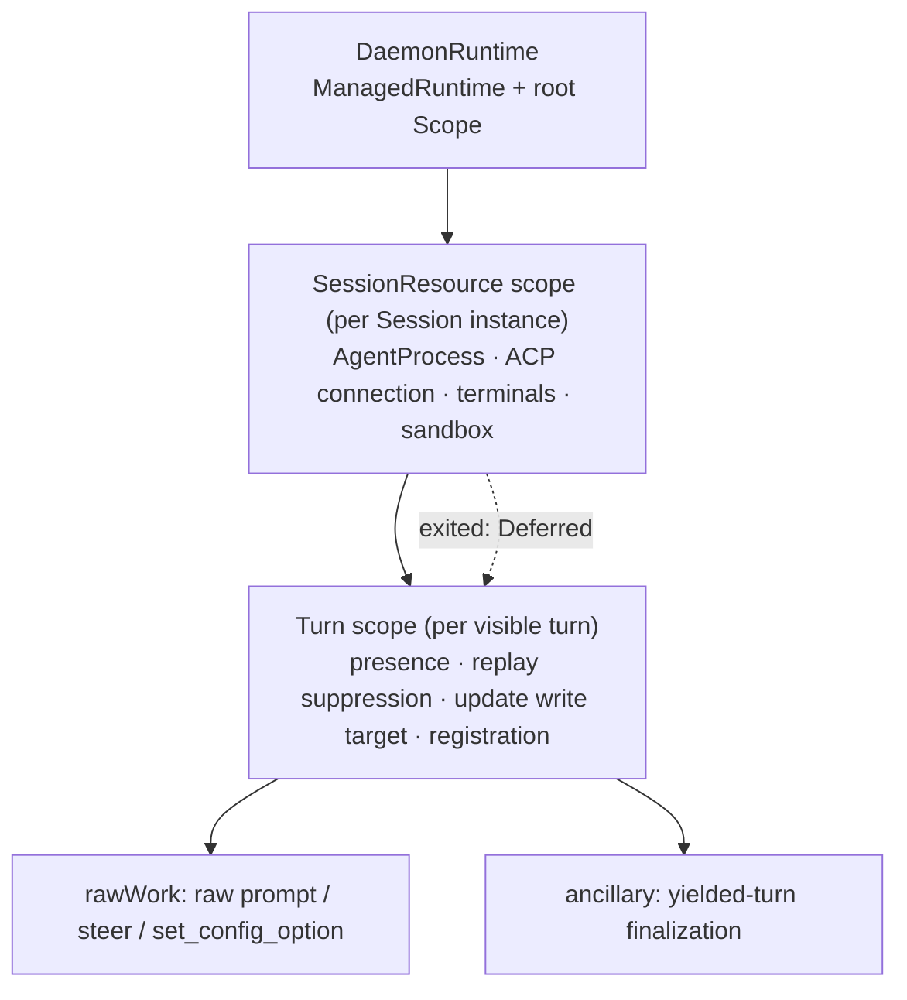

# Rebuild turn execution and ACP process ownership on Effect scopes

Status: proposed
Translation: current

[中文](2026-09-27-effect-turn-execution-and-acp-process-ownership.zh.md)

## Abstract

The CLI's turn execution runtime and ACP child-process shutdown produced the densest run of
lifecycle defects in the last two months: ownership released before cancellation settled, a
drain waiting on the wrong prompt, a failed instance's event finalizing a live turn, unbounded
initialization, and Windows descendants left running. They share one root cause: resource and
wait lifetimes are not bound to an owner, and are held together by about fifteen boolean
flags, a dozen per-session registries, and five different kill implementations. This proposal
moves ownership into three Effect scopes (daemon → session resource → turn): the session
resource scope acquires and releases the process and ACP connection; the turn scope owns raw
ACP requests, steers, configuration calls and finalization; stop reasons reach finalizers as
typed values; and every wait is bounded with explicit escalation. Delivery follows the bottom-up layering
rule of the [migration roadmap](2026-09-27-effect-lifecycle-migration-roadmap.md): platform and
process leaf first, then the ACP connection and the session resource. The turn layer finishes
last, after the state layer it depends on. Stop/steer semantics, history format and dispatch
pointer rules do not change. None of the expected benefits is measured yet, and two decisions —
Windows process trees and whether to quarantine a session after failed termination — need
human input.

## Problem and evidence

### Defect record

| Root-cause class                                                 | Fixed instances                                        | Still open                                                 |
| ---------------------------------------------------------------- | ------------------------------------------------------ | ---------------------------------------------------------- |
| Ownership released after cancel / raw request outlives its owner | #571, #618, #740 (#477, #666), #573, #847              | #738 (needs reproduction and attribution)                  |
| Drain waiting on the wrong object                                | #817 (SIGKILL five seconds after a handoff steer)      | —                                                          |
| A detached instance's event finalizes a live turn                | #595, both review follow-ups of bounded initialization | stale-ACP retry path (unverified, see below)               |
| Unbounded waits                                                  | #759 (initialization hung for 1h51m)                   | `killAndWait` force branch, `taskkill` without a deadline  |
| Process tree not cleaned up                                      | —                                                      | #429 (Windows descendants; #456/#457/#458 closed unmerged) |

Related decisions: [steer Stop and recovery ownership](../../implemented/bug-fix/2026-09-16-steer-stop-recovery-ownership.md),
[bounded session initialization](../../implemented/bug-fix/2026-09-16-bounded-session-initialization.md),
[interrupt pending input exactly once](../../implemented/bug-fix/2026-09-14-interrupt-pending-input-exactly-once.md),
[failed session create lifecycle events](../../implemented/bug-fix/2026-09-11-failed-session-create-lifecycle-events.md),
[native compaction cancellation](../../implemented/bug-fix/2026-09-12-native-compaction-cancellation.md), and the still-proposed
[Codex prompt ownership recovery](../bug-fix/2026-09-10-codex-prompt-ownership-recovery.md). This proposal
implements that note's first-phase structure ("AgentClient holds the real request until it
ends") and generalizes it to every turn resource. It does not implement that note's second
phase (execution records and unified recovery entry points).

### Current code (`HEAD` 963752f8)

The execution service, `apps/cli/src/session/session-execution-service.ts` (6890 lines):

- `TurnRuntimeState` (around :270-318) records which phase a turn is in and why it ended.
  It does this with flags — `promptStarted`, `promptInFlight`, `finalizeStarted`,
  `finalizeCompleted`, `cancelRequested`, `cancelFinalized`, `interruptRequested`,
  `terminateSessionOnCancel`, `initializationStalled` — plus several promise fields:
  `steerWaitController`, `cancellationDrain`, `pendingHandoffSteerOutcome`,
  `pendingSteerConfig`, and the `yieldedFinalization` chain.
- Three places record whether a turn is alive:
  - MessageHandler's `activeTurnId`, which is the ACP update write target;
  - `currentTurnBySession`;
  - `turnRuntimeBySession`.

  More registries sit beside them: `canceledTurnBySession`, `turnReleaseWaiters`, and
  `initializationStallWaiters`.

- The turn program is already an Effect (`runVisibleSessionTurn`, around :3350-3730), but:
  - it starts a root fiber on the default runtime with `Effect.runFork(program)`, so daemon
    shutdown cannot enumerate or await it;
  - the finalizer tells stall, cancellation and interruption apart from `Cause.isInterrupted`
    plus mutable flags. The bounded-initialization note explains why a direct interrupt would
    be misread as a user cancellation;
  - `requestTurnInterrupt` is `void Effect.runPromise(Fiber.interrupt(fiber))`, which does not
    wait for finalizers;
  - `Effect.promise(() => yieldedFinalization)` inside the finalizer is an unbounded wait;
  - on Stop, `drainCancelledPrompt` runs as a promise detached from any scope. After a
    five-second `withTimeout` it checks whether a response "won just after the timeout";
  - `finalizeTurn` is a promise that keeps running after Stop interrupts the fiber. It can
    only poll `stopIfTurnCancelled` between stages, and checks once more before sending the
    completion notification.
- `cancelSession` (around :5666-5895) has eight branches. It combines `promptInFlight`,
  `finalizeStarted`, runtime presence and ACP readiness to choose one of three actions:
  - interrupt the fiber;
  - send an ACP cancel plus a background drain;
  - call `finalizeCancelledTurn` directly.
- The last third of the file (around :5897-6850) is machine-level work that has nothing to do
  with turns: ACP authentication, capability refresh and binary install.

`apps/cli/src/agent/agent-client.ts` (2997 lines):

- A `pendingPrompts` Set records raw requests, and `pendingPromptCompletion` exposes their
  `allSettled`.
- `prompt()` races the raw request against an AbortSignal with `Promise.race`. On abort it
  sends an ACP cancel and rejects immediately.
- `steerPrompt` maintains the `applied` / `not-applied` / `unknown` states with
  `steerApplicationWaiters` and several `void promise.then` chains.

Process layer (`session.ts`, `session-sandbox.ts`, `acp-runner.ts`, `session-manager.ts`):

- **Termination:**
  - `Session.terminate` does not coalesce concurrent calls.
  - `killAndWait` checks `exitCode` but not `signalCode`.
  - Its force branch awaits `waitForExit()` with no bound.
  - Its graceful branch's `Promise.race` never clears its five-second timer.
- **What `terminated` reports:**
  - `sandbox.terminate` failures are swallowed, and `terminated` is emitted anyway.
  - Its `exitCode` comes from the exec process, not the agent.
- **Process trees:**
  - On Windows, the no-op sandbox runs `taskkill /T` but ignores its exit code, has no
    deadline, and uses a cached PID.
  - `acp-runner.ts` auxiliary processes kill only the outer wrapper on Windows (`child.kill`).
  - After an ACP root exits on its own, nothing signals the descendants left in its process
    group.
- **Unexpected ACP process death raises no event.** `onExit` only nulls `agentProcess`: the
  connection is not closed and `isCreated()` stays true. The SDK (`@agentclientprotocol/sdk`
  1.3.0, `jsonrpc.js` `close()`) rejects pending requests only when stdout reaches EOF, and
  that EOF never comes while a grandchild holds the pipe.
- **Events can reach the wrong instance:**
  - `SessionManager`'s `exit`/`terminated` listeners delete `sessions[id]` **by id**, so an
    undetached old instance can unregister its replacement.
  - On `terminated`, MessageHandler finalizes the whole turn with `finalizeACPState(sessionId)`,
    which carries no turnId.
  - The stale-ACP retry path (execution service around :4837) terminates an old instance that
    is still registered. That is the same class as #595, not yet reproduced.
- **At least five SIGTERM→wait→SIGKILL implementations:** `session.ts`, `acp-runner.ts`,
  `session-sandbox.ts`, the `acp-authentication.ts` status probe, and `packages/cli-supervisor`.

### Effect behaviour verified on effect 3.18.4

The research ran throwaway scripts against the same pinned version (since deleted). The
findings fix several details of the design below:

- **`Scope.close(scope, exit)` passes the exit to every `acquireRelease` release.**
  - Closing with `Exit.fail(reason)` therefore hands finalizers a typed reason.
  - A second `Scope.close` returns immediately, without waiting for the first close's
    finalizers. "Close" must therefore be one memoized, shared operation, and the first
    reason wins.
- **`Effect.forkIn(effect, scope)` fibers are interrupted and awaited when the scope closes.**
  For uninterruptible work, the close waits for the work to actually end. That is the
  structural form of "do not release ownership before the raw request ends".
- **Bounding a wait means putting the timeout on the waiter.** `Effect.timeout` applied to
  uninterruptible work waits for that work to finish. Use
  `Fiber.await(raw).pipe(Effect.timeoutTo(...))` instead.
- **Interruption variants differ:**
  - `Fiber.interrupt` awaits finalizers.
  - `Fiber.interruptFork` does not.
  - `Effect.disconnect` lets work continue in the background while the caller returns
    immediately, which amounts to abandoning ownership. This design does not use it.
- **`FiberMap.run` does not await the old fiber's finalizers when it replaces a key.** "One
  process per session" therefore needs an explicit interrupt-and-await, or a per-key
  `Semaphore(1)`.
- **An injected runtime is the seam for time-based tests.**
  - `ManagedRuntime.make(TestContext.TestContext)` lets `TestClock.adjust` drive `sleep`s
    forked through `runFork`.
  - Vitest's default fake timers freeze Effect's scheduler, which is why existing tests fake
    only `setInterval`.
- **`@effect/platform`'s `Command` is not adopted; we build a thin in-house wrapper.**
  - It spawns detached, kills the process group on POSIX, and uses `taskkill /T /F` on Windows.
  - Its release sends SIGTERM and then waits for `exit` forever: no escalation, no deadline.
  - It merges `process.env`, which conflicts with the filtered-environment spawn rule.
  - It would require pinning 0.92.x or upgrading effect.

## Runtime revision

The experiments above are historical v3 evidence, not verification of v4.
The implemented foundation now uses Effect 4.0.0; see the [v4 migration
record](../../implemented/architecture/2026-10-09-effect-v4-migration.md).
Future code uses `Layer.effect`, `Scope.provide`, `Fiber.Fiber` and
`Effect.forkChild` / `forkIn`; test clocks come from `effect/testing`.

## Goals and non-goals

Goals:

1. Every resource and async task a turn owns lives in the turn scope. Closing the scope
   releases it, so no work keeps running after release.
2. Every ACP process and its connection live in the session resource scope. An unexpected exit
   reaches the owning turn as a typed signal.
3. The stop reason is a typed value that finalizers dispatch on, replacing the boolean flags.
   The reasons are user Stop, Edit & Resend, access revocation, initialization stall, agent
   exit, daemon shutdown, and known failure.
4. Every wait is bounded. Exceeding a bound escalates by an explicit policy — ACP cancel, then
   process termination, then a reported termination failure — and failures are never
   swallowed.
5. A stale instance's callbacks and events structurally cannot reach a newer instance or turn.
6. Daemon shutdown can enumerate and await, with a deadline, every turn and process.

Non-goals:

- Changing the user semantics of Stop, Guide/steer or Edit & Resend. The three
  `applied`/`not-applied`/`unknown` outcomes and the `pendingInput`/`prePromptSession` policies
  stay as they are.
- Changing history format, the `latestUserMsgId`/`lastHandledUserMsgId` pointer rules, or
  queue promotion rules.
- Duplicate rows between CRDT replicas (the data-model half of #1040), ACP adapter protocol
  differences, and cross-restart delivery receipts.
- Refactoring the dispatch watcher, the rest of MessageHandler's event glue, or orchestration
  delivery here. Those belong to the [migration roadmap](2026-09-27-effect-lifecycle-migration-roadmap.md).

## Target ownership model



### DaemonRuntime

- One `ManagedRuntime` is created at daemon start. Its initial `Layer` holds only the Logger
  and the clock. It is injected into `SessionExecutionService` and `SessionManager` through
  deps; tests supply `TestClock.layer()` from `effect/testing`.
- Every turn starts with `runtime.runFork(program, { scope: daemonScope })`.
- Shutdown runs in this order, preserving the two-phase `cleanUp` rule in `session/AGENTS.md`:
  1. stop every turn with `DaemonShutdown`, within a deadline;
  2. close session resources;
  3. run MessageHandler's final flush;
  4. tear down documents.

### SessionResource

- **Scope and acquisition.** `Session` holds a `CloseableScope`. Inside it, `createAgent`
  acquires, in order:
  - the start-gate permit, covering spawn + initialize + newSession, with the default
    concurrency of 2 and `LODY_MAX_CONCURRENT_ACP_SESSION_STARTS` unchanged;
  - `AgentProcess`;
  - the ACP connection.
- **`AgentProcess.acquire(spec)`** is
  `Effect.acquireRelease(spawn, (proc, exit) => terminateTree(proc, policy(exit)))`. It exposes
  `exited: Deferred<ProcessExit>`, which reads both `exitCode` and `signalCode` and checks for
  an earlier exit before attaching a listener.
- **Exit watcher.** A fiber in the session resource scope awaits `exited`. When it completes,
  the watcher:
  - explicitly calls `connection.close(AgentExited)`, instead of relying on stdout EOF;
  - marks the client disconnected, so `isCreated()` returns false;
  - stops the turn that owns the session with `AgentExited`.
- **`terminate` is memoized.**
  - Concurrent calls share one close.
  - `terminated` is emitted exactly once, with the agent's exit information.
  - A termination failure emits a typed `terminationFailed` instead of pretending to succeed.
- **`SessionManager` subscribes per instance.** Each subscription is itself a resource in the
  session resource scope, and nothing deletes by id any more.
- **Session creation becomes interruptible.** `pendingSessionCreates` becomes an
  interruptible create fiber:
  - abandoning a create interrupts that fiber;
  - the scope releases any process it had already acquired;
  - the reaper and the 300-second sentinel from the bounded-initialization note are removed.

### Turn scope and TurnSupervisor

Each visible turn is represented by a `TurnHandle`:

```ts
type TurnStopReason =
  | { _tag: 'UserStop'; pendingInput: 'promote' | 'preserve'; prePromptSession: 'discard' | 'keep' }
  | { _tag: 'Rewrite' } // Edit & Resend: preserve / keep
  | { _tag: 'AccessRevoked' } // preserve / discard
  | { _tag: 'InitStalled'; stall: SessionInitializationStall }
  | { _tag: 'AgentExited'; exit: ProcessExit }
  | { _tag: 'DaemonShutdown' }
  | { _tag: 'Halted'; reason: ChatFailedReason };

type TurnPhase = 'preparing' | 'prompting' | 'finalizing';

interface TurnHandle {
  readonly turnId: string;
  readonly scope: Scope.CloseableScope;
  readonly phase: Ref<TurnPhase>;
  readonly stopReason: Deferred<TurnStopReason>; // first reason wins
  readonly released: Deferred<void>; // replaces turnReleaseWaiters
  readonly body: Fiber.Fiber<void, unknown>;
  readonly stop: (reason: TurnStopReason) => Effect<void>; // memoized
}
```

`stop(reason)` does two things: it records the reason in `stopReason`, then acts according to
the current phase:

| Phase                                                | Effect of Stop                                                                                                                                         | Replaces                                                         |
| ---------------------------------------------------- | ------------------------------------------------------------------------------------------------------------------------------------------------------ | ---------------------------------------------------------------- |
| `preparing` (create, restore, configure, open entry) | Interrupt and await `body`. A create in progress is interrupted; an already acquired process is released or kept per `prePromptSession`                | `requestTurnInterrupt` + `terminateSessionOnCancel`              |
| `prompting`                                          | Send the ACP cancel. Every local wait (steer waits, handoff verdict waits) races `stopReason` and ends. `body` keeps waiting for the raw prompt to end | `requestAgentCancelInBackground` + `steerWaitController.abort()` |
| `finalizing`                                         | Interrupt `body`. Each post-processing stage is an interruption point, so the completion notification needs no flag check                              | the `finalizeStarted` branch + `stopIfTurnCancelled`             |

When the turn scope closes, its release dispatches on the reason carried in the `Exit`. This
replaces `finalizeCancelledTurnEffect`, `finalizeStalledInitializationEffect`, and the
inference in `awaitTurnFiber`:

1. **Drain.** Run `agentClient.awaitIdle` with a five-second bound, placing the bound on the
   waiter. If the bound is exceeded:
   - close the session resource with `DrainTimeout`, which terminates the process, makes the
     SDK reject pending requests, and empties rawWork;
   - wait once more, with a bound.
2. **Termination failure.** The existing rule that a failed termination is not permission to
   reuse stays. The default keeps the turn as owner, but in an observable `release-blocked`
   state with logs and diagnostics, rather than as an unbounded await in a finalizer.
   Alternatives are listed under open questions.
3. **Writes per reason:**
   - `UserStop`, `Rewrite` and `AccessRevoked` keep the existing cancellation write order:
     `markDispatchCancelled` first, then the terminal assistant entry becomes visible.
   - `InitStalled` and `Halted` go through `recordKnownChatFailure`.
   - `AgentExited` takes the `agent_disconnected` classification.
   - `DaemonShutdown` writes no user-visible failure.
4. **Release and signal.**
   - Release presence and replay suppression.
   - Release the ACP update write target. MessageHandler's `activeTurnId` becomes an
     `acquireRelease` in this scope.
   - Complete `released`.

**Raw ACP work.** `AgentClient` becomes the single low-level occupancy boundary:

- A connection-level `FiberSet` holds every raw request: prompt, steer extension request, and
  `set_config_option`.
- Each request is wrapped in `Effect.uninterruptible`. Only an ACP response or a connection
  close can end it; a local interrupt cannot cancel it.
- It exposes `awaitIdle(): Effect<void>` and `isIdle`.
- `pendingPrompts`, `pendingPromptCompletion`, `pendingSteerConfig` and `cancellationDrain` are
  deleted.

**Steer:**

- Racing against `stopReason` replaces `steerWaitController`.
- Each steer verdict is a `Deferred<SteerOutcome>`. The handoff's `pendingHandoffSteerOutcome`
  becomes a turn field instead of a promise chain.
- The `Promise.race` loop in `awaitPromptHandoffTail` becomes an Effect loop, with
  `successorReady` as a `Deferred`.
- The rule that a steer wait does not end while a handoff verdict is outstanding is preserved
  unchanged (#817).
- `steerMutationQueue` and `steerStatusQueue` stay on `ConcurrentQueue` for now. L5 turns
  them into one `Semaphore(1)` per session inside the TurnSupervisor.

**Other turn work:**

- The `yieldedFinalization` promise chain becomes an `ancillary` `FiberSet` in the turn scope.
  Release joins it with a bound; exceeding the bound is logged and does not block release.
- The watchdog calls `stop(InitStalled)` directly, which removes `raceFirst` and the
  `initializationStalled` flag.

## Layered delivery

- **Strictly bottom-up.** Each layer ships in one or two PRs. Each PR can be reverted alone and
  changes no persisted format.
- **Shared rules.** Layer definitions, the definition of done, and the temporary-facade rule
  live in the [migration roadmap](2026-09-27-effect-lifecycle-migration-roadmap.md#layering-principle).
- **The existing suite is the behavioural contract.** Every PR must pass
  `tests/session-execution-service.test.ts` (9322 lines) without changing its assertions. The
  only permitted change is replacing timer scaffolding with TestClock.

### PR1: L0 platform + L1 ProcessService (directly targets #429)

> Implementation is delivered by [#1065](https://github.com/LodyAI/Lody/pull/1065),
> on the v4 baseline. DaemonRuntime and turn-fiber integration belong to L4;
> this layer provides its services through temporary facades per call.

- **L0 integration:** bridge Effect logging into the existing Logger. The v4
  runtime, TestClock tooling and Effect guide are inherited from #1070.
- **Location:** introduce the process core directly in `packages/shared/src/node/process.ts`;
  CLI retains only logger adapters and session containers.
- **L1: `ProcessService`**, offering:
  - `spawn(spec): Effect<ProcessHandle, SpawnFailed, Scope>`, whose release is
    `terminateTree`;
  - `exec`;
  - `awaitExit`.

  Each platform strategy is its own Layer:
  - **POSIX process group:** termination signals surviving group members even when the root already
    exited, and treats ESRCH as exited.
  - **Windows:** check the exit code of `taskkill /T` under a deadline, then fall back to `/F`.
  - **Linux cgroup:** escalate to `cgroup.kill` after the grace period.

  Rules for every strategy:
  - read both `exitCode` and `signalCode`;
  - bound every wait, and release its timer when the wait ends;
  - return termination failure as a typed `TerminationFailed`, never swallowed at the bottom.

- **Consumers migrated:**
  - `Session`'s ACP agent process, replacing `killAndWait` and the sandbox kill paths;
  - `acp-runner.ts` auxiliary ACP processes: capability probe, title generation, protocol auth;
  - the `acp-authentication.ts` status probe.

  Concurrent `Session.terminate` calls share a result; completed results are not reused.
  `terminated` fires once per termination, carrying the agent's
  exit information, and a sandbox termination failure no longer reports success.

- **Not yet migrated:** `Session` itself stays a Promise class. It calls ProcessService through a
  temporary `runtime.runPromise` facade, which L4 deletes.
- **Tests:**
  - Fake processes + TestClock cover the grace period, escalation, timeouts, `signalCode` exits,
    and a root that exits before surviving group descendants.
  - An injected platform and a fake `taskkill` cover the Windows branch.
  - A real-process POSIX test has the child write its grandchild's PID to stdout as an explicit
    readiness signal, then asserts the grandchild is gone after close. No sleeps.
- **Exit criteria:** the full CLI and shared suites pass and scoped process release is bounded.
  Daemon-wide disposal waiting for every turn fiber is an L4 criterion.

### PR2: the remaining L1 spawn callers

These move onto the same ProcessService:

- git, including the diff and branch sync used by finalization;
- the worktree setup runner, fixing a timeout that sends SIGTERM only to the shell and leaks its
  descendants;
- ACP terminals;
- login-shell environment probing;
- MCP, preview, and the rest.

After this, L1 meets the roadmap's definition of done.

### L2: state and cloud (owned by the roadmap)

The design of SessionDocuments, SessionHistory, SessionPresence and CloudPort, and the
loro-repo/streams-crdt decision, are in the
[roadmap](2026-09-27-effect-lifecycle-migration-roadmap.md#l2-and-the-loro-sync-stack). The
turn layer depends on them. This proposal's L5 therefore starts only after L2 is done, at least
in its version on the temporary `LoroRepo` Layer.

### L3: AcpConnection

- **Split `AgentClient`** into a protocol connection and domain operations.
- **AcpConnection:**
  - A connection-level `FiberSet` holds every raw request: prompt, steer extension request, and
    `set_config_option`.
  - Each request is wrapped in `Effect.uninterruptible`. Only an ACP response or a connection
    close can end it.
  - It exposes `awaitIdle` and `isIdle`.
  - A `closed: Deferred` and a notification `Stream` replace callbacks.
  - The SDK is the only third-party boundary wrapped in this layer.
- **Delete** the promise bookkeeping in `pendingPrompts`, `pendingPromptCompletion` and
  `steerApplicationWaiters`. Steer verdicts become `Deferred<SteerOutcome>`, with the three-state
  semantics unchanged.
- **Verify first:**
  - how the current SDK rejects prompts and extension requests after `connection.close(error)`;
  - what happens when an adapter grandchild holds stdout.

### L4: AgentSession and AgentSessionPool

- **`AgentSession` is a scope.** It acquires, in order:
  - the start-gate permit: `Semaphore(2)`, keeping `LODY_MAX_CONCURRENT_ACP_SESSION_STARTS`;
  - the ProcessService process;
  - the AcpConnection;
  - ACP terminals;
  - the sandbox.

  An `exited` watcher fiber closes the connection explicitly and notifies the owning turn with
  `AgentExited`.

- **`AgentSessionPool`** replaces `SessionManager`'s `sessions`, `pendingSessionCreates` and
  `pendingTerminationPromises`.
  - It is a per-sessionId `RcMap`, or a `FiberMap` with explicit interrupt-and-await, because
    `FiberMap` replacement does not await the old fiber.
  - Creation is interruptible. Abandoning a create interrupts it, and the scope releases any
    process already acquired. This removes the reaper and the 300-second sentinel.
  - Lifecycle events are subscribed per instance and never deleted by id.
- **Dependencies:** managed runtime download and ACP login, and worktrees/file locks, must
  first be finished per the roadmap.
- **Cleanup:** delete the facade PR1 left on `Session`.

### L5: turn scope and TurnSupervisor (core)

- Introduce `TurnHandle`, `TurnStopReason` and `TurnPhase`, and delete the flags and promise
  chains listed above.
- **Drain moves into the turn scope's release:**
  - run `AcpConnection.awaitIdle` with a five-second bound, placing the bound on the waiter;
  - on overrun, close the AgentSession with `DrainTimeout`, then wait once more, with a bound;
  - a termination failure enters an observable `release-blocked` state.
- **Finalization stages:** each `finalizeTurn` stage becomes an Effect step over L1 Git and L2
  SessionHistory. Write sequences that must be atomic go through
  `SessionHistory.commit(batch)`.
- **One stop path:** initialization stall, agent exit and daemon shutdown all go through
  `stop(reason)`. Presence is held by a `SessionPresence.hold` lease.
- **Registry and cancelSession:**
  - Merge `currentTurnBySession`, `turnRuntimeBySession`, `canceledTurnBySession`,
    `turnReleaseWaiters` and `initializationStallWaiters` into `TurnRegistry`.
  - `cancelSession` becomes: subagent-control branch → registry lookup →
    `handle.stop(UserStop{...})`. An explicit orphan-turn repair path is kept.
  - The steer queues become one `Semaphore(1)` per session.
- **Tests:**
  - the existing suite;
  - a phase × reason matrix: Stop in `preparing`, `prompting` and `finalizing`; a steer already
    submitted; a lagging handoff verdict; a drain timeout with successful or failed termination;
    agent exit;
  - ablation for each new mechanism.

### In parallel: extract machine-level ACP operations

- Authentication, capability refresh and binary install (execution service around
  :5897-6850) move into their own service.
- In-flight Maps become `RcMap`/`Deferred`.
- It depends on L1 and L3, and is not coupled to turns.

## Invariants to preserve

Before implementation, map each of these to a test. No phase may change them:

- **Stop and drain.** Stop ends local steer waits, not the owner. Before reuse, drain raw
  prompt/steer/configuration work, or confirm termination.
- **Steer outcomes:**
  - an acknowledged steer ends `applied`, `not-applied` or `unknown`;
  - only adapter proof maps to `not-applied`;
  - `unknown` never replays;
  - a handoff adapter reports `applied` only after the yielded prompt answers.
- **Cancellation policies:**
  - Stop uses `pendingInput: promote` / `prePromptSession: discard`;
  - Edit & Resend uses preserve/keep;
  - access revocation uses preserve/discard.
- **Write order.** The cancellation outcome is written before the terminal assistant entry,
  and a turn with no ACP updates takes `recordSilentTurnFailure`.
- **Pointer writes.** Ordinary turn execution writes only `processingUserMsgId` and
  `lastHandledUserMsgId`.
- **Lifecycle events.** `SessionManager` publishes lifecycle events only for instances a caller
  received.
- **Prompt hot path.** After a remote prompt arrives, only correctness-critical setup may block
  before `agent.prompt`; add no new waits.
- **Two-phase shutdown.** `cleanUp({ keepWorkspaceDocumentOpen: true })` first, then `cleanUp()`
  after the final flush.

## Risks

- **More interruption points.** Once Effect-ified, every `yield*` can be an interruption point,
  which widens the windows between two CRDT writes. Mitigation: list the write sequences that
  must be atomic and wrap each in an uninterruptible region.
- **The mixed-mode boundary.** While Promises and Effects coexist, `runPromise` turns
  interruption into a `FiberFailure` rejection. Rules:
  - map explicitly at the boundary with `runPromiseExit` or `Fiber.await`;
  - never call `run*` inside an Effect;
  - always use `tryPromise({ try: (signal) => ... })` for promises that can reject.
- **Waits inside finalizers.** Finalizers are uninterruptible, so any unbounded wait there can
  hang shutdown. Every wait inside a release must be bounded.
- **Adapter differences.** Handoff (built-in Claude), same-turn steer (Codex) and synthetic
  compaction tool calls can only be fully verified against real adapters. Deterministic tests
  prove only the execution service's side of the ordering.
- **Changing the two largest files together.** L4 edits MessageHandler (9762 lines) and the
  execution service at once, which is expensive to review. Layered PRs keep each PR's size in
  check.
- **Lingering temporary facades.** Bottom-up means upper layers use new services through
  `runtime.runPromise` facades until they migrate.
  - Each facade is registered in its layer's PR and deleted when that layer migrates.
  - A facade must never appear inside a finished layer.
- **Test-double fan-out.** Interface changes ripple into about 95 Logger doubles. PR1's runtime
  injection must avoid adding new required dependencies.
- **Rollback:**
  - No phase changes a persisted format, so each can be reverted alone.
  - A switch keeping old and new execution paths for L5 is not recommended: maintaining
    two copies of ~6000-line logic costs more than the risk it guards.
  - The existing suite, ablation and staged rollout by release channel replace it.

## Open questions (need human decisions)

1. **Windows process trees.** Is a verified `taskkill /T` enough, or should Lody adopt Job
   Objects? Job Objects need a native module or helper executable and affect packaging.
   PR1 does only the former by default.
2. **Ownership after failed termination.** Should the turn keep ownership until the raw
   request ends (current semantics, and the L5 default)? Or should the session resource
   be quarantined so a new process can continue? The latter is a behaviour change and needs a
   Spec draft.
3. ~~Test tooling~~ Revised (2026-10-09): inherit `@effect/vitest` 4.0.0 and Vitest 5.0.2; use v4 TestClock.
4. **The `ancillary` finalization bound.** No measurements exist yet.
5. ~~Where ProcessService lives~~ Revised (2026-10-09): introduce the core directly in `packages/shared/src/node/process.ts`; CLI keeps its adapters.

## Verification limits

What this record rests on:

- code reading;
- repository history;
- GitHub issues;
- throwaway scripts run against effect 3.18.4.

At the original proposal date, no implementation or CLI suite was run. The v4 baseline is now checked separately; later layers record their own evidence. "Fixes #429" and "each defect class becomes
structurally impossible" are design goals, not measurements.

Not verified:

- the event race on the stale-ACP retry path;
- SDK close behaviour while a grandchild holds the pipe;
- any Windows behaviour.

## v4 baseline and PR ownership

The bottom [#1070](https://github.com/LodyAI/Lody/pull/1070) migrates only existing Effect consumers and test tooling.
This plan (#1057) builds on it. #1065 introduces the v4 process core directly in shared,
CLI containers and ACP consumers; #1069 migrates the remaining CLI consumers and adds
the CLI guard. The final cross-runtime PR migrates Electron, supervisor, shared helpers
and the review helper and expands the guard. Every layer uses v4; the core is not first
introduced in CLI and then relocated.
