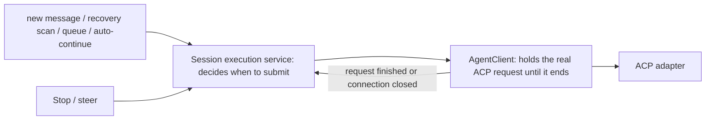

# Investigation into prompt occupancy when Codex sends after recovery

Status: proposed
Translation: current
PR: https://github.com/LodyAI/Lody/pull/571

[中文](2026-09-10-codex-prompt-ownership-recovery.zh.md)

## Abstract

Codex ACP's `A Codex prompt is already active` means the same adapter process still holds an older
prompt for that ACP session and has received an ordinary prompt anyway. Neither the current source nor
the controlled verification shows that "restart recovers an unprocessed message while a new message
arrives" can by itself bypass Lody's serial dispatch. Cancellation ends Lody's local wait early while
the adapter is still waiting for the native completion event or its cleanup, and that overlap window is
reproduced; it cannot explain a disconnect-recovery failure in the absence of cancellation evidence.
The current minimal fix keeps the original ACP request and the execution occupancy until the request
ends, terminating the old Session and then releasing if cancellation cleanup exceeds five seconds.
Restructuring the recovery protocol remains a proposal; there is no log from a failing machine, and no
released user scenario has been verified.

## Scope

- Lody: `179c63da04c990538de838632bcf399ed67ae078`.
- Pinned adapter: `e472d56e9a07b782d1c065a631d630765958a6a3`, inspected and tested in an independent
  temporary checkout.
- Native runtime manifest: Codex `0.153.4`; the local Rust source read for reference is `b5ea64a203`,
  which is not taken as proof of the failing machine's binary version.
- The failing machine's Lody version, CLI/adapter process lifetime and request logs were not obtained.
  This document contains no user session content or identifiers.

## Why recovery dispatch does not overlap directly

1. [The dispatch logic](../../../../apps/cli/src/session/session-dispatch-logic.ts) does recover
   unprocessed messages, including compatible unread states.
2. `enqueueSessionCheck` in the
   [watcher](../../../../apps/cli/src/session/session-dispatch-watcher.ts) chains Promises serially per
   Session; the RPC offer enters the same queue. Answering the initial probe does not release the
   execution chain, and `maybeHandleSession` awaits the whole `dispatchPreparedSessionTurn`.
3. The [execution service](../../../../apps/cli/src/session/session-execution-service.ts) registers the
   executor before the access check, request construction and ACP resume. There is no `await` between
   the duplicate check and registration in `runVisibleSessionTurn`; direct chat and Operation delivery
   use the same entry point.
4. After the original adapter has fully exited, `activePrompts` is a freshly created empty Map;
   `loadSession`/`resumeSession` do not rebuild it from history. A native thread with unfinished history
   alone is not enough to produce this specific error.

A combined verification connected the unmodified `enqueueSessionCheck` method to a real Codex ACP server
fixture, driving progress with native completion notifications. Feeding a new message after the recovery
input's initial probe had returned but before the old prompt finished produced
`submit-1 → acp-response-1 → submit-2 → acp-response-2`, with both ending normally. A control that
bypassed the queue reproduced exactly the same `-32600`, and a retry after the old request ended
succeeded. Both checks passed. Input recovery and the watcher's downstream connection were assembled in a
controlled way, without running a full CLI startup, persistence recovery or cloud sync, so this proves
that serial boundary rather than the absence of defects on every recovery path.

## The reproduced cancellation boundary

[AgentClient.prompt](../../../../apps/cli/src/agent/agent-client.ts) uses `Promise.race` to await the
original request or the AbortSignal. On cancellation it sends the ACP cancel notification and rejects
immediately, and `activePromptCompletion` is cleared afterwards. The outer execution service can release
the local executor while the old original ACP Promise is still unfinished.

The adapter's `CodexAcpServer.prompt` calls `activePrompt.complete()` only at the end of its final
cleanup. An ordinary cancellation waits for the native completion notification; a Goal cancellation may
additionally wait for the goal to pause. Re-sending an ordinary prompt during that interval yields the
same `-32600` and English error. `await cancel()` alone is not a fix: the ACP cancel is itself a
notification and does not confirm that the old prompt's cleanup has finished.

Controlled adapter tests use synthetic inputs and explicit Promise/event signals, with no model
connected:

- The native interrupt reply has arrived but `turn/completed` has not: the new prompt is rejected; after
  the old prompt completes, the new prompt succeeds.
- Cancellation between two Goal rounds has returned but pausing the Goal has not finished: the new prompt
  is rejected.
- Extending the existing `goal-prompt-lifecycle.test.ts`, the original 7 plus these 2 make 9 passing tests.

## Excluded paths and branches that still need extra conditions

- [MachineRuntime](../../../../apps/cli/src/lib/machine-runtime.ts)'s ordinary remote detach only
  disconnects sync and does not cancel execution; it cancels actively only when permission is explicitly
  revoked. The two must not be conflated as a disconnect.
- The execution Fiber does not belong to the RPC request; disconnecting the request does not interrupt it
  automatically. Automatic post-processing is still protected by the outer executor, and Codex steer's
  completion reuses the original prompt's wait.
- Errors reported by adapter files are already caught. A failed notification write in `dispose()` could
  skip the final Map cleanup, but the SDK closes the local ACP connection at the same time; it has not
  been shown that this path can still receive the next prompt. Making a mock throw by hand does not
  reproduce a network failure.
- The adapter's `load`/`resume`, title generation and background terminal reconcile all establish no
  prompt in that Map. The Goal control extension has an entry point that starts a prompt on its own, but
  no production caller of it was found in the current Lody, so a counterexample built by calling the
  extension directly cannot explain an ordinary send after recovery. A controlled control that does call
  that extension directly did reproduce prompt overlap, and verified that an ordinary request succeeds
  once the internal prompt ends.
- On restart, the cancellation check and the dispatch check are independent. If a persisted old
  cancellation marker is processed after the recovery prompt, the cancellation window above can be
  entered; that requires an old cancellation marker and a specific ordering, and has not been reproduced
  or attributed.

## Further verification and fix direction

First distinguish "the interface reconnects to an existing background" from "the CLI/adapter is fully
rebuilt". Locate the first prompt accepted within one adapter lifetime, its completion/cancellation
events, and the second prompt that was rejected; only request identity, timing and process version are
needed, not prompt bodies.

If the cancellation window is confirmed, the suggestion is to separate stopping the local UI from
releasing the original ACP request, and to have a new ordinary prompt wait until the old request
completes or the old connection is explicitly discarded. Do not remove the adapter's duplicate
protection, and do not automatically turn every `acp_invalid_request` into a steer or an automatic
replay. Recovery concurrency still needs full CLI/ACP integration verification; the controlled
verification here does not cover real cloud sync, process crashes or released user installations.

The final merge ran the three temporary suites above for 12 passing tests (7 pre-existing behaviors and
5 diagnostic checks). The repository document check still has 12 baseline broken links, and this note
adds no new check errors. The full CLI suite was not run, because this nested checkout has no root
workspace dependencies; no product code was modified or committed.

## The minimal fix in this change

Only the reproduced cancellation window is closed, reusing the execution service's existing serial
dispatch:

- AgentClient tracks the original ACP Promises in a Set, and a local Abort does not remove one; only
  success or failure removes it. The drain snapshot includes both requests of a Claude handoff, and the
  existing steer and completion protocols are unchanged.
- A visible cancellation and the idle state still complete immediately, but the execution service keeps
  holding the runtime until the whole snapshot has finished. This makes the next round be blocked at the
  existing entry point before initialization, configuration changes or reply creation.
- After waiting more than five seconds, it awaits the existing `Session.terminate(true)` and then
  releases; a failed termination is logged and the original request continues to be awaited — a timeout
  or a failure must not be treated as idle. The termination flow waits for the process to exit.

This change adds no low-level prompt admission check and changes no history format, recovery scan,
message acknowledgement point or steer selection rule. The fuller structural proposal below is not
implemented. The five-second cap may interrupt a legitimately slow wrap-up, including a Goal pause or
flush; forced termination is not a lossless cancellation, and existing tool side effects are not undone.
When termination fails and the original request never ends, the execution occupancy is retained — the
trade-off chosen to avoid reusing the old agent.

Verification used isolated source at the current HEAD with a matching adapter source, with dependencies
supplied by an existing local installation:

- AgentClient suite 53/53: including raw success/failure after a local cancellation, and both Claude
  handoff requests ending in either order, confirming that occupancy is released only when the actual
  request ends.
- Execution service suite 86/86: explicit Promise signals and fake timers verify raw success, failure,
  termination on timeout, and failed termination; cancellation stays promptly visible, and new input is
  not fed to a still-busy agent. The same four tests all fail against the original HEAD source, each
  showing the execution occupancy released early.
- The CLI TypeScript check passes. No cloud reconnection or full real-process-replacement E2E was run;
  this cannot confirm the root cause of the original user report or claim that the recovery protocol is
  fully fixed.
- Ordinary lint on changed files reports no errors (5 pre-existing warnings), and the format check and
  diff whitespace check pass. Type-aware lint could not run because the local machine lacks the tsgolint
  executable; repository-wide `pnpm check` was attempted and aborted at
  `tsgo: command not found` caused by missing dependencies. `pnpm format` was run, and the formatting it
  produced outside this scope was reverted, keeping the verified fix files.
  `docs check` is unchanged from the start, retaining 12 pre-existing missing links caused by
  uninitialized submodules.

## Structural proposal

The suggestion is to consolidate responsibilities from the existing execution service, rather than
building a parallel queue or a new cross-layer Stop numbering. The following is a proposal awaiting
review; it is not implemented and does not claim to locate the root cause of the feedback above.

### One decision entry point, one low-level occupancy boundary

The execution service interprets the intent of user input, recovery input, auto-continue, stop and steer
uniformly. RPC and the watcher only relay and wake; UI state, unread fields, and whether an in-memory
Session exists do not independently authorize an ordinary prompt. Automatic post-processing and future
Goal control must also go through this entry point.

AgentClient holds the actual in-flight ACP request until the original Promise completes or the connection
is confirmed closed. An upper-layer cancellation ends only the visible execution and expresses the
cancellation intent; it cannot clear that occupancy. Every ordinary prompt call passes this boundary
check. It builds no second message queue — pending input still belongs to the existing persisted
queue/dispatch service. Checking availability and registering this request must be one synchronous
action; one must not query `isReady()` first and submit after asynchronous preparation. Occupancy is
represented by the current request object/Promise, so a late callback from an old instance can release
only the occupancy it holds, never a new instance's or a new request's.

The low-level state expresses only four facts: sendable, request in flight, waiting for the end after a
cancellation, and connection recovering. Interface state is derived from those facts and user intent and
takes no part in deciding whether the low level is idle. Do not put the whole prompt inside an
uninterruptible serial lock; serialize only short state changes, and Stop/steer must be able to enter
during execution.

### Recovery determines execution state first, then selects pending input

Reuse the current User Turn ID and any available execution record to distinguish: definitely not
submitted, has completion evidence, submission result unknown. A restart recovers stop intent and
execution records first, then scans pending input. Unknown must not be resubmitted as unread; there is a
crash window between the local write record and the remote receiving the request, and exactly-once
execution cannot be promised without provider deduplication or query capability. Reconnecting only the UI
should subscribe to the existing executor and must not restart the same work from history.

When a low-level drain exceeds its deadline, enter an explicit recovery state; replacement is allowed
only after confirming the old connection is closed and isolating the old callbacks. Closing a connection
is also not proof that old tool side effects have been rolled back. An old request whose result is
unknown stays unknown and is not replayed automatically just because a new connection was created.

### User-visible behavior and verification

- While running normally, an append is steered or queued by explicit intent; new input can still be saved
  during cancellation cleanup and recovery, showing "waiting for the previous one to finish" or
  "reconnecting".
- A low-level busy rejection means the two sides disagree about state, so dispatch should pause and
  reconcile; it must not be presented as user input error, silently dropped, retried indefinitely, or
  turned into a steer for every invalid request.
- When it cannot be confirmed whether the old task ran, show the result as unknown explicitly and offer a
  reconcile/resend entry rather than pretending recovery succeeded.
- Deliver AgentClient's retention of the original completion and the final submission check first, closing
  the reproduced window; then unify recovery and all initiating entry points incrementally, without
  requiring the whole Session system to be rewritten first.
- Acceptance uses combined tests at the real boundaries: stop meeting new input, recovery meeting new
  input, a crash after submission, steer meeting completion, and a late callback from an old connection.
  Assert the persisted result and the requests the low level actually received, not just counts. The
  controlled tests here must be extended to the execution service and real process replacement before they
  can verify this proposal.

Diagnostics record only existing Turn IDs, process/connection identity, the reason for state changes, and
request lifetimes — never prompt bodies. That way the next report can establish directly the ordering of
the first submission, the occupancy release and the second submission.

## Proposal risk assessment and delivery constraints

Consolidating the submission entry point is medium risk on its own; changing steer, cancellation
semantics, recovery decisions and the persistence format at the same time is high risk. The following
constraints tighten the proposal above and do not claim the failure is fixed.

| Risk | Constraint that must hold |
| --- | --- |
| A new waiting state leaves a session stuck forever | Define the drain deadline and the recovery exit explicitly; a timeout only enters recovery and must not clear occupancy directly; lock only short state changes, never awaiting a long request or an applied callback. |
| The cross-provider append protocol breaks | Restrict ordinary prompts, not every prompt by function name. Codex's request steer reuses the old completion; Claude's prompt steer allows a negotiated handoff. Decide by capability and keep legacy compatibility. |
| Old output or callbacks affect a new round | On replacement, isolate completion, text, tool state and permission by client/request object identity; comparing a reused ACP session ID is not enough. Termination signals can still be handled, but a stopped UI is not reopened. |
| Messages dropped or executed twice | The waiting state does not consume persisted messages; reuse the existing acknowledgement point. Resending is allowed only when it is provably unsubmitted or rejected, and an unknown state must constrain the recovery scan and older-client fallback. |
| Old execution keeps producing side effects after the pipe is closed | The recovery boundary includes managed adapter/native execution instances; sending kill or closing a pipe is not confirmation of exit. Old side effects are not treated as undone, and an existing unknown result is not replayed automatically. |
| Rolling back to an older version re-executes unknown messages | Changes that persist an unknown state need their own reader/writer compatibility design; do not claim a direct downgrade is safe until older versions are shown to respect that state. |

Phase one changes only the retention of the original completion, the ordinary submission check, waiting
wake-ups and old-instance isolation; it migrates no history, changes no recovery selection rule, changes
no user meaning of Stop, and does not force every provider onto one steer implementation. It requires
blocked new input to keep its existing persisted state and to be woken again when sending becomes
possible, rather than raising an ordinary error upward and marking the message failed. Rollout and
rollback switch at safe session-instance boundaries, not on an in-flight request's control logic.

Only phase two unifies every recovery entry point and adds execution records; write a draft Spec first,
stating user behavior for unknown results and compatibility with old data and old clients, then implement.
The unconfirmed root cause of this incident must not become the justification for an automatic replay
policy.

Release gates include: stop/new-message combinations across the real execution service and adapter,
Codex and Claude steer handoff, drain failure and process replacement, late output from an old instance,
message retention after recovery, and no replay of unknown state. Tests are accepted on explicit events
and persisted results. In production, observe repeated rejections, recovery success/failure, wait
duration and the number of unknown results, collecting no prompt bodies; do not assume metric thresholds
that have not been validated against a baseline.

### Bounded model check

A temporary TypeScript/Vitest model check covers two input IDs, two connections, at most three
submissions and interleavings of at most 10 events; it typechecks and visits 64 states over 110
transitions. The encoded safety constraints found no counterexample. Weakening each of four constraints
separately produced counterexamples in every case:

- Release on cancel: at `submit → cancel` a request is still in flight while the state already shows
  sendable.
- Release on timeout: `submit → cancel → timeout` has the same problem.
- No identity check on old callbacks: after the old instance exits and a new instance is created and
  submits, the old callback releases the new occupancy.
- Automatic replay of unknown: the process exits after submission, and rebuilding the connection submits
  the same input again.

This is a model of the proposal, not a proof about product code; it contains no real persistence crash
points, output attribution, Claude handoff, cross-process tool lifetime, or liveness proof. The real
boundary acceptance above remains a necessary condition.
