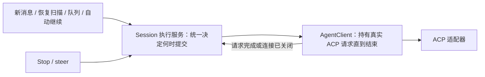

# Codex 恢复发送时的 prompt 占用调查

Status: proposed
Translation: pending
PR: https://github.com/LodyAI/Lody/pull/571

## 摘要

Codex ACP 的 `A Codex prompt is already active` 表示同一适配器进程仍持有该
ACP session 的旧 prompt，却又收到了普通 prompt。当前源码和受控验证未证明
“重启恢复未处理消息，同时收到新消息”本身能绕过 Lody 的串行派发。
取消会提前结束 Lody 的本地等待，适配器仍等待原生完成事件或清理，这是已复现的
重叠窗口；它不能在缺少取消证据时直接解释掉线恢复故障。当前最小修复保留原始
ACP 请求与执行占用直到请求结束，取消清理超过 5 秒则终止旧 Session 后释放。
恢复协议重构仍是提案；尚无故障机器日志，也未验证发布后的用户场景。

## 范围

- Lody：`179c63da04c990538de838632bcf399ed67ae078`。
- 锁定适配器：`e472d56e9a07b782d1c065a631d630765958a6a3`，在独立临时 checkout 检查和测试。
- 原生运行时清单：Codex `0.153.4`；辅助阅读的本机 Rust 源码为 `b5ea64a203`，
  不将该源码当成故障机器二进制的版本证明。
- 未取得故障机器的 Lody 版本、CLI/适配器进程生命周期或请求日志。
  本文不包含用户会话内容或标识符。

## 恢复派发为何没有直接重叠

1. [派发逻辑](../../../../apps/cli/src/session/session-dispatch-logic.ts)
   确实会恢复未处理的消息，包括兼容的未读状态。
2. [watcher](../../../../apps/cli/src/session/session-dispatch-watcher.ts)
   的 `enqueueSessionCheck` 按 Session 串行连接 Promise；RPC offer 也进入这个队列。
   初始探测的应答不释放执行链，`maybeHandleSession` 等待整个 `dispatchPreparedSessionTurn`。
3. [执行服务](../../../../apps/cli/src/session/session-execution-service.ts)
   在访问检查、请求构建和 ACP 恢复之前注册执行者。`runVisibleSessionTurn` 的
   重复检查与注册之间没有 `await`；直接聊天和 Operation delivery 也走这个入口。
4. 原适配器完全退出后，`activePrompts` 是新建的空 Map；`loadSession/resumeSession`
   不从历史重建该 Map。仅原生线程有未完成历史，不足以产生这条特定错误。

组合验证将未修改的 `enqueueSessionCheck` 方法与真实 Codex ACP server fixture
连接，用原生完成通知控制进度。恢复输入的初始探测已返回、旧 prompt 尚未结束时
送入新消息，观察到 `submit-1 → acp-response-1 → submit-2 → acp-response-2`，
两条都正常结束。绕过队列的对照准确得到同一 `-32600`；旧请求结束后重试成功。
两项验证通过。输入恢复和 watcher 下游连接是受控搭建的，未运行完整 CLI 启动、
持久化恢复或云同步，因此它证明该串行边界，不证明所有恢复路径无缺陷。

## 已复现的取消边界

[AgentClient.prompt](../../../../apps/cli/src/agent/agent-client.ts) 用
`Promise.race` 等原始请求或 AbortSignal。取消时发送 ACP cancel 通知并立即 reject，
`activePromptCompletion` 随后被清除。外层执行服务可以释放本地执行者，而旧的原始
ACP Promise 仍未结束。

适配器 `CodexAcpServer.prompt` 只在最终清理末尾调用 `activePrompt.complete()`。
普通取消等待原生完成通知；Goal 的取消还可能等待暂停目标。此间重新发送普通 prompt
会得到相同的 `-32600` 和英文错误。仅 `await cancel()` 不足以修复，ACP cancel
本身是通知，不确认旧 prompt 已清理完成。

受控适配器测试使用合成输入和明确的 Promise/事件信号，不连接模型：

- 原生 interrupt 回复已到、`turn/completed` 尚未到：新 prompt 被拒绝；
  完成旧 prompt 后，新 prompt 成功。
- Goal 两轮之间取消已返回、暂停 Goal 尚未完成：新 prompt 被拒绝。
- 扩展现有 `goal-prompt-lifecycle.test.ts`，原有 7 项加上述 2 项共 9 项通过。

## 排除项与仍需额外条件的分支

- [MachineRuntime](../../../../apps/cli/src/lib/machine-runtime.ts) 的普通远程 detach
  只断开同步，不取消执行；权限明确撤销才主动取消。两者不能混为掉线。
- 执行 Fiber 不隶属于 RPC 请求；断开请求不会自动中断它。自动后处理仍受外层
  执行者保护；Codex steer 的 completion 沿用原始 prompt 等待。
- 适配器文件报告的错误已被捕获。`dispose()` 的通知写失败虽可能跳过最终 Map
  清理，但 SDK 同时关闭本地 ACP 连接；未证明该路径还能接收下一条 prompt。
  人工让 mock 抛错不能作为网络故障复现。
- 适配器 `load/resume`、标题生成、后台终端 reconcile 均不建立该 Map 的 prompt。
  Goal control 扩展有自主启动 prompt 的入口，但当前 Lody 未找到它的生产调用，
  不能用直接调用扩展的反例解释普通恢复发送。直接调用该扩展的受控对照也已复现
  prompt 重叠，并验证内部 prompt 结束后普通请求成功。
- 重启时，取消检查与派发检查独立。若持久化旧取消标记晚于恢复 prompt 被处理，
  可能进入上述取消窗口；这需要旧取消标记和特定顺序，尚未复现或归因。

## 后续验证与修复方向

先区分“界面重新连接已有后台”与“CLI/适配器完全重建”。定位同一适配器生命周期中
第一条被接收的 prompt、它的完成/取消事件，以及第二条被拒绝的 prompt；只需请求
身份、时间和进程版本，不需提示词正文。

若命中取消窗口，建议让本地 UI 停止与原始 ACP 请求释放分别完成，新普通 prompt
等待旧请求完成或旧连接被明确废弃。不要删除适配器重复保护，也不要将所有
`acp_invalid_request` 自动改成 steer 或自动重放。恢复并发仍需完整 CLI/ACP 集成验证；
这里的受控验证不覆盖真实云同步、进程崩溃和用户安装版本。

最终合并运行上述三个临时 suite 共 12 项通过（7 项原有行为与 5 项诊断验证）。
仓库文档检查仍有 12 处基线断链，本 note 没有新增检查错误。未运行完整 CLI suite，
当前嵌套 checkout 没有根工作区依赖；未修改或提交产品代码。

## 本次最小修复

只补已复现的取消窗口，沿用执行服务已有的串行派发：

- AgentClient 用 Set 跟踪原始 ACP Promise，本地 Abort 不删除它；成功或失败才删除。
  排空快照包含 Claude handoff 的两个请求，原有 steer 和 completion 协议不变。
- 可见取消和 idle 状态仍立即完成，但执行服务继续持有 runtime，直到快照全部结束。
  这使下一轮在初始化、修改配置、创建回复之前就被现有入口挡住。
- 等待超过 5 秒，await 现有 `Session.terminate(true)` 后再释放；终止失败则记录日志，
  继续等待原始请求，不能把超时或失败当成空闲。终止流程等待进程退出。

本次不新增底层 prompt 准入检查、不改变历史格式、恢复扫描、消息确认点或 steer
选择规则。后面的完整结构提案尚未实施。5 秒上限可能打断耗时较长的正常收尾，
包括 Goal 暂停/落盘；强制终止不是无损取消，既有工具副作用也不会被撤销。
终止失败且原始请求始终不结束时，执行占用继续保留，这是避免复用旧 agent 的取舍。

验证使用当前 HEAD 的隔离源码与匹配适配器源码，依赖由已有本机安装提供：

- AgentClient suite 53/53：包括本地取消后 raw 成功/失败、Claude 两个 handoff 请求
  以任一顺序结束，确认占用只随实际请求结束而释放。
- 执行服务 suite 86/86：用显式 Promise 信号和 fake timers 验证 raw 成功、失败、
  超时终止、终止失败四种情况；取消及时可见，新输入不会送入仍忙的 agent。
  相同四项测试配原始 HEAD 源码全部失败，均观察到执行占用提前释放。
- CLI TypeScript 检查通过。未运行云端重连或完整真实进程替换 E2E；不能据此确认
  最初用户反馈的根因或声称恢复协议已经完整修复。
- 修改文件的普通 lint 无错误（5 条既有警告），格式检查和 diff 空白检查通过。
  带类型 lint 因本机缺少 tsgolint executable 未运行成功；全仓 `pnpm check` 已尝试，
  在依赖缺失导致的 `tsgo: command not found` 处中止。`pnpm format` 已运行，清理了
  它在本次范围外产生的格式变动，保留已验证的修复文件。
  `docs check` 与开始时相同，保留 12 条未初始化子模块导致的既有缺失链接。

## 结构调整提案

建议从现有执行服务收敛职责，不另建一套并行队列或新的跨层 Stop 编号。
以下是待评审方案，尚未实现，也不代表已定位上述反馈的根因。

### 一个决定入口，一个底层占用边界

执行服务统一解释用户输入、恢复输入、自动继续、停止和 steer 的意图。
RPC 与 watcher 只传递和唤醒；UI 状态、未读字段、内存 Session 是否存在都不独立
授权一次普通 prompt。自动后处理以及未来的 Goal control 也必须经过这个入口。

AgentClient 则持有实际在途 ACP 请求，直至原始 Promise 完成或连接被确认关闭。
上层取消只结束可见执行和发出取消意图，不能清除这份占用。所有普通 prompt
调用都经过该边界检查。它不另建消息队列，待处理输入仍归现有持久化队列/派发服务。
检查可用并登记本次请求必须是同一个同步动作；不能先查询 `isReady()`，再经过异步
准备后提交。可用当前请求对象/Promise 表示占用，旧实例的迟到回调只能释放它自己
持有的占用，不能释放新实例或新请求。

底层状态只表达四种事实：可发送、请求在途、取消后等待结束、连接正在恢复。
界面状态由这些事实和用户意图派生，不参与判断底层是否空闲。不要把整个 prompt
放进不可中断的串行锁；只串行处理短状态变更，Stop/steer 必须能在执行中进入。

### 恢复先确定执行状态，再选择待处理输入

复用当前 User Turn ID 和可用的执行记录区分：确定未提交、已有完成证据、提交结果
未知。重启先恢复停止意图与执行记录，再扫描待处理输入。未知不能按未读重新提交；
本地写记录与远端接收请求之间存在崩溃窗口，没有提供方去重/查询能力就不能承诺
恰好执行一次。仅重连 UI 时应订阅已有执行者，不能通过历史再次启动同一工作。

底层排空超出期限时，进入明确恢复状态；确认旧连接关闭、隔离旧回调后才能替换。
关闭连接也不是旧工具副作用已经回滚的证明。旧请求结果未知仍保留未知状态，
不因创建了新连接就自动重放。

### 用户可见行为与验证

- 正常运行中追加按明确意图 steer 或排队；取消清理和恢复期间仍可保存新输入，
  显示“等待上一条结束”或“正在恢复连接”。
- 出现底层 busy 拒绝说明两边状态不一致，应暂停派发并核对；不将它直接作为用户
  输入错误，也不静默丢弃、无限重试或把任何 invalid request 都转成 steer。
- 无法确认旧任务是否执行时，明确显示结果未知并提供核对/重新发送入口，不能伪装
  成恢复成功。
- 先交付 AgentClient 原始 completion 的保留与最终提交检查，封闭已复现窗口；
  再逐步统一恢复与所有发起入口，不要求先重写整套 Session 系统。
- 验收使用真实边界组合测试：停止与新输入相遇、恢复与新输入相遇、提交后崩溃、
  steer 与完成相遇、旧连接晚回调。断言持久化结果和底层实际收到的请求，而非仅计数。
  本次已有受控测试需要扩展到执行服务和真实进程替换，才能验证上述方案。

诊断只记录现有 Turn ID、进程/连接身份、状态变更原因和请求生命周期，不记录提示词
正文。这样下次报告可直接确定第一次提交、占用释放及第二次提交的先后关系。

## 提案风险评估与交付约束

收敛提交入口本身风险中等；同时改变 steer、取消语义、恢复判定和持久化格式则风险高。
以下约束收紧上述提案，不宣称故障已修复。

| 风险 | 必须满足的约束 |
| --- | --- |
| 新等待状态使会话永久卡住 | 明确排空期限与恢复出口；超时只进入恢复，不能直接清空占用；只锁短状态变更，不等待长请求或 applied 回调。 |
| 跨 Provider 追加协议被破坏 | 限制普通 prompt，不按函数名禁止所有 prompt。Codex 的 request steer 复用旧 completion；Claude 的 prompt steer 允许协商过的 handoff。按能力判断，保留 legacy 兼容。 |
| 旧输出或回调影响新一轮 | 替换时按 client/请求对象身份隔离 completion、文本、工具状态及 permission；不能仅比较复用的 ACP session ID。终止信号仍可处理，但不重开已停止的 UI。 |
| 消息被丢弃或重复执行 | 等待状态不消费持久化消息；沿用现有确认点。只有可证明未提交/被拒绝才允许重发，未知状态必须约束恢复扫描和旧客户端回退。 |
| 关闭 pipe 后旧执行继续产生副作用 | 恢复边界包括受管理的 adapter/native 执行实例，不能把发送 kill 或关闭 pipe 当成确认退出。旧副作用不视为撤销；已有未知结果不自动重放。 |
| 回退到旧版重新执行未知消息 | 涉及持久化未知状态的改动需单独设计 reader/writer 兼容；未证明旧版本尊重该状态时，不宣称可直接降级回退。 |

第一阶段只改变原始 completion 的保留、普通提交检查、等待唤醒和旧实例隔离；不迁移
历史，不改变恢复选择规则，不改变 Stop 的用户含义，也不强制所有 Provider 共用一种
steer 实现。它需要让被阻塞的新输入保留原有持久化状态，并在可发送时被再次唤醒，
而非向上抛一个普通错误使消息被标记失败。上线/回退在安全的会话实例边界切换，
不在进行中的请求上切换控制逻辑。

第二阶段才统一所有恢复入口并补执行记录；先写 draft Spec，明确未知结果的用户行为、
旧数据和旧客户端兼容，再实施。不能把本次事故未确认的根因作为自动重放策略的依据。

发布门槛包括：真实执行服务与 adapter 的停止/新消息组合、Codex 和 Claude 的 steer
交接、排空失败与进程替换、旧实例迟到输出、恢复后消息保留及未知状态不重放。
测试以显式事件和持久化结果验收。运行中观察重复拒绝、恢复成功/失败、等待时长及
未知结果数量，均不收集提示词正文；不预设未经基线验证的指标阈值。

### 有界模型检查

临时 TypeScript/Vitest 模型检查两个输入 ID、两个连接、最多三次提交、最长 10 个
事件的交错；通过类型检查，访问 64 个状态、110 条迁移。编码的安全约束未发现反例。
分别削弱四项约束后，均能找到反例：

- 取消即释放：`submit → cancel` 时仍有在途请求却已显示可提交。
- 超时即释放：`submit → cancel → timeout` 仍有同样问题。
- 旧回调无身份检查：旧实例退出、建立新实例并提交后，旧回调释放了新占用。
- 未知自动重放：提交后进程退出，重建连接再次提交同一输入。

这是方案模型，不是产品代码证明；它不包含真实持久化崩溃点、输出归属、Claude
handoff、跨进程工具生命周期或活性证明。上述真实边界验收仍是必要条件。
