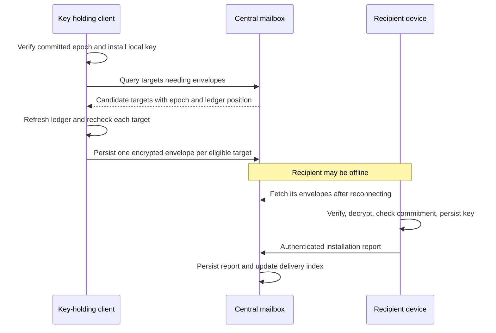

# Centralized epoch-key delivery

Status: draft
Translation: current

[中文](./e2ee-central-key-delivery.zh.md)

## Scenario and scope

A device publishes a new epoch while other authorized devices are offline. The
application uses a centralized durable mailbox so those devices can fetch their
individual encrypted key envelopes later. This is the selected integration model;
peer-to-peer reachability is not a prerequisite. Core now provides finite coordination, installation reports and reference stores.
Lab offers an opt-in HTTP/SQLite mailbox; its older scripted `keys` stream remains.
Hosted Convex integration still needs application work. This draft supplements the [ledger contract](./e2ee-ledger.zh.md).

## Responsibilities and flow

The committed, verified ledger determines device eligibility and the current
epoch. The server stores ciphertext and derives delivery indexes from that ledger;
it never receives plaintext epoch keys. The client rechecks every target returned
by the server and obtains its encryption key from its own verified ledger.

The publishing client starts durable fan-out work after verified publication and
local installation. Startup reconciliation must discover committed epochs whose
fan-out work was not scheduled before a crash. New device admission also starts
current-key delivery without requiring another epoch. Other eligible key-holding
clients may finish missing deliveries; this is not restricted to Owner/Admin.
All active recipient devices are included, including Guest, machines and recovery
R. The publishing device can report its local installation without sending to itself.

## Delivery state

Index work by `(genesis, epoch, recipient signing key)`, separate from the existing
sender-specific outbox ID and each envelope's digest. An epoch change or device
revocation makes old work ineligible for current delivery. Use a derived index
updated from accepted ledger changes and durable mailbox/report writes; do not
rescan the entire key stream for every target query or create a second role table.
The returned ledger position is diagnostic, not a permission or freshness proof.

| State                 | Meaning                                                                               |
| --------------------- | ------------------------------------------------------------------------------------- |
| NeedsEnvelope         | Eligible recipient has no stored envelope for this epoch.                             |
| EnvelopeStored        | Central storage has durably accepted a matching envelope.                             |
| InstallationReported  | The recipient has authenticated a report after verification and durable installation. |
| Ineligible / Obsolete | The recipient is revoked or the task concerns an older epoch.                         |

Expose `needsEnvelope` and `awaitingInstallationReport` separately. A stored envelope
with no report should remain available; absence of a report must not cause endless
new encryption. Recovery R normally stays offline and needs retained ciphertext,
not a mandatory online installation report. Rejected or unusable envelopes need
an explicit repair path; server acceptance cannot prove the secret matches its
commitment. An installation report describes a past client action, not proof of
continued key possession, current permission or decryptability after local data loss.

Reports bind protocol purpose, genesis, epoch, recipient and key commitment, and
are authenticated by the reporting device. Envelope-based installation additionally
binds sender and exact envelope digest. A publisher instead binds the exact verified
publication record hash; it has no received envelope. Initial local installation
uses equivalent verified-genesis provenance. Retry reports durably and idempotently;
persist receive context before the keyring write so a crash after key installation
can reconstruct an unsent report. Independent keyring/report stores require an
idempotent receive journal, not an assumed cross-store atomic transaction. Reports also bind a repair revision: a delayed pre-repair report cannot close a
later repair, and an old-epoch report cannot update the current epoch. Local key loss requires a repair
request rather than treating an old report as proof the key is still present.

## Authorization and recovery

Send only after device admission is verified. Refresh and recheck eligibility,
recipient encryption key and epoch before preparing and before sending/resuming
saved bytes. The central gateway also checks the authenticated sender, envelope
signature, recipient and epoch against its ledger before accepting a write. The
recipient independently verifies before installation and reports only after the
key is durable. A server work list is a hint, never permission to export a key.

Persist exact envelope bytes before sending; retries reuse them. Sender-specific
IDs may differ when another helper sends to the same recipient, so central status
must aggregate by recipient and epoch. Offline fetch and report processing must
be idempotent. A failed delivery does not undo ledger admission or publication.
Recovery tasks stop when the verified current epoch or recipient eligibility has
changed, and retain an application-visible terminal result across restart.

These checks do not prove global freshness or eliminate cross-stream races. Keep
the existing trusted-host/access-window assumptions. Revocation cannot erase an
already disclosed key; protecting subsequent content requires rotation excluding
the revoked device. This draft does not enable production E2EE.

## Reference implementation and Convex mapping

`LedgerClient.keyDistribution()` returns explicit reconcile, resume, receive, report,
repair and result-consumption operations. The application calls finite rounds on
startup, verified ledger changes and reconnect. Rotation itself starts no scheduler.
Receive checkpoints distinguish unverified ciphertext from commitment-checked
installation context, so an already-held key never substitutes for opening a new
unverified envelope. Atomic task/result commits make terminal outcomes restartable;
acknowledgement cannot be undone by a late duplicate completion.

The reference memory/Node host aggregates multiple sender frames by recipient/epoch,
retains exact ciphertext, and rebuilds only eligibility projection from verified
ledger authority. Node open never creates storage. Reference pages contain at most
100 entries; offset cursors are not stable snapshots and discovery must restart on
changes. Reference persistence is a 16 MiB document, not a production-scale database.
Accepted old ciphertext is retained, but current-key fetch/report admission requires
current device authority and epoch. No independent role table grants permission.

Proposed hosted mapping (outside public core):

| Table             | Identity / indexes                                                      | Transaction responsibility                                                                                                            |
| ----------------- | ----------------------------------------------------------------------- | ------------------------------------------------------------------------------------------------------------------------------------- |
| ledgerProjections | genesis; verified head/position/epoch/commitment and device eligibility | Apply verified increments without rollback; store synchronization checkpoint.                                                         |
| keyRecipients     | genesis/epoch/recipient; genesis/epoch/status/recipient                 | Derived state and repair revision; query missing envelopes and reports separately.                                                    |
| keyEnvelopes      | genesis/epoch/recipient/frameDigest; sender/deliveryId                  | Store exact signed ciphertext plus its recipient index in one mutation; retry by digest.                                              |
| keyReports        | genesis/epoch/recipient/revision/reportDigest                           | Verify device signature/source, store exact report and derived state in one mutation.                                                 |
| keyRepairs        | genesis/recipient/requestId                                             | Authenticated recipient-only, idempotent request; increment revision, invalidate older reported state, optionally exclude bad digest. |

Use bounded indexed queries/pagination; recipient fetch comes from the authenticated
session, not a caller-selected identity. Convex documents the transaction scope of
[mutations](https://docs.convex.dev/functions/mutation-functions) and explicit
[index queries](https://docs.convex.dev/database/reading-data/indexes/). Idempotency
requires querying the identity index and writing both data/index in that mutation;
it is not an assumed database uniqueness constraint.

The preferred admission verifier is the pinned browser-compatible noble Ed25519
implementation with canonical prime-subgroup A/R checks and `zip215: false`, keeping
deterministic verification in the mutation. Convex documents browser-like APIs and
Web Crypto but does not establish compatibility with this exact protocol/verifier.
Bundle and execute strict signature/proof/rejection vectors in the deployed default
runtime before enabling it. Node-only modules belong to actions, which cannot share
an external permission-stream transaction with mailbox writes; see
[runtime restrictions](https://docs.convex.dev/functions/runtimes). If verification
needs a Node action, pass exact-byte identity and projection head to a final internal
mutation that rechecks current projection before committing; an action result alone
must never authorize a stale write.

External Loro Streams permission/content transport need not migrate. A trusted
synchronizer verifies ledger increments and advances Convex's projection/checkpoint;
write admission must fail closed when its declared freshness/access window is not
satisfied. Host deployment must specify the refresh barrier/lease, lag handling and
revocation behavior. A Convex mutation is atomic only for its own tables: it is not
atomic with external Loro Streams changes. The Lab re-reads and verifies Riverrun
control at admission and again after asynchronous signature work, retaining the
existing external-stream race/freshness boundary.

## Implementation evidence and acceptance

- [Coordinator](../packages/e2ee-core/src/workflows/key-distribution.ts),
  [report/projection protocol](../packages/e2ee-core/src/pure/key-mailbox.ts),
  [ports](../packages/e2ee-core/src/ports/key-mailbox.ts),
  [admission host](../packages/e2ee-core/src/workflows/key-mailbox.ts), and
  [Node persistence](../packages/e2ee-core/src/platform/node-key-mailbox.ts).
- [Core acceptance](../packages/e2ee-core/test/central-key-delivery.test.ts) uses
  real signatures/HPKE and explicit failure boundaries: offline/R retention,
  genesis/rotation reporting, same-epoch admission, helper fan-out, duplicate/lost/
  delayed/old reports, unusable-envelope/local-loss repairs, revoked/obsolete work,
  SIGKILL after key installation/report queue/result commit, and durable consumption.
- [Lab acceptance](../packages/e2ee-lab/test/central-key-delivery.test.ts) uses real
  HTTP, SQLite and Riverrun; host/client restart preserves offline ciphertext,
  report status and results while authenticated fetch/repair rejects impersonation.
- No Convex deployment, production JWT/device binding, protected product keyring,
  cross-stream cutoff, hardware power-loss test or formal security proof is claimed.
