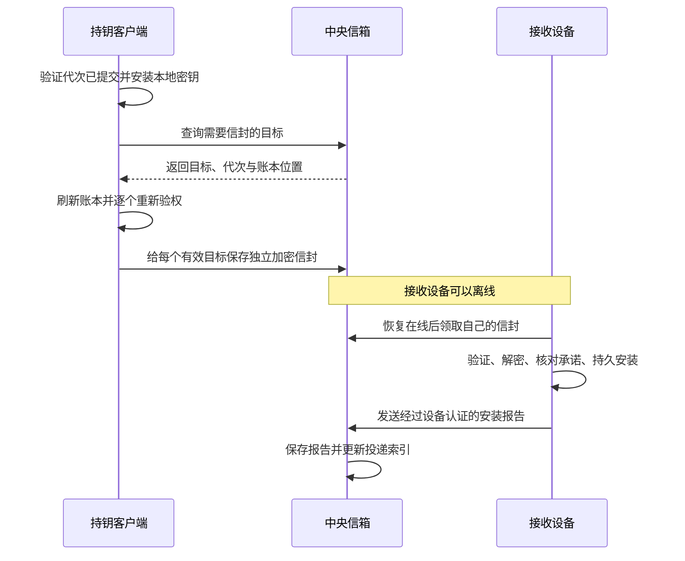

# 中心化代次密钥投递

Status: draft
Translation: current

[English](./e2ee-central-key-delivery.md)

## 场景与范围

设备发布新代次时，其他已授权设备可能离线。应用采用中心化持久信箱，保存给每台
设备单独加密的密钥信封，供其恢复在线后领取。这是选定的接入模型，不要求两台
设备同时在线或能建立点对点连接。core 已提供有限一轮协调、安装报告与参考存储；Lab 可显式启用 HTTP/SQLite
信箱，旧 `keys` 流仍保留。实际 Convex 宿主接线尚未完成。本草案补充[账本契约](./e2ee-ledger.zh.md)。

## 职责与流程

已提交、已验证账本决定设备资格与当前代次。服务器保存密文，并根据账本派生
投递索引，不接收明文组织密钥。客户端重新核对服务器返回的每个目标，并从自己
已验证的账本获取设备加密公钥。

发布客户端在验证提交成功并安装本地密钥后，启动可恢复的全设备分发任务。启动
恢复必须发现「代次已提交，但崩溃前尚未创建分发任务」的情况。新设备入账也触发
当前代密钥投递，不要求再次换代。其他具备转发资格且持有当前密钥的客户端可以
补发，不限于 Owner/Admin。接收目标包括全部当前有效设备：Guest、机器和恢复
设备 R 也包括在内。发布设备可报告本地安装，不必给自己发送信封。

## 投递状态

按 `(genesis, epoch, 接收设备签名公钥)` 索引任务，与现有按发送者区分的 outbox
ID 以及每份信封的摘要分开。换代或设备撤权使旧任务失去当前投递资格。索引由已
接纳的账本变化、持久信封与报告写入更新；查询目标不应每次扫描完整密钥流，也
不另建一份可独立授予权限的角色表。返回的账本位置用于定位，不证明权限或最新性。

| 状态                  | 含义                                                 |
| --------------------- | ---------------------------------------------------- |
| NeedsEnvelope         | 有资格的设备尚无该代已保存信封。                     |
| EnvelopeStored        | 中央存储已持久接纳对应信封。                         |
| InstallationReported  | 接收设备在验证并持久安装之后，提交了经过认证的报告。 |
| Ineligible / Obsolete | 设备已撤权，或任务属于旧代次。                       |

分别提供「缺少信封」与「尚无安装报告」列表。已有信封但没有报告时继续保留信封，
不能不断生成新的加密投递。R 平时不在线，需要保留密文，而不是强制取得在线安装
报告。被拒绝或不可用的信封需要明确补发路径；服务器接纳不证明其中秘密与承诺
一致。安装报告说明客户端过去完成过安装，不证明密钥一直存在、当前仍有权限，
也不保证本地数据丢失后还能解密。

报告绑定协议用途、genesis、代次、接收者和密钥承诺，由报告设备认证。通过信封
安装的报告还绑定发送者与完整信封摘要；发布设备没有收到信封，改为绑定精确的
已验证发布记录哈希。初始本地安装同理使用已验证创世来源。报告本身持久重试并
幂等；在写 keyring 前保存接收上下文，确保密钥安装后崩溃仍能恢复尚未发送的报告。
独立 keyring/报告存储使用幂等接收日志，不假设跨存储原子提交。报告还绑定修复
轮次，修复前的延迟报告不得覆盖新修复，旧代报告不得更新新代状态。本地丢钥必须能请求
修复，不能把过去的安装报告当成现在仍有密钥的证明。

## 验权与恢复

设备登记读回验证后才发钥。准备、实际发送及恢复已保存投递前，都刷新并重新核对
接收资格、公钥和代次。中央网关也根据账本核对认证发送者、信封签名、接收者与
代次后才接纳写入。接收端独立验证并安装，密钥持久保存后才报告。服务器的列表
只是候选任务，不能作为导出密钥的授权依据。

先持久保存精确信封，再发送；重试复用同一字节。不同补发者的 ID 可以不同，
中央状态应按接收设备与代次汇总。离线领取、报告处理都应幂等。投递失败不撤销
已经生效的设备登记或换代。恢复任务发现当前代次或目标资格变化时停止，并给应用
保留跨重启可见的终态结果。

这些检查不证明全局最新，也不消除跨流并发窗口；继续使用既有可信宿主与访问时限
假设。撤权不能抹掉已经交出的密钥，新内容通过排除被撤设备的换代保护。本草案
不启用生产 E2EE。

## 参考实现与 Convex 映射

`LedgerClient.keyDistribution()` 返回显式的协调、恢复、接收、报告、修复和结果消费
操作。应用在启动、已验证账本变化、联网恢复时调用有限一轮；换代本身不启动调度。
接收日志区分未验证信封和已核对承诺的安装上下文，已有本地钥不能替代打开新信封。
任务终态与未消费结果同一次提交，晚到的重复完成不能重新生成已确认消费的结果。

内存/Node 参考宿主按接收者/代次汇总多个发送者的精确信封，只从已验证账本重建
资格投影。Node open 不创建存储。每页最多 100 项；参考游标是位置，不是稳定快照，
状态变化后须重新发现任务。参考持久实现保存最多 16 MiB 的整体文档，不能替代生产
规模数据库。旧密文继续保留，但当前钥领取/报告须通过当前资格及代次检查。
不另建可独立授予权限的角色表。

托管映射提案（公共 core 不引入 Convex）：

| 表                | 身份与索引                                                | 同一次 mutation 的责任                                         |
| ----------------- | --------------------------------------------------------- | -------------------------------------------------------------- |
| ledgerProjections | genesis；已验证 head/position/epoch/commitment 与设备资格 | 不回退地应用已验证增量，保存同步检查点。                       |
| keyRecipients     | genesis/epoch/recipient；genesis/epoch/status/recipient   | 派生状态与修复轮次，分别查询缺信封和缺报告。                   |
| keyEnvelopes      | genesis/epoch/recipient/frameDigest；sender/deliveryId    | 精确签名密文与接收者索引同一次保存，按摘要幂等。               |
| keyReports        | genesis/epoch/recipient/revision/reportDigest             | 验证设备签名和来源，精确报告与派生状态同一次保存。             |
| keyRepairs        | genesis/recipient/requestId                               | 仅认证接收者请求，幂等增加轮次、清除旧报告状态，可排除坏摘要。 |

使用有界索引查询/分页，领取目标来自认证会话而不是请求自报身份。Convex 的
[mutation](https://docs.convex.dev/functions/mutation-functions)定义事务范围，
[索引查询](https://docs.convex.dev/database/reading-data/indexes/)须显式指定索引。
幂等需要在同一 mutation 查询身份索引并写密文/状态，不能假定索引自动保证唯一。

首选在 mutation 内使用固定版本的浏览器兼容 noble Ed25519，保留 A/R 规范编码、
非零素数子群检查与 `zip215: false`，验证保持确定性。Convex 文档列出类浏览器和
Web Crypto API，但不证明本协议/验签器已兼容。启用前须在真实默认运行时完成打包、
签名/证明与拒绝向量验收。Node 模块只能用于 action；action 不能让外部权限流与信箱
同一次提交，见[运行时限制](https://docs.convex.dev/functions/runtimes)。若验签需要
Node action，最终内部 mutation 必须绑定精确字节与投影 head，并再次检查当前投影；
不能单凭 action 返回结果接纳已过期写入。

权限账本和内容的 Loro Streams 运输不必迁移。可信同步器验证增量并推进 Convex 投影
和检查点；声明的新鲜度/访问时限不满足时拒绝写入。宿主须明确刷新屏障/租期、落后
处理与撤权策略。Convex mutation 只对本库表原子，不与外部 Loro Streams 变更原子。
Lab 在准入时重读验证 Riverrun control，并在异步验签后再次读取；仍有既有跨流并发
和新鲜度边界。

## 实现依据与验收

- [协调器](../packages/e2ee-core/src/workflows/key-distribution.ts)、
  [报告/投影协议](../packages/e2ee-core/src/pure/key-mailbox.ts)、
  [ports](../packages/e2ee-core/src/ports/key-mailbox.ts)、
  [准入宿主](../packages/e2ee-core/src/workflows/key-mailbox.ts)、
  [Node 持久实现](../packages/e2ee-core/src/platform/node-key-mailbox.ts)。
- [core 验收](../packages/e2ee-core/test/central-key-delivery.test.ts)使用真实签名/HPKE
  与明确故障位置，覆盖离线/R 保留、创世/换代报告、同代设备、补发者、重复/丢失/
  延迟/旧代报告、坏信封与丢钥修复、撤权/换代终态、安装/报告入队/结果保存后的
  SIGKILL 重启，以及显式消费结果。
- [Lab 验收](../packages/e2ee-lab/test/central-key-delivery.test.ts)使用真实 HTTP、
  SQLite 和 Riverrun；宿主/客户端重启保留离线密文、报告状态与结果，认证领取/修复
  拒绝冒充。
- 未验收 Convex 部署、生产 JWT/设备绑定、产品受保护 keyring、跨流截止、硬件断电
  或正式安全证明，不宣称生产已上线。
