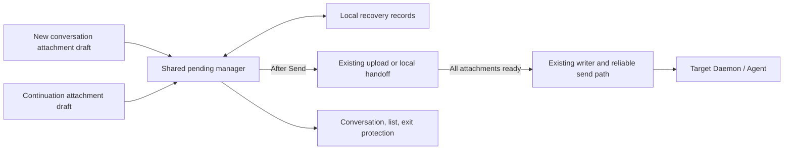

# Attachment drafts and pending messages

Status: draft
Translation: current

[中文](session-files.zh.md)

## Abstract

- **Use attachment drafts in both new conversations and continuations.** Picking, dropping, or pasting images/files performs preliminary validation and local preview only; attachments remain removable/replaceable. Existing transfer starts on Send.
- **An independent manager takes over the complete input.** After successful saving, release the composer and show pending messages/progress while allowing conversation navigation. Completion updates only the original target without navigating back or clearing newer drafts.
- **Submit only when every attachment is ready.** One failure preserves the whole message for retry/cancellation. Same-session submissions retain takeover order, including later text-only messages; different sessions progress independently.
- **Share the flow and accept both entry points separately.** New conversations retain the reserved session ID and a reachable pending view. Continuations freeze this turn's configuration and use existing direct/queue/guide handling without changing the preceding active turn.
- **Retry, exit, and recovery preserve content without duplicate submission.** Keep turn identity fixed; distinguish local acceptance, persistence, and Daemon receipt. Reconcile uncertain results. Close/reload protection covers unfinished tasks; mobile recovery uses confirmed retries, without promising transfer after application exit.
- **Adopt Effect in stages for tasks and resources.** Extract submission boundaries, take over resources, complete submission/delivery ownership, then deliver drafts for both entry points together. The first three stages keep transfer on addition; components retain ordinary interfaces and Effect stays inside the workspace service. Persistence, cross-window exclusion, and submission reconciliation still need explicit implementation.
- **This PR owns the draft lifecycle only.** Reuse existing upload, local handoff, fallback, and backfill semantics. Original-path references, permanent zero upload, and their protocol/Daemon work belong to a [separate follow-up PR](local-attachment-references.md), not a dependency. Text-to-file conversion and an image editor are also excluded. The four-layer implementation is available for review; this Spec remains draft and packaged-device acceptance is still outstanding.

## 1. Scenario and PR scope

On either new-conversation landing or an existing conversation, the user adds attachments and reviews/edits the draft before sending. Send creates a local pending message and lets the user work elsewhere. Actual submission follows confirmed completion of all attachments; returning exposes progress, failures, and retry.

Leaving a conversation means navigation inside its hosting page. Leaving the page includes close, reload, external navigation, or runtime destruction. The former continues work; the latter warns. Attachment services may receive files first, but cannot cause early Agent execution of this message. Existing tasks and non-executing warmup remain separate.

This PR covers new conversations, existing-session continuations including children, images, ordinary files, and attachment-only messages. Desktop/mobile layouts share the lifecycle; native mobile-shell recovery needs acceptance in its owning repository. Public desktop retains the [platform boundary](../packages/platform/AGENTS.md); unifying draft handling cannot add cloud capabilities.

| Current PR                                                                                                                                   | Separate follow-up PR                                                                                                                                                     |
| -------------------------------------------------------------------------------------------------------------------------------------------- | ------------------------------------------------------------------------------------------------------------------------------------------------------------------------- |
| Draft validation/preview, takeover, delayed existing transfers, progress, cancel/retry, submission/recovery, acceptance of both entry points | Original local paths, permanently local generated attachments, new reference protocol/authorization/capabilities, Daemon resolution, removal of automatic upload/backfill |

The PRs can be reviewed and delivered independently. This PR changes no attachment wire types, existing path-copy/materialization behavior, upload service APIs, fallback, or backfill policy; client transfer helpers may add cancellation options. Electron lifecycle ownership includes draft exit protection. The later PR plugs into the same preparation boundary without rebuilding drafts or orchestration. OS background transfer, cross-device unsent draft sync, automatic text-file conversion, a new image editor, and new Agent-output policies are excluded. Existing folded text still expands on Send.

To reduce adoption risk, section 11.6 proposes three prerequisite refactoring PRs merged in sequence, followed by the complete draft feature in a fourth PR. “This PR” elsewhere in this document means that draft feature PR; its acceptance is not split between creation and continuation. Upload-free local communication remains separate follow-up work.

## 2. Inspected implementation and gaps

These observations concern this checkout, not deployed acceptance. Evidence paths are at the end.

| Current behavior                                                                                                      | Change in this PR                                                                              |
| --------------------------------------------------------------------------------------------------------------------- | ---------------------------------------------------------------------------------------------- |
| New/existing sessions transfer images/files on addition, orchestrated by components/hooks                             | Validate/preview on addition; a shared manager calls transfer after Send                       |
| Unsuccessful images block sending, but failed ordinary files are filtered out                                         | Require every attachment; never silently reduce the set                                        |
| Landing and existing conversations maintain separate attachment/submission state                                      | Share draft/takeover contracts; only final creation versus continuation differs                |
| Same-machine files use temporary files/CLI blob storage; legacy local data may backfill and some paths may fall back  | Delay existing calls until Send without redefining transport or claiming permanent zero upload |
| Send helpers generate IDs per invocation; append does not deduplicate IDs; initial meta/history writes are concurrent | Freeze IDs, reconcile through the existing writer, and recover partial success                 |
| Writer acceptance is a local CRDT write; workspace navigation disposes runtime                                        | Define persistent handoff, recovery records, and exit protection                               |
| Electron `before-quit` destroys relays and stops CLI first                                                            | Check/confirm pending work before cleanup                                                      |

The renderer currently authors messages through WorkspaceWriter / SessionData / HistoryWriter. Older comments must not restore CLI proxy-authoring. Retain the [single history writer](session-history-writes.md).

## 3. Responsibilities and ownership



| Responsibility                                                           | Owner                                                                                |
| ------------------------------------------------------------------------ | ------------------------------------------------------------------------------------ |
| Text, mention spans, references, attachment order, pre-send editing      | Composer draft; components do not own background tasks                               |
| Takeover, transfer, cancellation, retry, order, reconciliation, recovery | Manager in shared components, independent of conversation mounting                   |
| Creation parameters/reserved session ID or existing-session target       | Snapshot builders at both entry points, passed to the common manager                 |
| Upload or existing local handoff                                         | Existing platform transport capabilities returning existing SessionInputBlock values |
| History/queue mutation and dispatch                                      | Existing WorkspaceWriter / SessionData / HistoryWriter and send mechanisms           |
| Local pending storage and window/application exit                        | Platform storage and Electron main/renderer lifecycle                                |

The manager sits above landing, conversation pages, and mobile panels and lives until its host page exits. Workspace switching does not introduce multiple long-lived runtimes; resolve pending work before disposing the old runtime.

Recovery records are isolated by platform/account/workspace/session and hold fixed identity, creation parameters if applicable, input snapshot, sources/results, intent, and stage. They do not belong to the shared Session Doc. Progress, File/Blob objects, object URLs, tokens, and recovery locks stay out of synchronized messages. Real messages retain existing attachment representations.

Within one browser storage domain or Electron data directory, one executor owns each record. Local exclusion coordinates claims, ordering, and eligibility; another window cannot duplicate execution, and a former owner cannot submit. Different devices/storage domains retain existing collaboration behavior without global click-time ordering.

## 4. Attachment draft lifecycle

### 4.1 Addition, editing, and leaving the composer

Pick/drop/paste only checks type, count, empty files, and existing size limits, retaining File/Blob sources and bounded local previews. Show “Pending upload” or “Pending preparation” for existing local paths. Do not upload, hash the full file, invoke local handoff, or use executable pending history/queue rows as draft storage.

Users may remove attachments or replace draft sources before Send. Invalid attachments must not remain as silently omitted inputs. Revoke unused object URLs on removal/replacement while preserving data owned by another draft or accepted pending task. Navigating away from a conversation or landing and returning preserves attachments, text, references, and ordering within the same scope; restoring names without usable File/Blob data is insufficient.

Changing target/configuration updates the draft and necessary validation without triggering upload. Removing all attachments before Send creates no transfer. Existing folded-text expansion stays intact; no new text-file conversion or image-editing UI is added.

### 4.2 Reuse existing transfer after Send

After Send and successful takeover, retain existing platform/target routing to upload or local handoff. Use current results and SessionInputBlock types, without new local-path references. Legacy `transport: local` readiness means the target can use the attachment through its existing path; it does not promise permanent zero upload and does not require waiting for background backfill in this PR.

Cloud readiness requires a valid final response; 100% byte transfer while server verification remains pending is not ready. Existing local handoff uses its current success response. Existing fallback remains capability-gated, with no expanded authority from the draft refactor. UI must not represent local preparation using fictional network-upload percentages.

Only explicit successful attachment results become ready. Failure/cancellation cannot become success by filtering attachments. Reuse confirmed results within the same task and retry only failed/expired ones; submission failure does not retransmit everything. Image transfers also support cancellation, and obsolete completions cannot trigger submission.

## 5. Complete new-conversation and continuation flows

| Stage                    | New conversation                                                                                   | Existing-conversation continuation                                                         |
| ------------------------ | -------------------------------------------------------------------------------------------------- | ------------------------------------------------------------------------------------------ |
| Add attachments          | Belongs to the landing draft with text, references, and reserved session ID                        | Belongs to the current workspace/session; navigation cannot mix drafts                     |
| Send                     | Freeze creation/input/configuration and reuse reserved ID; clear only after takeover               | Freeze this turn's input/configuration/target; clear only after takeover                   |
| Transfer                 | Openable pending view/list entry independent of real meta; user may begin another new conversation | Pending row alongside existing Agent activity; user may navigate or draft the next message |
| All ready                | Create session and first message using the same ID, handing off once                               | Use the same turn ID through existing direct/queue/guide, handing off once                 |
| Failure/retry            | Retain creation parameters, text, and all attachments; no replacement session ID                   | Retain original target/input; do not reread another currently viewed conversation          |
| Success                  | Merge placeholder with real session/first message without taking navigation                        | Merge placeholder with history/queue without clearing a newer draft                        |
| Cancel before submission | Remove this task without creating an empty session; preserve any newer landing draft               | Cancel only this unsubmitted task, not the Agent or existing queue entries                 |

Both entry points call the same takeover/preparation service, not separate upload/retry/cancel state machines. Final creation and continuation adapters differ, while snapshots, readiness, and failure semantics are identical. A busy Agent cannot cause an executable queue row before attachments are ready. Transfer or cancel new-session warmup leases instead of relying on an unmounted hook.

## 6. Takeover, states, and ordering

### 6.1 Send boundary

After synchronously excluding double submission, freeze text, mention spans, code/visual references, attachment order, creation parameters, target, Role/revision, model/mode/permissions, MCP selection (including an explicit empty array), and submission intent. The attachment snapshot retains the File/Blob sources, order, and existing prepared results at Send. Later Role/configuration edits cannot replace this snapshot. Revocation, machine removal, and session archiving are rechecked before submission.

Takeover succeeds only when the manager holds a recoverable record and required source data. Then clear this draft and release the composer. Preserve existing click-time mobile keyboard dismissal without automatically refocusing after save failure. While saving, show “Saving pending content”; preserve input on failure. File/Blob sources and pending content on every platform follow section 9, without depending on future local-reference registration. Old asynchronous callbacks cannot clear a newer draft.

### 6.2 Minimal message states

| State                          | Meaning and actions                                                                                     |
| ------------------------------ | ------------------------------------------------------------------------------------------------------- |
| Pending/preparing              | Hash, existing upload/local handoff, or server verification; cancelable                                 |
| Waiting for previous message   | Preparation may proceed, but an earlier message is neither handed off nor canceled; cancelable          |
| Preparation failed/interrupted | Not submitted; keep the whole message for failed-attachment retry or cancellation                       |
| Submitting                     | Entering writer/queue handoff; no promise of cancellation                                               |
| Reconciling send result        | Write, persistence, or handoff is uncertain; reconcile without blind resubmission                       |
| Handed off                     | Existing local send system has taken persistent responsibility; it owns later delivery/execution status |
| Canceled                       | Reachable only before submission; late preparation completion cannot revive the message                 |

Message phase and resource lifetime are separate; handed-off messages may still have persistent delivery work. Each attachment has readiness or a specific preparation phase. Byte progress and server verification are separate; 100% transfer without confirmation is not ready. Local handoff does not invent upload percentages. Cancellation covers every preparation phase: cooperative I/O actually stops; noncancelable operations lose submission eligibility and clean up as section 11.4 specifies. Attempt generations ignore obsolete results.

Within one client storage domain, each session enters the send system in takeover order, including later text-only messages. A failed/uncertain A holds B until A is canceled or confirmed handed off. Different sessions can progress concurrently with bounded global transfers. Tune concurrency through load validation rather than making it a protocol constant.

### 6.3 Direct, queue, and guide

The local pending list is separate from the Daemon message queue. Before attachments are ready, neither executable history nor queue rows may serve as placeholders. Uploads do not hold the direct-dispatch lock.

Freeze user intent and configuration, while checking Agent activity again at actual submission. Ordinary sends safely enter existing direct/queue handling; an Agent becoming busy during upload must not cause interruption of its new task. Explicit queue intent remains queued.

Guide fixes its target assistant turn. If that turn ends before preparation finishes and no steer was attempted, visibly convert to a normal follow-up queue entry, never guide a different turn. After a steer attempt, authoritative no-active-turn may reuse the same ID for follow-up where the existing protocol proves non-submission; other failed/unknown acknowledgments require reconciliation and do not establish non-application. Applied steer follows the [existing history contract](session-history-writes.md) and must not execute again as an ordinary message.

## 7. Submission identity, persistence, and first sessions

Takeover assigns stable submission/turn identity, preserving the existing `userTurnId` relationship between queue and history. Queue-row identity also remains stable. Do not generate new message IDs per retry. Check existing identity and matching input inside the existing writer's local serialized boundary; mismatching content is a conflict, not permission to overwrite.

A fixed ID alone cannot prevent duplicate LoroList append. Implementation must validate cross-window exclusion, writer reconciliation, queue promotion, and reconnect. Sending twice with the same ID is not itself deduplication. The guarantee is that one local submission does not manufacture duplicate messages, not a new distributed exactly-once Agent execution mechanism.

Recovery uses the existing HistoryWriter to prepare exact CRDT operations on a temporary fork. Persist the original baseline first, save the operation bytes in a strict IndexedDB transaction, then import into the live document and flush. Replaying the same operations is idempotent; never re-append after an uncertain receipt. Imported operations require explicit repo synchronization because the current Streams adapter only subscribes to local edits. A successful target transport sync is a durable handoff, not proof that the Agent executed the message. Submission and delivery use separate per-session Web Locks; delivery checks earlier unfinished turns before dispatch. Recovery records are account/workspace scoped and windows exchange invalidations only.

Distinguish three evidence levels:

1. **Writer acceptance:** local CRDT mutation, without proof of disk persistence or Daemon receipt.
2. **Safe handoff:** input, initial metadata if needed, and subsequent dispatch/queue information are held by the existing persistent send path and can advance after recovery. Only then release unnecessary draft content and this submission's exit guard; outstanding delivery obligations remain in recoverable records owned by workspace tasks.
3. **Target receipt/execution:** show only with existing Daemon/Agent evidence; a connected synchronization channel does not establish receipt.

Errors distinguish definitely unwritten from uncertain. Definitely unwritten submissions may retry with the same ID and prepared attachments. Unknown results first reconcile history, queue, and handoff state. Absence in an offline replica does not prove no write occurred. An acceptance acknowledgment without proven safe handoff retains recovery state and attachment references.

New sessions retain the landing's reserved session ID and creation parameters, including project/branch and Agent. During preparation, use an openable local placeholder and list entry without requiring real session metadata. Create the actual session after all attachments are ready. Recover meta-only and history-only partial success against the same session, never a replacement ID. Explicitly transfer or cancel the landing's ACP preparation lease rather than relying on an unmounted hook; canceling warmup and starting normally is acceptable.

When actual history or queue content becomes visible, replace the placeholder by fixed turn identity without disappearance or duplication. Repairing placeholder metadata must not overwrite subsequent real-session edits from another window.

## 8. Presentation and exit protection

| Surface/stage                    | Presentation and behavior                                                                        |
| -------------------------------- | ------------------------------------------------------------------------------------------------ |
| Composer                         | Pending preparation / Pending upload; remove or replace before Send                              |
| Local preparation                | “Preparing files · Not sent,” with existing handoff completion semantics                         |
| Remote transfer                  | “Uploading files; message not sent,” with per-file progress and reliable byte totals             |
| Server confirmation              | “Verifying files,” even at 100% byte transfer                                                    |
| Failure                          | Name affected attachment and reason; preserve whole message with Retry / Cancel send             |
| Unknown result                   | “Confirming send result”; do not claim the Daemon has not received it                            |
| Sidebar/mobile home              | Preparation/upload/failure indicator; new sessions are openable too                              |
| Agent processing an earlier turn | Preserve Agent activity and add a separate pending indicator; uploading does not mean Agent busy |

Use i18n and accessible status names, not only spinners. Subscribe by affected message and throttle progress rather than repainting the entire list per part event. Completion updates only the original target, never navigation.

### 8.1 Browser and application navigation

Install `beforeunload` while the page owns records not safely handed off or explicitly canceled, including failed and uncertain records. Remove it when none remain. Call `preventDefault()` and set compatible `returnValue`. Browsers control the dialog text; the page cannot mandate a custom unsaved-edits sentence or guarantee that mobile fires the event.

Conversation switches and panel closes that retain runtime do not prompt. Workspace switching, logout, cache clearing, and application-driven reload first show a clear in-app warning, defaulting to Stay. Before submission, offer “Cancel pending sends and leave.” During submission/uncertainty, say it may already have been sent and retain reconciliation state rather than promising recall. Logout/cache clearing cannot silently erase uncertain records: cancel exit if unresolved; forced clearing explicitly discloses possible delivery and loss of recovery data.

### 8.2 Electron

Main aggregates unfinished state from all product windows. Close/reload checks affected windows; application exit/update/cache clearing checks all windows. Confirm before setting quitting state, destroying relays, or stopping the CLI. Canceling exit keeps those resources usable. Hiding a live window continues work.

Updates pass the same guard before invoking installation shutdown, not only through `before-quit`, because update shutdown closes windows in a different order. Exclude newly accepted work during exit confirmation and avoid repeated dialogs for repeated quit events. A nonresponsive renderer timeout is not “no pending messages”; use main's last known state and an explicit forced-exit warning. Persisted interrupted records remain recoverable after restart.

## 9. Local recovery and cleanup

The first version preserves recoverable content without promising transfers after page exit. All platforms store accepted snapshots, source File/Blob data, and stages in local IndexedDB or an equivalent platform store. Electron uses this draft-recovery mechanism too, without depending on future original-path registration. Recovery data is a local copy of unsubmitted content, not a new SessionInputBlock or permanent local-attachment protocol. Recreate object URLs after restart and obtain credentials from the original account/workspace capability for each attempt, never from stored tokens.

Persistent saving is a takeover prerequisite. Quota failure, disabled storage, or source read errors preserve the draft rather than claiming background sending. Large local saves need visible progress/failure. Define quotas and expiry explicitly; do not reclaim pending, failed, or uncertain messages to make space silently.

Switching apps or locking the device may suspend processing; foreground return refreshes real state. After restart, preparation-stage records show “Send interrupted; retry available.” Recheck account, workspace, machine, and authorization before user-directed recovery; do not automatically execute old messages. Submission-stage records reconcile acceptance/handoff by the same ID first, rather than retrying as incomplete uploads. Already-accepted delivery obligations may resume synchronization; they do not authorize a new turn or repeated Agent execution. Recovery claims obey the same single-executor rule.

Cancellation or safe handoff releases pending source Blobs/object URLs once no underlying operation or preview still uses them. Committed attachment storage and cleanup retain existing transport lifecycles and are not deleted by draft cleanup. Upload cancellation promises not to submit the message, not immediate physical deletion of temporary remote bytes. Reuse existing abort/cleanup capabilities rather than inventing a backend deletion protocol.

Storage eviction, disk damage, user clearing, and forced process termination are outside an unconditional recovery guarantee. Recovery must not disclose signed-out account content to another account. Privacy clearing and unresolved submissions require explicit user choices.

## 10. Acceptance criteria

These are implementation acceptance requirements, not product tests completed by this change. Use synthetic files, controllable Promises, fault injection, and actual transport observation rather than user attachments or sleep races.

| ID  | Trigger                                                                                              | Observable result                                                                                                                                |
| --- | ---------------------------------------------------------------------------------------------------- | ------------------------------------------------------------------------------------------------------------------------------------------------ |
| A01 | Pick, paste, or drop images/files before Send                                                        | No attachment upload, full hash, or local handoff; validation/local preview work                                                                 |
| A02 | Take over A, navigate to B, then finish A's preparation                                              | Only A receives input; B's draft/config/navigation remain; new-session placeholder is reachable                                                  |
| A03 | One of two attachments succeeds, or byte transfer is complete but verification pending               | No history/queue/dispatch submission; failed file is not omitted                                                                                 |
| A04 | Double Send, repeated Retry, obsolete completion after cancellation                                  | No duplicate takeover/submission; canceled work never revives                                                                                    |
| A05 | Attachment message A fails, followed by text B; another session C is healthy                         | B waits while C progresses; B can hand off after A is canceled                                                                                   |
| A06 | Change Role/model/permissions/MCP/text after takeover                                                | Frozen configuration and correct spans remain; revocation blocks submission rather than substituting configuration                               |
| A07 | Add new-conversation attachments, leave/return to landing, send, then start another draft            | Restore text/attachments/configuration; retain original session ID after takeover; completion preserves newer draft                              |
| A08 | Draft attachments in existing A, switch to B and return, send A and edit the next message            | Isolated A/B drafts; A completion preserves next input and does not require its composer to remain mounted                                       |
| A09 | New/continuing conversation sends image-only, file-only, mixed attachments, or text plus attachments | Takeover works; preserve type/count/order/text/references; submit only when all ready                                                            |
| A10 | Remove/replace attachments or change target before Send; empty/oversized input in both entry points  | No automatic transfer; use final draft only; visible errors, no silent omissions, unused previews released                                       |
| A11 | Retry/cancel failed first attachments in a new conversation and failed transfer in an existing one   | Preserve whole input, retry failed attachments only; no duplicate new session or interruption of existing Agent                                  |
| A12 | New-session warmup exists, then landing unmounts after takeover or pending send is canceled          | Explicit lease transfer/cancellation; no lost task, duplicate startup, or cancellation of another draft warmup                                   |
| A13 | Lost write acknowledgment, queue promotion, partial initial meta/history                             | Reconcile original IDs; one logical message/session; uncertainty stops resubmission                                                              |
| A14 | Failure after writer acceptance but before persistence/dispatch handoff                              | Recovery record remains; local acceptance is not shown as Daemon receipt                                                                         |
| A15 | Guide target ends during preparation, or applied steer acknowledgment is lost                        | Never-attempted guide queues as follow-up; attempted steer reconciles without duplicate ordinary execution                                       |
| A16 | Browser close/reload, Electron auxiliary-window close/quit/update, another window's pending work     | Correct guard scope; canceled exit preserves CLI/relay; hide can continue                                                                        |
| A17 | Quota failure, restart, native mobile reclaim, simultaneous window recovery                          | Preserve draft on save failure; recover interruption; one executor per record; reconcile unknown outcomes first                                  |
| A18 | Both entry points use existing upload/local handoff, including fallback and legacy local data        | Only transfer timing changes; existing attachment types, fallback/backfill, materialization, and image semantics remain; no new cloud capability |

Applicable A01–A06, A09–A11, and A13–A18 scenarios must be accepted on both new-conversation and continuation surfaces and desktop/mobile layouts, not only a shared helper. A07/A12 specifically cover new conversations, and A08 covers continuations.

The [finite model](models/session-files.model.ts) checks only declared draft-submission gates, readiness, ordering, and state decisions. It does not establish disk durability, browser lifecycle, or real Agent behavior. Final acceptance includes packaged Electron, browsers, native mobile, and representative adapters. Public component tests cannot establish private-shell/service integration.

## 11. Effect TS integration and implementation order

### 11.1 Scope and module boundaries

Use the repository-pinned **Effect 3.18.4** to manage pending-send work. React/Jotai retain draft editing and view subscriptions; asynchronous work after takeover belongs to a `PendingSendService` independent of component mounting. This is the proposed implementation, not product integration already completed.

| Coupled module                                             | Current lifetime / dependency                                                                                            | Integration responsibility                                                                                                                                                                        |
| ---------------------------------------------------------- | ------------------------------------------------------------------------------------------------------------------------ | ------------------------------------------------------------------------------------------------------------------------------------------------------------------------------------------------- |
| Composer / `useComposerSubmission`                         | Mount-scoped submission token also owns double-submit protection, keyboard, and focus                                    | Keep the UI token for snapshot saving/takeover; workspace owns background work; clear only the original draft and never steal focus on background completion                                      |
| Landing / child-session drafts                             | Reserved IDs, tab aliases, parent parameters, cleanup, and navigation share creation callbacks                           | Separate pending views from real meta; freeze parent/target, merge placeholders by ID; navigation failure cannot delete a written session                                                         |
| `useSessionPreparation` / CLI preparation service          | Hook debounce/idle timers and cancel RPC; CLI hard TTL, compatibility check, and resource claim                          | Frontend owns lease control, not ACP itself; first version releases warmup on attachment takeover with owned cancellation cleanup, allowing normal cold start on actual send                      |
| File/image transfer / Electron handoff                     | Hash Worker, XHR, retries, main temporary files, and CLI blobs have different owners                                     | Preparation Scope owns cooperative client resources; retain raw ownership of noncancelable IPC; main/CLI still clean up their own resources                                                       |
| Configuration / MCP / Role / access / billing capabilities | Read from several hooks/component closures, with values changing during waits                                            | Freeze user input/configuration; recheck eligibility at commit; dynamically obtain credentials/routing and revalidate automatic resume pointers instead of freezing old ACP identity              |
| History/queue writer                                       | Store borrowing has finally; initial meta/history run concurrently; writer currently does not execute dispatch arguments | Retain the single writer; extract UI-independent submission covering fixed IDs, partial-success reconciliation, local flush, and dispatch/queue activation data                                   |
| Session store / room sync / caches / prefetch              | Separate store references and sync leases; cache disposes/unloads after final release                                    | Borrow stores briefly for writes/reconciliation and sync leases for synchronization; release only owned borrows, never dispose a shared store; preparation/offline parking retain no full history |
| `requestSessionDispatch` / CLI watcher / history gate      | RPC carries full input and ACKs a stash; history continues syncing; CLI serializes execution                             | Workspace owns delivery follow-through; distinguish ACK, persistence, sync, and execution; preserve CLI deduplication/history gate without making Agent execution a renderer child                |
| Direct/queue/guide / other message entry points            | Presence, unfinished history, direct-submit lock, queue editing/promotion interact                                       | All ordinary new-message producers share session submission eligibility; briefly read fresh routing state; existing queue edits, Stop, and edit/resend retain their own contracts                 |
| Visual comments / preferences / analytics / list state     | Accepted callbacks mark comments submitted, record recent runs, clear references, and scroll                             | Draft cleanup follows takeover; submission side effects follow real commit evidence, never resend accepted messages on their failure; upload progress remains separate from Agent presence        |
| Workspace / account / windows / exit                       | Token updates can retain runtime; each window has a repo/cursor namespace; exit releases transport/CLI                   | Token refresh does not rebuild service; identity/topology changes use guards; cross-window recovery checks the original persisted replica; service drains before dependencies                     |

Existing reconnect code uses Effect clocks/fibers; the file-index cache uses Scope. Their injection and asynchronous release patterns are useful references, but remaining Promises/manual state do not establish complete structured task ownership. This PR does not additionally rewrite reconnect, file caching, or the entire workspace runtime.

### 11.2 Explicit lifetime tree

Proposed resource ownership follows. Persistent recovery records are not temporary Scope resources.

```text
one workspace runtime generation
└─ Send service ManagedRuntime / service Scope
   ├─ preparation task → attempt Scope (hash, upload, progress, waits)
   ├─ submission task → short writer/store borrow
   ├─ post-submit delivery attempt → store/sync leases, RPC, reconciliation
   └─ necessary cleanup of late preparation/IPC results

React composer: short takeover and focus token only
CLI Agent / backfill: separate owners, not renderer child tasks
Persistent recovery records: survive task parking and process exit
```

Compose the service and injectable storage/transport/submission dependencies using `Layer.scoped`, with one `ManagedRuntime` owned by the workspace. After takeover returns, work explicitly uses `forkIn` with a service-owned Scope; do not attach it to the short-lived button invocation fiber or use an unowned `forkDaemon`. Scopes group resources that stop/release together, not every function. Preparation completion cannot terminate registered delivery work. Failed/offline records park in storage without indefinitely retaining fibers/open stores where avoidable. Storage, transport, and submission boundaries suffice; avoid a Layer per helper or a ManagedRuntime per message.

`acquireRelease` / finalizers release owned Workers, listeners, and session resource leases. Actual preview owners release their URLs; recovery Blobs, successful attachments, and written messages follow section 9 instead of unconditional deletion on Scope closure. Ordinary failure ends its own task without terminating the service or another session.

### 11.3 Concrete cross-module handoffs

**UI takeover and actual submission differ.** The composer receives “saved and owned,” not “history written.” Retain `useComposerSubmission` locking, immediate mobile keyboard dismissal, and desktop one-shot focus policy for the short takeover phase. Save failure preserves drafts without automatically refocusing mobile. Move visual-comment `mark-submitted`, recent run settings, and submission analytics to actual acceptance/handoff events instead of reusing the old meaning of `onSendMessage === true`. Failed bookkeeping retains diagnostics/needed follow-up work without resending messages or overwriting newer drafts/comments.

**Creation includes child drafts.** Integrate `draft-session-chat-interface` / `session-detail.handleSendDraft`. Freeze parentSessionId, project, machine, child tab ID, and future session ID; leaving the parent during upload cannot retarget work. Rebuild promotion aliases from pending records on return. Distinguish definite rejection from partial creation; a broad catch must not delete an accepted child because navigation/analytics failed. Explicit deletion/closure of a draft or Side Chat containing pending work handles that record; ordinary panel hiding does not cancel it.

**Warmup is a disposable optimization.** Current `handoffToSession()` only drops hook references/timers and returns a boolean; it is not a resource handle suitable for a long upload. First version stops draft warmup scheduling on attachment takeover and gives the service ownership of “await start settlement, then cancel the exact preparationId.” Do not claim transfer to an actual session or extend CLI TTL. Cancel failure cannot lose the message; CLI expiry/compatibility checks remain, and cold start is valid. Attachment-free sends retain existing valid warmup reuse. Keeping warmup through uploads later requires explicit lease handoff/expiry rather than captured hook closures.

**Freeze choices; refresh runtime facts.** Text, attachments, Role revision, model/permissions, MCP including `[]`, tool switches, project, and guide target are fixed. Runtime-injected capabilities supply credentials, routing, access/billing eligibility, archive/deletion, and busy state. Preserve existing offline/indeterminate-access rules rather than blanket denial or fabricated permission; token refresh does not retransmit successful attachments. Automatic acpSessionId/resume is a runtime pointer revalidated at submission; explicit fork/edit-resend targets retain their own contracts and cannot be arbitrarily rewritten as ordinary delayed input.

**Ordinary new messages share submission.** Continuation text-only sends, plan execution, and toolbar-generated ordinary prompts cannot bypass same-session FIFO. Extract the existing route resolver and preserve queueing behind unfinished history when presence is absent; a component-local direct lock cannot coordinate multiple surfaces. Already-handed-off queue editing/reordering/promotion and Stop are not owned by preparation Scope; ordinary sends cannot bypass edit/resend's rewrite barrier. Classify guide as applied, authoritatively not submitted, or unknown. Existing `no-active-turn` may promote the same ID where its protocol proves no submission; other false/timeout results do not prove nonapplication.

**Delivery has a separate owner.** Current `requestSessionDispatch` starts sync waiting, RPC, and a metadata pointer write; writer dispatch arguments do not perform those actions. Extract them into submission adapters and workspace-owned delivery tasks. Retain RPC acceleration without waiting for remote sync to clear the composer. RPC carries full input and CLI may execute early, but ACK proves stash/deduplicated receipt rather than persisted history/meta. Continue history synchronization for CLI TurnHistoryGate ordering; local submission need not wait for an entire Agent turn to end.

The proposed local handoff boundary requires fixed-ID history/queue plus required metadata/activation data confirmed through repo local persistence, with delivery obligations durably registered. Preparation can then finish and unused source Blobs release; the same recovery record may compact into a smaller delivery record until sufficient target sync/receipt evidence retires that obligation. Closing upload Scope must not also interrupt delivery; never delete recovery then launch an unowned Promise. RPC timeout calls for reconciliation, not another append. No new message protocol is introduced.

**Store borrowing differs from sync borrowing.** Use existing cache/writer borrows for writing/reconciliation and independent leases for sync. Finalizers release their own borrow, never store.dispose()/repo.unloadDoc() behind the UI. A late asynchronous acquire must still release its handle after interruption; `tryPromise` must not discard it. acquireRelease masks acquisition by default, so assess acquisition wait bounds instead of blocking exit indefinitely. Active sync attempts retain necessary stores; offline backoff releases stores/connections and reacquires later. Delivery works without mounted UI without creating a transport or Mirror per upload.

Current waitUntilSynced(signal) can return on abort and selected detached bindings, and its transport-ready wait does not yet forward cancellation. Promise resolution is therefore not a sync receipt. The submission adapter must distinguish local durability, confirmed target-binding sync, interrupted/disconnected, and uncertain outcomes, including late-join cleanup. Reuse runtime routing/recovery rather than creating a reconnect loop per message.

**Cross-window recovery is not another Ref.** Repo and cursors currently use window namespaces. Pending records may coordinate in the storage domain, but a new window's empty replica does not prove another window never submitted; consult original durable state or authoritative acceptance. Token refresh preserves ownership. Account/workspace/local-runtime-setting changes that destroy runtime/routing checkpoint state, fence the old generation, and follow shutdown order. Recheck archive/deletion before submission; recovery cannot resurrect a deleted session from an uncertain record.

### 11.4 Transitions, cancellation, and retry

An immutable record and centralized synchronous transition function check runtime generation, ownership, attempt, and phase. Ref.modify can integrate this with Effect, or encapsulated ordinary variables can implement it: correctness comes from transition rules and no await between check/update. Serialize/version-check recovery writes and checkpoint fixed identity/submitting before invoking the writer. Platform coordination separately owns cross-window exclusion.

Preparation completion, cancel, retry, and submit use this entry point. A cancellation winning ready → canceled blocks late readiness; a submission winning ready → submitting permits only confirmation/reconciliation. Waiting for predecessors holds no upload capacity or dispatch lock. Semaphore bounds actual in-flight transport, not entire message network waits.

Connect existing file hash/upload AbortSignals to Effect; add xhr.abort() and listener release to image postMultipartWithProgress. Replace multipart void fetch(DELETE) with owned bounded cleanup preserving the original error. Noncancelable Electron File.arrayBuffer()/IPC revokes submission eligibility but retains raw Promise/capacity ownership until settlement; late results only clean up without submitting or cloud fallback. Main temporary files and CLI blobs/backfill keep their existing owners; draft finalizers cannot delete handed-off attachments.

Distinguish validation, storage, authorization, retryable transport, and uncertain submission. Interruption cannot trigger failure fallback. Keep one part-retry layer; migration to Schedule removes the old loop, without whole-write/steer retries. Record individual attachment successes and isolate failures between messages. Never wrap whole uploads, IPC, or network sync in uninterruptible; it cannot make CRDT, disk, and RPC transactional.

### 11.5 Workspace shutdown order

For normal workspace/account changes, section 8's confirmation precedes navigation/React unmounting. Then stop takeover and revoke old work's submission eligibility → checkpoint interrupted/uncertain state → interrupt/join cooperative tasks and account for unsettled raw IPC → await record persistence and service Scope closure → destroy session caches, transport, and repo. Repeated dispose returns the same completion result.

React cleanup in `RuntimeProvider` cannot make React await asynchronous disposal; the guard and wait belong to the explicit leave flow. Runtime's asynchronous `dispose()` still enforces internal resource order. While raw work remains unsettled, normal leave waits or lets the user stay. Forced leave retains recovery records; Electron main continues existing IPC temporary-file cleanup, and late renderer callbacks cannot access the old repo. Timeout is not safe handoff. Forced process termination/mobile reclamation cannot guarantee finalizers, so recovery depends on previously persisted checkpoints rather than a final exit-time flush.

### 11.6 Staged adoption and acceptance

Complete ownership changes before changing transfer timing. The following four PRs merge in sequence, each with observable completion conditions. Split by responsibility rather than individual files or screens; shipping first and patching failures later is not acceptance.

| PR                                    | Complete responsibility delivered                                                                                                                                                                                                                                                                                                                                              | User behavior and merge conditions                                                                                                                                                                                                                                                                                                                                                                                                                                                                                    |
| ------------------------------------- | ------------------------------------------------------------------------------------------------------------------------------------------------------------------------------------------------------------------------------------------------------------------------------------------------------------------------------------------------------------------------------ | --------------------------------------------------------------------------------------------------------------------------------------------------------------------------------------------------------------------------------------------------------------------------------------------------------------------------------------------------------------------------------------------------------------------------------------------------------------------------------------------------------------------- |
| 1: Extract submission boundaries      | Extract a UI-independent submission entry from components/hooks, retaining separate creation, continuation, and guide adapters. Pass target, input, and configuration explicitly; React retains focus/navigation. Reuse existing types and writer without inventing a general task framework.                                                                                  | Preserve transfer timing, routing, and side-effect timing. Behavioral tests at actual boundaries compare message content, configuration, creation/queue results, and draft preservation on failure across new, child, continuation, and other ordinary-message sources. Record existing defects as counterexamples with an owning later stage, not expected correct behavior; do not promote old booleans into durability guarantees.                                                                                 |
| 2: Own asynchronous resources         | Introduce one workspace Effect runtime for uploads, hashing, image processing, multipart cleanup, and store/sync borrows. Expose ordinary Promise/cancellation/subscription interfaces. Each migrated resource has one acquisition, retry, and release owner.                                                                                                                  | Transfer still starts on addition; behavioral improvements are limited to explicit cancellation and cleanup. Verify actual underlying cancellation, late IPC/handles, preservation of UI-shared stores, stopped retries, and workspace shutdown order, rather than only fiber termination. Resources introduced here must have complete exit cleanup in this PR.                                                                                                                                                      |
| 3: Own submission and delivery        | Move already-prepared messages into the service: stable identity, recovery intent recorded before submission, serialized writes/reconciliation, explicit uncertain outcomes, and registered independent delivery. Define local persistence and target-sync receipts plus original-replica recovery. Ordinary messages share ordering while retaining direct/queue/guide rules. | Transfer timing remains unchanged; this is an explicitly scoped reliability change. Verify partial writes, lost ACKs, UI unmounting, offline operation, restart, and cross-window claiming. Never blindly retry uncertainty; distinguish authoritative guide non-submission. Submission does not await remote sync or full Agent execution; annotation/configuration/analytics bookkeeping follows actual acceptance stages. Complete record quotas, retention, exit handling, and recovery compatibility in this PR. |
| 4: Deliver complete attachment drafts | Switch new conversations, children, and continuations together to transfer after Send. Save complete input before clearing drafts; connect pending views, progress, failed-item retry, cancellation, FIFO including text, warmup release, and platform exit/recovery.                                                                                                          | Only this cutover promises the Spec's draft experience. Set file-storage quotas/retention first and preserve drafts on save failure. Run A01–A18, E01–E12 below, and relevant platform acceptance. Landing alone is insufficient; exit, failure, and recovery are not deferred patches.                                                                                                                                                                                                                               |

During adoption:

- **One actual executor per responsibility.** Old hooks and the new service never both orchestrate the same message/attachment. The migrating PR removes the previous owner. Pure results and synthetic fixtures may be compared; production uploads, history writes, and dispatch must not run twice. Uncertain submission never automatically falls back to legacy sending.
- **Keep Effect inside asynchronous services.** Do not rewrite components, Jotai, or pure TypeScript state solely for adoption; Ref.modify remains optional. Reuse the writer, caches, transport/reconnect, and CLI. Do not combine adoption with protocol redesign, an Effect major upgrade, or upload-free local references. Keep pinned 3.18.4.
- **Verify each newly owned real boundary.** Observe successful content/state and control failure, cancellation, late completion, and shutdown with explicit signals. Add actual storage/recovery acceptance when persistence is introduced. Compare behavior and interaction latency/resource use for pure migrations; investigate meaningful regressions before layering on the next stage. Test counts and small probes do not replace these conditions.
- **Switch whole service versions.** Prefer independent PRs and internal builds over long-lived dual implementations. If a temporary switch is necessary, select it before workspace service startup. In-flight work keeps its owner; per-message splitting must not break ordering.

Rollback is a completion condition for each PR. Before recovery records exist, refactoring can be reverted after in-flight operations finish. Once records exist, stop takeover, finish or reliably retain in-flight work, and return only to a compatible version that can recognize and process those records. Do not merely revert to code that ignores them, delete unfinished records, or resend uncertain messages through the old path. PR 3 cannot ship while record compatibility and original-replica recovery remain undefined; PR 4 cannot be enabled early.

Add the following checks with their owning responsibilities, then run them together for complete draft acceptance:

| ID  | Deterministic check                                                                      | Required observable outcome                                                                                             |
| --- | ---------------------------------------------------------------------------------------- | ----------------------------------------------------------------------------------------------------------------------- |
| E01 | Release preparation after Send returns/component unmounts, then close workspace          | Original task continues; closure awaits cleanup; no callback accesses destroyed repo                                    |
| E02 | Explicitly order ready/cancel/retry in both directions                                   | One valid transition; obsolete attempt cannot revive; later messages obey FIFO                                          |
| E03 | Cancel image XHR/hash; release late noncancelable IPC                                    | Cooperative work really stops; late IPC neither submits/falls back nor prematurely releases actual in-flight capacity   |
| E04 | Writer produces a side effect before interruption/lost acknowledgment                    | Keep recovery record and reconcile original ID without blindly writing again                                            |
| E05 | One attachment/session fails while another succeeds                                      | Preserve success; other sessions continue; failed message stays complete                                                |
| E06 | Cancel retry wait, block async cleanup, claim from two windows                           | TestClock/explicit signals control steps; no late retry, correct close order, one executor in the actual storage domain |
| E07 | Cancel before acquire returns; UI and send share a store                                 | Release late handles; ending send drops only its own reference, leaving UI valid                                        |
| E08 | All conversation UI unmounts; RPC ACK precedes disconnected history/meta sync            | Owned recoverable delivery continues; no duplicate append or treating detached/abort as sync success                    |
| E09 | Warmup start arrives late, upload exceeds lease lifetime, new draft warms up             | Clean up exact old lease without canceling new draft; actual send may cold-start                                        |
| E10 | Switch parent tab, change ACP resume, revoke/archive, edit annotations during upload     | Preserve target/user choices; revalidate runtime identity/eligibility; old bookkeeping preserves newer content          |
| E11 | Navigation fails after child write; applied steer ACK lost; authoritative no-active-turn | Preserve child identity, reconcile uncertainty without duplicate execution, transition only on proven non-submission    |
| E12 | Window B claims A's uncertain record with no turn in B's replica                         | Reconcile rather than treating empty replica as rejection; restart continues existing delivery without a new turn       |

Use `Deferred`, explicit Promise gates, and `TestClock`, not real sleeps or a guessed number of microtask flushes. The [Effect probes](models/session-files.effect-probe.mjs) pass six boundary cases covering Promise interruption, signals, Scope cleanup, generations, and two current store-ref-tracker.ts cases with synthetic stores: releasing late acquisition and preserving UI-owned resources. They do not establish E01–E12 or product integration acceptance.

Original-path wire/IPC, file registration authority, local image adaptation, and old-Daemon compatibility remain in the [follow-up PR](local-attachment-references.md), not prerequisites for adopting Effect.

## 12. Evidence and verification status

Inspected source: `8c429a890037c5b21855ce7ef9f59e3677c25a38`. This Spec and the [decision note](../.agents/notes/proposed/architecture/2026-09-14-deferred-attachment-send.md) are design artifacts. This revision defines the PR split and Effect lifecycle proposal without changing product behavior or running device send acceptance.

- New conversations: `packages/components/src/components/chat/chat-landing.tsx`, `hooks/use-chat-landing-{file-draft,image-draft,draft-session}.ts`.
- Continuations: `packages/components/src/components/sessions/session-chat-input-area.tsx`, `session-chat-interface.tsx`.
- Shared boundaries: `packages/components/src/lib/{electron-session-file-sender,session-file-upload,session-image-upload,multipart-upload}.ts`, `hooks/use-session-actions.ts`, `providers/{runtime-provider.tsx,workspace-writer-impl.ts}`; `packages/shared/src/{history-writer,session-input,message-schemas}.ts`, `session-data/loro.ts`.
- Exit lifecycle: `apps/electron/src/main/index.ts` and `main/window.ts`.
- Current explanations: [CLI attachment lifecycle](../.agents/docs/cli-lib-session-files.md), [composer/run configuration](../.agents/docs/sessions-run-config.md). Existing decisions: [workspace draft isolation](../.agents/notes/implemented/bug-fix/2026-09-11-workspace-window-composer-drafts.md), [context copy and withdrawn text-attachment experiment](../.agents/notes/implemented/feature/2026-09-09-conversation-context-fallback.md).
- Platform references: [Electron quit/update ordering](https://www.electronjs.org/docs/latest/api/app#event-before-quit), [browser beforeunload limits](https://developer.mozilla.org/en-US/docs/Web/API/Window/beforeunload_event).

- Existing Effect use: `pnpm-workspace.yaml` pins 3.18.4; `src/providers/local-reconnect-loop.ts`, `src/lib/code-collab-file-index-cache.ts`, and `tests/local-reconnect-loop.test.ts` provide partial examples; `src/providers/create-workspace-runtime.ts` owns asynchronous teardown. Paths are under `packages/components` except the workspace configuration.
- Official Effect 3.18.4 API source: [Scope/fiber ownership](https://github.com/Effect-TS/effect/blob/effect%403.18.4/packages/effect/src/Effect.ts), [Promises and cancellation signals](https://github.com/Effect-TS/effect/blob/effect%403.18.4/packages/effect/src/Effect.ts), [ManagedRuntime](https://github.com/Effect-TS/effect/blob/effect%403.18.4/packages/effect/src/ManagedRuntime.ts), [TestClock](https://github.com/Effect-TS/effect/blob/effect%403.18.4/packages/effect/src/TestClock.ts). Actual probes used a temporary 3.18.4 installation without changing repository dependencies.

- Coupled lifecycle evidence: `packages/components/src/components/chat/submission/use-composer-submission.ts:44`; `hooks/use-session-preparation.ts:113`; `components/sessions/{session-detail.tsx:1979,session-chat-interface.tsx:2394}`; `providers/{workspace-writer-impl.ts:76,create-workspace-runtime.ts:3854,store-ref-tracker.ts:212}` (the latter groups are relative to `packages/components/src/`). CLI: `apps/cli/src/session/{session-preparation-service.ts:142,session-dispatch-watcher.ts:681,turn-history-gate.ts:5}`.

## Implementation evidence and compatibility

The stack implements the Promise submission boundary, Effect resource ownership, durable submission journal, and send-time attachment preparation in that order. The journal writes local record version 2 with attachment Blob snapshots; it can read version 1. Older version-1 readers reject version 2 rather than submit incomplete input. Rollback must retain records and use a compatible reader. The recorded source replica is the window that actually prepares the CRDT operations, which may differ from the admitting window.

Picking attachments performs no transfer. Accepted draft sources survive renderer restart; recovery presents an explicit retry instead of automatically sending old messages. Successful per-file receipts are reused. Target acknowledgement releases source Blob references; abandoned uploads retain the existing service cleanup policy. A canceled first message transfers pending creation metadata to its next saved message, keeping that conversation reachable.

Deterministic source tests cover failure with partial success, late cancellation, cross-connection cancellation fencing, persisted source bytes, first-message cancellation, immutable operation replay, and current billing checks. Repository checks are implementation evidence; packaged desktop, real multi-window networking, and the separately owned native mobile shell still require device acceptance.
