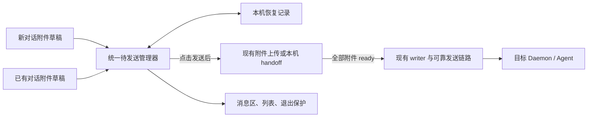

# 附件草稿与待发送消息

Status: draft
Translation: current

[English](session-files.md)

## 摘要

- **新对话和已有对话都采用附件 draft 模式。** 选择、拖入、粘贴图片/文件只做初步校验和本地预览，可移除、替换；点击发送才调用现有附件传输。
- **点击发送后由独立管理器接管完整输入。** 保存成功后释放输入框，显示待发送消息和上传进度，允许切换会话；完成时只更新原目标，不抢回导航或清理新草稿。
- **全部附件就绪才真正提交。** 一个失败就保留整条消息，支持重试和取消；同会话按接管顺序提交，后发纯文本不越过前面的附件消息，不同会话独立推进。
- **两类入口共用流程，分别验收。** 新对话保持预留 session ID 和可返回的待发送入口；已有对话冻结本轮配置并接入现有 direct/queue/guide，不改变正在执行的上一轮。
- **重试、退出和恢复不丢内容、不重复提交。** 固定 turn ID，区分本地接受、持久化与 Daemon 接收；结果未知先核对。关闭/刷新保护覆盖未完成任务，移动端恢复后确认重试，不承诺应用退出后继续上传。
- **建议分阶段用 Effect 管理任务与资源。** 先抽提交边界，再接管资源，再完善提交/投递，最后同时交付两类入口的 draft。前三步保留添加即传的时机；组件保留普通接口，Effect 留在 workspace 服务内部。持久化、跨窗口互斥与提交结果核对仍需明确实现。
- **当前 PR 只落实 draft 生命周期。** 复用现有云端上传、本机 handoff、fallback 和 backfill 语义；原路径直引、永久零上传及相关协议/Daemon 改动属于[独立后续 PR](local-attachment-references.zh.md)，不作为本 PR 的依赖。长文本转文件和图片编辑器也不在本版。本文仍为待审阅草稿，尚未实现。

## 1. 场景与 PR 范围

用户在新对话输入页或已有对话输入框里添加附件，发送前可检查和修改草稿。点击发送后转为本机待发送消息，允许用户去处理其他会话；全部附件传输确认后再进入真正的发送链路。返回原会话可查看进度、失败原因或重试。

“离开会话”指同一承载页面内导航；“离开页面”包括关闭、刷新、外站跳转或应用销毁 runtime。前者继续处理，后者须提示。附件服务可以先接收文件，但不能提前让 Agent 执行这条消息；已有任务和无执行副作用的启动预热不受影响。

本 PR 覆盖新建会话、已有会话继续发送（含子会话）、图片、普通文件及纯附件消息。桌面和移动布局使用同一生命周期；原生移动壳的恢复接入在其所属仓库验收。公开桌面端仍遵守[平台边界](../packages/platform/AGENTS.md)，不能为了统一 draft 流程引入原本不存在的 cloud capability。

| 当前 PR                                                                        | 独立后续 PR                                                                                        |
| ------------------------------------------------------------------------------ | -------------------------------------------------------------------------------------------------- |
| 草稿校验/预览、发送接管、现有传输延后、进度、取消/重试、提交与恢复、双入口验收 | 本机原路径引用、无路径内容的永久本地附件、新引用协议/授权/能力协商、Daemon 解析、取消自动上传/补传 |

两者可独立审阅与交付。当前 PR 不改变附件 wire 类型、既有路径复制/物化方式、上传服务接口、fallback 或 backfill 策略；客户端传输 helper 可以补齐取消参数；Electron 仍需为 draft 的退出保护调整生命周期。后续 PR 接入相同准备边界，不重做草稿和发送编排。系统级后台上传、跨设备未发送草稿同步、长文本自动转文件、新图片编辑器及新的 Agent 输出策略均不在本版；已有折叠文本继续在发送时展开。

为降低接入风险，建议将三项前置整理独立为依次合并的 PR，完整 draft 功能在第四个 PR 交付，详见第 11.6 节。本文“当前 PR”指该 draft 功能 PR；其验收范围不按新建/继续对话拆开。本机跳过上传仍是另一项后续工作。

## 2. 当前实现与落地差距

以下是本 checkout 的源码观察，不代表部署验收。完整路径集中在末尾证据区。

| 当前行为                                                                                                      | 本 PR 的调整                                               |
| ------------------------------------------------------------------------------------------------------------- | ---------------------------------------------------------- |
| 新建及已有会话添加图片/文件后立即传输，状态编排依赖组件/hooks                                                 | 添加只校验、预览；统一管理器在点击发送后调用传输           |
| 图片未成功会阻止发送，普通文件失败却被过滤掉                                                                  | 统一等待全部附件；不静默减少附件                           |
| landing 与已有会话分别维护附件和提交状态                                                                      | 共用草稿/接管契约，仅创建会话与继续发送的最终动作不同      |
| 同机文件经临时文件/CLI blob store；旧 local 数据可补传，部分路径可 fallback                                   | 将这些现有调用延后到发送，不重写其传输语义；不是永久零上传 |
| `startSession` / `addSessionHistory` 每次生成 ID，HistoryWriter append 不按 ID 去重；首次 meta/history 并行写 | 固定提交 ID，通过现有 writer 核对并恢复部分成功            |
| writer 接受只表示本地 CRDT 写入；工作区切换会销毁 runtime                                                     | 定义持久交接、恢复记录和退出保护                           |
| Electron `before-quit` 先销毁 relay 并关闭 CLI                                                                | 先检查待发送任务和确认，再执行清理                         |

当前 renderer 通过 WorkspaceWriter / SessionData / HistoryWriter 写用户消息，不能依旧注释恢复“Electron 由 CLI 代写”。继续沿用[唯一历史 writer](session-history-writes.zh.md)，不引入第二套历史写入。

## 3. 职责与数据归属



| 责任                                                | 归属                                                          |
| --------------------------------------------------- | ------------------------------------------------------------- |
| 输入文字、mention spans、引用、附件顺序与发送前编辑 | 输入框草稿；组件不拥有后台任务                                |
| 接管、传输、取消、重试、顺序、结果核对与恢复        | shared components 中不依赖会话组件挂载的管理器                |
| 首次创建参数与预留 session ID / 既有会话目标        | 两个入口的快照构造；统一传给管理器                            |
| 文件上传或已有本机 handoff                          | 现有平台传输能力，成功后返回现有 SessionInputBlock            |
| 消息/队列写入和发送                                 | 既有 WorkspaceWriter / SessionData / HistoryWriter 与发送机制 |
| 本机待发送数据保存、窗口/应用退出                   | 平台存储能力及 Electron main/renderer 生命周期                |

管理器至少高于 landing、会话页和移动面板，活到承载页面退出。不为切工作区引入多个长期 runtime；销毁旧 runtime 前处理其待发送任务。

恢复记录按平台/账户/工作区/会话隔离，持有固定身份、创建参数（如有）、输入快照、附件源及成功结果、发送意图和阶段。它不属于共享 Session Doc；上传进度、File/Blob、object URL、token 和恢复锁都不写入共享消息。真实消息仍使用现有附件表示。

同一浏览器存储域或 Electron 数据目录内，同记录只有一个执行者。通过本地互斥协调领取、排队序号和提交资格；其他窗口不重复执行，失去所有权的旧执行者不能提交。不同设备/存储域之间不承诺点击时间的全局顺序，继续现有协作规则。

## 4. 附件 draft 生命周期

### 4.1 添加、修改与离开输入框

选择、拖入或粘贴时，只检查类型、数量、空文件和现有大小限制，保存 File/Blob 与有界本地预览，显示“待上传”（已有本机传输路径可显示“待准备”）。不启动上传、全量 hash 或本机 handoff，也不将普通 pending history/queue 当草稿存储。

发送前可移除附件或替换草稿来源；失败校验不得留下会被静默忽略的附件。移除、替换后释放不再使用的 object URL，不释放其他草稿或已接管任务仍使用的源数据。切换会话或暂时离开 landing 再返回，同一作用域内的附件、文字、引用与顺序仍在，不能只恢复附件文件名而丢失 File/Blob。

发送前改变目标或运行配置只更新草稿并重新做必要校验，不自动上传。未点发送就移除全部附件，不产生传输任务。已有折叠文本仍由原有逻辑展开；不新增文本转文件或图片编辑 UI。

### 4.2 发送时复用现有传输

点击发送并成功接管后，按既有平台与目标选择上传或本机 handoff；复用上传结果和已有 SessionInputBlock，不新加本地路径引用类型。旧 `transport: local` 就绪仍表示该目标可按旧链路使用附件，不表示永久不上传，也无需在本 PR 改成等待后台 backfill 完成。

云端上传需要最终有效响应，传输 100% 仍在服务端校验不能 ready。本机 handoff 按现有响应判断就绪；原有 fallback 仍受平台 capability 限制，不因 draft 重构扩大。哪条现有链路被使用是传输实现细节，UI 不能把本机准备伪装成网络上传百分比。

管理器只接收明确的附件成功结果；失败/取消不能通过过滤附件变成成功。重试复用同任务已确认结果，只重新处理失败或已失效的结果；提交失败不重新上传所有附件。图片传输也须支持取消，旧代次的完成不能再触发提交。

## 5. 新对话与已有对话的完整流程

| 阶段          | 新对话                                                             | 已有对话继续发送                                                    |
| ------------- | ------------------------------------------------------------------ | ------------------------------------------------------------------- |
| 添加附件      | 归属当前 landing 草稿，与文字、引用和预留 session ID 一起保存      | 归属当前 workspace/session，切换会话不串草稿                        |
| 点击发送      | 冻结创建参数、输入和配置，沿用预留 ID；仅接管成功才清该份草稿      | 冻结本轮输入/配置/目标；仅接管成功才清该份草稿                      |
| 上传期间      | 有独立于真实 meta 的可打开待发送视图和列表入口；可继续开其他新对话 | 原会话显示待发送消息，原有 Agent 活动继续；可切会话或继续编辑下一条 |
| 全部就绪      | 用同一 ID 创建会话及第一条消息，只交接一次                         | 用同一 turn ID 进入现有 direct/queue/guide，只交接一次              |
| 准备失败/重试 | 保留创建参数、文字及所有附件；重试不生成新 session                 | 保留原目标和输入；重试不读取当前正在看的其他会话                    |
| 成功          | 占位合并成真实会话/首条消息；不抢回导航                            | 占位与实际 history/queue 合并；不清后来编辑的下一条草稿             |
| 提交前取消    | 移除该待发送任务，不创建空会话；保留用户另外开始的新草稿           | 仅取消该未提交任务，不停止 Agent 或取消已有队列消息                 |

两个入口调用同一接管与准备服务，不能保留两套独立的上传、重试或取消状态机。首次创建与已有会话的最终提交适配不同，但输入快照、就绪条件和失败语义一致。已有会话不能因为点击时 Agent 正忙，就在附件未准备完前写入可执行队列。新对话的预热 lease 要移交或取消，不依赖卸载后的 hook 自动完成。

## 6. 接管、状态与顺序

### 6.1 点击发送的边界

同步防双击后，冻结文字、mention spans、代码/视觉引用、附件顺序、创建参数、目标、Role 及其版本、模型/模式/权限、MCP 选择（含显式空数组）和发送意图。附件快照保存点击发送时的 File/Blob、顺序及现有已准备结果。角色或配置后来改变不能替换这份快照；权限撤销、机器移除和会话归档须在提交前重新检查。

接管成功表示管理器持有可恢复记录和所需的源数据，才清理本次草稿并释放输入框；移动键盘仍在点击发送时按现有策略收起，保存失败不自动重新聚焦。保存期间显示“正在保存待发送内容”；失败则保持原输入。各平台的 File/Blob 与待发送内容按第 9 节保存；不依赖后续 PR 的本机引用登记。旧异步回调不能清理用户后来输入的草稿。

### 6.2 最小消息状态

| 状态              | 含义与允许动作                                          |
| ----------------- | ------------------------------------------------------- |
| 待准备 / 准备中   | hash、现有上传/本机 handoff 或服务端校验；可取消        |
| 等待上一条        | 附件可独立准备，但前一条尚未交接或取消；可取消          |
| 准备失败 / 已中断 | 尚未提交；保留整条内容，重试失败附件或取消              |
| 提交中            | 进入 writer/队列交接；不再提供“取消发送”承诺            |
| 正在确认发送结果  | 写入、持久化或交接结果未知；仅核对，不盲目重发          |
| 已交接            | 本地发送系统已持久接管；投递/执行状态由现有机制继续展示 |
| 已取消            | 仅提交前可到达；晚到的准备结果不得复活消息              |

普通消息状态与准备/投递资源的存活分别管理；已交接消息可能仍有持久投递任务。单附件记录 `ready` 或具体准备阶段；上传的 byte progress 与服务端确认分开。传输 100% 但尚未确认时不 ready。不对本机 handoff 伪造上传百分比。取消须覆盖所有准备阶段；可取消的 I/O 实际停止，不能取消的操作按第 11.4 节撤销提交资格并收尾，使用 attempt 代次忽略旧结果。

同一客户端存储域内，同会话按接管顺序进入发送系统，包括后续纯文本消息。A 失败或结果未知时 B 等待，取消 A 或确认 A 已交接后才放行 B。不同会话可并行，全局传输有界；具体并发值通过负载验证确定，不作为协议常量。

### 6.3 direct / queue / guide

管理器的待发送记录与 Daemon 的消息队列是两层：附件就绪前，不能写入可执行的 history 或 queue 来占位。上传不能占住 direct dispatch 锁。

冻结的是用户意图和配置，真正提交时仍检查 Agent 当前是否忙。普通发送安全地进入现有 direct/queue 路径，不因上传期间 Agent 开始工作而中断其新任务。明确的 queue 意图仍进入队列。

guide 冻结所指向的 assistant turn。准备完成前该 turn 已结束且从未尝试 steer 时，改为普通后续排队并在 UI 说明，不改为引导另一个 turn。已尝试 steer 后，权威 `no-active-turn` 若按现有协议明确证明未提交，可沿用同 ID 转后续发送；其他失败/未知回执须核对，不能证明未应用。已应用的 steer 按[现有历史契约](session-history-writes.zh.md)处理，不能再次作为普通消息执行。

## 7. 提交身份、持久化与首次会话

接管时产生固定 submission/turn 身份；沿用已有 `userTurnId` 与 queue → history 的身份关系，不添加一套随重试变化的消息 ID。队列项自身也保持稳定身份。检查同 ID 是否已存在以及输入是否相同，需在现有 writer 的本机串行边界完成；内容不一致就是冲突，不能覆盖。

固定 ID 本身不能阻止 LoroList 重复 append。实现必须验证同记录多窗口互斥、writer 核对、队列提升及重连行为，不能把“请求发了两次但 ID 一样”当成成功去重。保障目标是一次本机提交不制造重复消息，不宣称提供新的分布式 exactly-once Agent 执行机制。

恢复通过现有 HistoryWriter 在临时 fork 上准备精确的 CRDT 操作。先持久化原始基线，再用严格 IndexedDB 事务保存操作字节，最后导入实时文档并 flush。重放同一操作不会重复 append；回执未知时禁止重新 append。当前 Streams 适配器只监听本地编辑，因此导入操作后必须显式执行 repo 同步。目标 transport 同步成功只代表持久交接，不代表 Agent 已执行。提交和投递分别使用会话级 Web Lock；投递前检查更早的未完成消息。恢复记录按账号和 workspace 隔离，窗口之间只广播失效通知。

区分三层证据：

1. **writer 接受**：本地 CRDT 已变更，不代表数据已写盘，更不代表 Daemon 收到。
2. **安全交接**：输入、创建元数据（如有）以及后续 dispatch/queue 所需信息已由现有持久发送路径接管，恢复后仍能推进。达到这个条件才释放不再需要的草稿内容、解除本次退出保护；尚未完成的投递义务继续以可恢复记录交给 workspace 任务，不能直接删除。
3. **目标接收/执行**：只有现有 Daemon/Agent 证据支持时显示；同步连接成功不是接收证据。

提交报错须区分确定未写和结果未知。确定未写可沿用同一 ID 重试，不重传已准备成功的附件；未知则先查原 history、queue 和交接状态。离线副本里查不到不等于没写过。收到接受回执但未证实安全交接时继续保留恢复记录；附件引用也不能提前清理。

新会话复用 landing 预留的 session ID，并保存 project/branch、Agent 等创建参数。准备期间用本机可打开的占位视图和列表项，不依赖真实 session meta 已存在。全部附件就绪后创建真实会话；meta 已写/history 未写、history 已写/meta 未写分别补齐同一会话，不能重建新 ID。原页面的 ACP preparation lease 必须移交或取消，不能依赖卸载后的 hook；允许取消预热后正常启动。

真实 history 或 queue 可见时，用固定 turn ID 将占位替换成同一行，不短暂消失或出现两行。补齐待发送占位的元数据也不能覆盖其他窗口后来修改的真实会话数据。

## 8. 展示与离开保护

| 位置/阶段            | 展示与行为                                             |
| -------------------- | ------------------------------------------------------ |
| 输入框附件           | 待准备 / 待上传；支持移除和发送前替换来源              |
| 本机准备             | “正在准备文件 · 尚未发送”，完成条件沿用现有 handoff    |
| 远程传输             | “文件上传中，消息尚未发送”，逐附件进度及可信字节总量   |
| 服务端确认           | “正在校验文件”，即使字节传输为 100%                    |
| 失败                 | 明确失败附件与原因，整条消息保留“重试 / 取消发送”      |
| 结果未知             | “正在确认发送结果”；不能显示“Daemon 尚未收到”          |
| 侧栏/移动首页        | 对应会话的准备/上传/失败标记，新会话也可打开           |
| Agent 正在处理上一条 | 保留 Agent 状态，另加待发送标记；上传不冒充 Agent busy |

全部文案进入 i18n；可访问名称表达状态，不能仅靠 spinner。按受影响消息订阅并节流进度，避免每个分片事件重绘整个列表。完成仅更新原目标，不改变当前导航。

### 8.1 浏览器和应用内导航

有尚未安全交接或明确取消的记录时，在承载页面安装 `beforeunload`，包含失败和结果未知任务；全部结束后移除。调用 `preventDefault()` 并设置兼容性的 `returnValue`。浏览器弹窗文案由浏览器决定，不能指定“现在有未保存的编辑”，也不能保证移动端触发。

切换会话、关闭不销毁 runtime 的面板不弹框。切工作区、退出账户、清缓存或主动刷新前，用应用内对话框说明未发送内容，默认留下。提交前可选择“取消待发送并离开”；提交中/结果未知只能说明“可能已发送”，保留核对记录，不能提供假的撤回承诺。退出登录/清缓存不得静默抹掉这种不确定记录：无法核对时可取消退出；强制清除须明确披露可能已发送和恢复数据会丢失。

### 8.2 Electron

main 汇总所有产品窗口的未完成状态，窗口关闭/重载检查受影响窗口，应用退出/更新/清缓存检查所有窗口。确认必须在设置退出标记、销毁 relay、停止 CLI 之前完成；取消退出时这些资源均保持可用。普通 hide 继续任务，不视为真正关闭。

更新安装须在调用退出安装入口之前经过同一保护，不能只依赖 `before-quit`，因为更新退出的窗口关闭顺序不同。确认期间防止新任务越过退出检查，重复 quit 不重复弹框。renderer 不响应时不能将超时当成“没有待发送消息”；使用主进程最近的状态和明确的强制退出提示。已持久保存的中断记录仍供重启恢复。

## 9. 本地恢复与清理

首版采用“可恢复内容，但不承诺离页继续传输”。各平台将已接管输入、源 File/Blob 和阶段存入本机 IndexedDB 或等价平台存储。Electron 也复用此草稿恢复方式，不把后续的原路径登记作为恢复前提。恢复数据只是未提交内容的本机副本，不是新的 SessionInputBlock 或永久本地附件协议。object URL 恢复时重新创建，token 每次从原账户/工作区能力获取，不写进记录。

持久保存是接管条件：配额不足、存储禁用、文件读取失败时不清空草稿，也不假装已经在后台发送。大文件本机保存需要进度/错误反馈；存储额度、过期策略必须明确，不自动删除仍在等待、失败或核对中的内容来腾空间。

切到其他 App 或锁屏可能暂停执行，返回后刷新真实状态。重启后，准备阶段显示“发送中断，可重试”，重新核对账户、工作区、机器和授权后由用户恢复；不自动执行旧消息。提交阶段先核对同 ID 的接受与交接结果，不能按“上传未完成”直接重发。已接受消息的投递义务可继续同步，不授权新建 turn 或重复执行 Agent。领取恢复记录也遵循单执行者约束。

取消或安全交接后，在底层操作及预览均不再使用时释放待发送记录的源 Blob 和 object URL；已提交附件的存储与清理继续遵循现有传输生命周期，不由草稿清理删除。取消上传仅承诺不提交这条消息，不保证远端已经接收的临时字节立即物理删除；使用已有 abort/清理能力，不擅自新增后端删除协议。

存储被系统驱逐、磁盘损坏、用户清数据或强制杀进程均超出无条件恢复保证。恢复不能在注销后向另一个账户显示内容。隐私清理与未决提交的处理须提供明确用户选择。

## 10. 验收条件

下面是实现必须通过的行为检查；不是本次已通过的产品测试。使用合成文件、可控 Promise、故障注入和真实出口观察，不使用真实用户附件或靠 sleep 竞争。

| ID  | 触发                                                                        | 可观察结果                                                                                            |
| --- | --------------------------------------------------------------------------- | ----------------------------------------------------------------------------------------------------- |
| A01 | 选择、粘贴、拖入图片/文件，尚未点击发送                                     | 无附件上传、全量 hash 或本机 handoff 调用；校验和本地预览可用                                         |
| A02 | 接管后从 A 切到 B，再让 A 准备完成                                          | 只提交到 A；B 草稿/配置/导航不变；新建会话有可返回入口                                                |
| A03 | 两附件仅一个成功，或上传 100% 但仍校验                                      | 不提交 history、queue 或 dispatch；失败文件不被跳过                                                   |
| A04 | 双击发送、重复重试、取消后旧回调成功                                        | 同任务不重复接管/提交；已取消任务不复活                                                               |
| A05 | A 带文件失败，后发 B 纯文本；另一个会话 C 正常                              | B 等待 A，C 可推进；取消 A 后 B 才能交接                                                              |
| A06 | 接管后修改 Role/模型/权限/MCP/文字                                          | 原消息仍用冻结配置和正确 spans；权限撤销则阻止提交而非改配置兜底                                      |
| A07 | 新对话添加附件后离开 landing，再返回、发送并切去另一新草稿                  | 原文字/附件/配置可恢复；接管后使用原 session ID；完成不清除新草稿                                     |
| A08 | 已有对话 A 添加附件，切到 B 并返回；发送 A 后继续编辑下一条                 | A/B 草稿隔离；A 上传后不清除下一条输入；不要求 A 输入组件持续挂载                                     |
| A09 | 在新对话和继续对话中发送纯图片、纯文件、混合附件、文字加附件                | 都能接管；附件类型、数量、顺序及文本/引用完整，全部就绪后才提交                                       |
| A10 | 两类入口中发送前移除/替换附件，或改变目标；遇到空文件/超限                  | 不自动传输；只用最终草稿；错误可见，不静默漏附件；释放未使用预览                                      |
| A11 | 新对话首条附件失败后重试/取消；已有会话传输失败后重试/取消                  | 两者均保留完整内容，重试只处理失败附件；新会话不重复创建，继续对话不停止 Agent                        |
| A12 | 新对话预热已启动，发送接管后 landing 卸载；或取消待发送                     | lease 显式移交或取消；不因卸载丢任务、重复启动或取消其他草稿的预热                                    |
| A13 | writer 已写但回执丢失、queue 提升、首次 meta/history 部分成功               | 原 ID 核对恢复；只有一条逻辑消息/会话；不能确定时停止重发                                             |
| A14 | writer 接受后、持久化或 dispatch 交接前故障                                 | 恢复记录尚在；不把本地接受显示成 Daemon 收到                                                          |
| A15 | guide 的目标 turn 在准备期间结束，或已应用 steer 的 ACK 丢失                | 未尝试的前者改为后续排队；后者核对原结果，不重复普通执行                                              |
| A16 | 浏览器刷新/关闭，Electron 子窗口关闭/quit/更新；另窗口仍有任务              | 保护覆盖正确范围；取消退出后 CLI/relay 可用；hide 可继续                                              |
| A17 | 存储配额失败、重启、移动壳回收、多窗口同时恢复                              | 保存失败保留草稿；中断可恢复；同一记录一个执行者，未知结果先核对                                      |
| A18 | 两类入口在既有云端上传/本机 handoff 路径发送，包含 fallback 和旧 local 数据 | 仅传输时机改变；返回原有附件类型，保留既有 fallback/backfill、物化及图像语义；不新增 cloud capability |

A01–A06、A09–A11、A13–A18 的适用场景必须同时在新对话和已有对话继续发送上验收，并覆盖桌面与移动布局，不能只验证共用 helper。A07/A12 专验新对话，A08 专验继续对话。

[有限模型](models/session-files.model.ts)只检查声明域内的草稿发送门槛、就绪、顺序和状态决策，不能证明磁盘持久化、浏览器生命周期或真实 Agent 行为。最终验收须包括 Electron 实包、浏览器、原生移动壳与代表性适配器；公开仓库的组件测试不能代替私有壳/服务集成验收。

## 11. Effect TS 落地方案与实施顺序

### 11.1 使用范围与模块边界

建议使用仓库已锁定的 **Effect 3.18.4** 管理待发送任务。React/Jotai 保留草稿编辑和视图订阅；接管后的异步逻辑进入一个不依赖组件挂载的 `PendingSendService`。本节是拟采用的实现方案，尚未接入产品。

| 耦合模块                                              | 当前生命周期 / 依赖                                                                  | 接入后的责任                                                                                                                     |
| ----------------------------------------------------- | ------------------------------------------------------------------------------------ | -------------------------------------------------------------------------------------------------------------------------------- |
| 输入框与 `useComposerSubmission`                      | 提交 token 随挂载作用域结束，还管理防双击、键盘和焦点                                | 保留 UI token，只管快照保存/接管；后台任务归 workspace；完成只清原草稿，后台结果不夺焦点                                         |
| landing 与子对话 draft                                | 预留 ID、tab 别名、父会话参数、草稿清理和导航绑在创建回调中                          | 分开待发送入口与真实 meta；冻结父关系/目标，按 ID 合并占位；导航失败不能删除已写会话                                             |
| `useSessionPreparation` / CLI preparation service     | hook 的 debounce/idle timer 与取消 RPC；CLI 有硬 TTL、兼容检查及资源 claim           | 前端只拥有预热 lease 控制，不拥有 ACP 本体；首版在有附件的接管时释放预热，保留可靠取消收尾；实际发送可正常冷启动                 |
| 文件/图片传输、Electron handoff                       | hash Worker、XHR、重试、main 临时文件、CLI blob 各有所有者                           | 准备 Scope 管可取消客户端资源；不可取消 IPC 保留原始在途所有权，main/CLI 仍清理自己创建的资源                                    |
| 配置、MCP、Role、授权和计费能力                       | 目前从多个 hook/组件闭包读取；部分值在等待中会变                                     | 冻结用户输入/配置，提交时复查资格；token/路由动态获取，自动 resume 指针重新核对，不能冻结成旧 ACP 身份                           |
| history/queue writer                                  | store 借用有 finally；创建 meta/history 并行；dispatch 参数目前未在 writer 内执行    | 沿用唯一 writer，提取无 UI 提交边界；固定 ID、部分成功核对、本地 flush、dispatch/queue 激活信息必须一起覆盖                      |
| 会话 store / room sync / 缓存与预取                   | store 引用和 sync lease 分开；最后引用释放后缓存才 dispose/unload                    | 写入/核对时短借 store，同步时另借 sync lease；只释放自己的借用，不直接 dispose 共享 store；附件准备/离线等待不保活完整历史       |
| `requestSessionDispatch` / CLI watcher / history gate | RPC 带完整输入并 ACK 暂存；正文历史继续同步，CLI 自己串行执行                        | workspace 拥有投递收尾；ACK、持久化、同步、执行分别记录，保留既有 CLI 去重与 history gate，不让 renderer Scope 管 Agent 生命周期 |
| direct/queue/guide 与其他消息入口                     | presence、未完成历史、直接提交锁、队列编辑/提升共同决定行为                          | 所有普通新消息入口共用同会话提交资格；短借最新状态决定路由；已有 queue 编辑、Stop、编辑重发保留各自契约                          |
| 视觉批注、运行偏好、统计与列表状态                    | `accepted` 回调会标批注已提交、记录最近运行、清引用及滚动                            | 草稿清理在接管后；提交类副作用在真实提交证据后；失败不重发已接受消息；进度独立于 Agent presence                                  |
| workspace、账户、窗口和退出                           | token 可在原 runtime 更新；窗口 repo/cursor 各有 namespace；退出会释放 transport/CLI | 同一 runtime 的 token 刷新不重建服务；身份/拓扑切换走 guard；跨窗口接管必须核对原持久化副本；服务先收尾再释放依赖                |

已有重连循环使用 Effect 的时钟/fiber，文件索引缓存使用 Scope，可参考依赖注入与异步释放方式。它们仍有 Promise 和手工状态，不能据此认定已有完整的结构化任务管理。本 PR 不顺带重写重连、文件缓存或整个 workspace runtime。

### 11.2 明确的生命周期树

以下是拟采用的资源归属；持久恢复记录不是 Scope 内的临时资源。

```text
workspace runtime 的一代实例
└─ Send 服务的 ManagedRuntime / 服务 Scope
   ├─ 消息准备任务 → 本次尝试 Scope（hash、上传、进度、等待）
   ├─ 消息提交任务 → 短暂 writer/store 借用
   ├─ 提交后的投递尝试 → store/sync lease、RPC、结果核对
   └─ 准备/IPC 晚到结果的必要收尾

React 输入框：只拥有短接管和焦点 token
CLI Agent / backfill：各自运行，不是 renderer Scope 的子任务
持久恢复记录：任务暂停或进程结束后仍需存在
```

通过 `Layer.scoped` 组装服务及可注入的存储/传输/提交依赖，由 workspace 持有一个 `ManagedRuntime`。接管命令返回后，任务显式 `forkIn` 到服务持有的 Scope；不能挂在马上结束的按钮调用 fiber 上，也不使用没有该所有者约束的 `forkDaemon`。Scope 按一起停止/释放的资源组划分，不是每个函数一个 Scope；准备结束不能带走已登记的投递任务。失败或离线暂停时内容留在存储里，尽量不靠永不结束的 fiber/已打开 store 保活。依赖采用存储、传输、提交三个边界即可，不为每个 helper 增加独立 Layer，也不为每条消息建 ManagedRuntime。

`acquireRelease` / finalizer 负责该次任务拥有的 Worker、监听器、会话资源 lease 等。预览 URL 由实际预览持有者释放；恢复 Blob、已成功附件和已写消息按第 9 节处理，不能因 Scope 关闭一律删除。普通失败只结束所属任务，不终止整个服务或另一个会话。

### 11.3 跨模块交接的具体规则

**UI 接管与真实提交分开。** 服务对输入框返回的是“已保存并接管”，不是“已写 history”。`useComposerSubmission` 的锁、移动端立即收键盘、桌面一次性焦点交接仍按原 UI 契约工作；本 Spec 不把它们拖长到上传完成。保存失败保留草稿，移动端不自动重新聚焦。视觉批注的 `mark-submitted`、最近运行配置及提交统计移到真实接受/交接事件，不复用 `onSendMessage === true` 的旧含义。补记失败保留诊断/必要的补记任务，不能重发消息；清理和补记不得覆盖后来编辑的草稿或批注。

**新建不止 landing。** `draft-session-chat-interface` / `session-detail.handleSendDraft` 也必须接入。冻结 `parentSessionId`、项目、机器、子 tab ID 和未来 session ID；上传中离开父会话不改变归属。现有 tab 升级别名须能在返回时从待发送记录重建。真实创建失败分辨确定未写和部分成功；不能沿用一个大 catch 在导航/统计失败时删除已接受的子会话。显式关闭/删除承载待发送内容的 draft 或 Side Chat 要处理对应记录，普通隐藏面板仍不取消任务。

**预热是可丢弃优化。** 当前 `handoffToSession()` 仅清掉 hook 的引用/计时器并返回布尔值，不是一个可跨长时间上传持有的资源句柄。首版在附件接管时停止该草稿的预热调度，并将“等待 start 结束后取消准确 preparationId”的收尾交给服务；不伪装成已经移交给真实会话，也不延长 CLI TTL。预热取消失败不能丢消息；CLI 的过期/兼容 claim 仍有效，必要时正常冷启动。无附件路径保留原有有效预热复用。若以后保留上传期间预热，需单独定义显式 lease 移交及到期，不通过捕获 hook 闭包实现。

**冻结选择，重新读取运行事实。** 用户文字、附件、Role 版本、模型/权限、MCP（含 `[]`）、工具开关、项目与引导目标固定；读取 token、机器路由、授权/计费资格、归档/删除状态和当前 busy 状态使用 runtime 注入的现有能力。离线/授权未知沿用现有规则，不能一律拒绝或冒充允许；不能因 token 刷新重传成功附件。自动 `acpSessionId/resume` 是运行时指针，提交前必须核对当前会话；显式 fork/编辑重发目标仍按其原契约，不能作为普通延迟消息随意改写。

**所有普通新消息共享提交入口。** 继续对话中的纯文本、计划执行和工具栏生成的普通 prompt 不能绕过同会话 FIFO。提取现有 route resolver，并保留“presence 暂缺但历史尚未结束则 queue”的保守规则；组件内 direct 锁不足以协调多个面板。已交接到 Daemon queue 的编辑、重排、提升和 Stop 不归附件准备 Scope 管；编辑重发的历史改写屏障不能被普通发送绕过。guide 结果改用明确分类：已应用、权威确认未提交、未知；现有 `no-active-turn` 在原协议保证未提交时可沿用同 ID 转普通发送，不能把其他 `false`/超时当成未应用。

**后台投递单独有所有者。** 现有 `requestSessionDispatch` 同时启动同步等待、RPC 和 meta 指针更新；writer 的 `dispatch` 参数并未完成这些动作。将它们抽成提交适配器及 workspace 级投递任务，保留 RPC 加速而不等待远端才清输入框。RPC 传完整输入，CLI 可先执行，但 ACK 只证明暂存/去重接收，不能证明 history/meta 持久化；继续同步以维持 CLI `TurnHistoryGate` 的历史顺序，不能等 Agent 整轮结束才放行下一条本地提交。

拟采用的本机交接边界为：同 ID 的 history 或 queue、所需 meta/激活信息均写入并经 repo 本地持久化屏障确认，同时投递义务已可恢复地登记。然后准备任务可结束，原大 Blob 在不再使用时可释放；同一恢复记录可压缩为较小的投递记录，直到必要的目标同步/接收证据足以结束这项义务。不能关闭上传 Scope 时一起中断投递，或先删恢复记录再启动一个无人持有的 Promise。RPC 超时只影响核对，不重新 append；不为这一步新增另一套消息协议。

**借用 store 和借用同步连接是两回事。** 写入/核对通过现有 cache/writer 借用；同步使用它的独立 lease。finalizer 释放本次借用，不调用 `store.dispose()` / `repo.unloadDoc()` 抢走 UI 的资源。异步 acquire 晚到也须释放，不能被 `tryPromise` 中断后丢掉返回句柄；`acquireRelease` 的获取阶段默认不可中断，必须评估其等待边界，不能让未知时长的获取堵死退出。实际同步尝试持有必要 store；离线退避释放 store/连接，下次恢复再借。没有 UI 挂载也能投递，但不能每条上传各建 transport 或 Mirror。

当前 `waitUntilSynced(signal)` 在已 abort 时返回，选中 binding 为 detached 时也可返回；等待 transport ready 的部分还没有贯通信号。因此不能把 Promise resolve 当作“已同步”的收据。提交适配器需要区分本地持久化、目标 binding 已确认同步、已中断/未连接和结果未知，并处理晚到 join 的释放。复用 runtime 的目标路由与重连，不让每条消息新建重连循环。

**跨窗口恢复不是换个 Ref。** 当前 repo 与 cursor 按 window namespace 隔离。待发送记录可在存储域内协调，但接管其他窗口的未知提交时，新窗口的空副本不能证明未发送；须核对原持久副本或权威接受记录。正常 token 刷新不改变服务所有者；账户/工作区/本地运行设置导致的 runtime 或路由销毁，则保存检查点、撤销旧代次并按退出顺序收尾。归档/删除提交前重新检查，未知记录不能借恢复把已删除会话复活。

### 11.4 状态转换、取消与重试

服务内以不可变记录和统一的同步转换函数检查 runtime 代次、执行权、attempt 代次和当前阶段。可以使用 `Ref.modify` 融入 Effect，也可以封装普通变量；安全性来自规则与无 await 的检查/修改，不来自 Ref 这个名字。恢复写按记录串行并检查版本，进入真实 writer 前先保存固定身份和 submitting 检查点。跨窗口执行权另由平台协调。

准备成功、取消、重试、提交都走同一入口；取消赢得 `ready → canceled` 后，晚到 ready 不再提交；提交赢得 `ready → submitting` 后，结果只能确认/核对。等待前一条不占上传额度或 dispatch 锁；`Semaphore` 只限制实际在途传输，不包住整条消息的网络等待。

文件 hash/上传的既有 AbortSignal 接通 Effect，图片的 `postMultipartWithProgress` 补上 `xhr.abort()` 与监听释放。multipart 的 `void fetch(DELETE)` 改为有所有者且有时限的清理，保留原错误。Electron `File.arrayBuffer()` / IPC 不支持取消时，撤销提交资格但保留原 Promise 和实际在途额度直到结束；晚到结果只收尾，不提交或触发 cloud fallback。main 临时文件、CLI blob/backfill 继续归现有所有者，不能在草稿 finalizer 删除已交接附件。

校验、存储、授权、可重试传输、未知提交分别处理；中断不作为失败触发 fallback。保留现有分片重试为唯一重试层，若迁到 `Schedule` 同时删除原循环；不重试整条写入/steer。每个附件的成功结果独立记录，一个失败不杀掉其他消息。不把上传、IPC 或网络同步整体放入 `uninterruptible`；它不能把 CRDT、磁盘与 RPC 变成事务。

### 11.5 workspace 退出的收尾顺序

正常切工作区或退出账户，应在导航和 React 卸载前完成第 8 节确认。确认后：停止接管并撤销旧任务的提交资格 → 保存中断/未知状态 → 中断并等待可取消任务清理、核算未结束的原始 IPC → 等待记录落盘和服务 Scope 关闭 → 再销毁会话缓存、transport 和 repo。重复 dispose 返回同一个完成结果。

`RuntimeProvider` 的 React cleanup 不能让 React 等待异步收尾，所以 guard 和等待必须在主动离开流程；runtime 自身的异步 `dispose()` 仍确保内部资源关闭顺序。原始操作尚未结束时，正常离开继续等待或让用户留下；强制离开保留恢复记录，Electron main 继续负责已有 IPC 临时文件的最终清理，renderer 晚到回调不得访问旧 repo。超时不能报安全交接。强制杀进程/移动壳回收不保证 finalizer 执行，恢复依赖此前已持久保存的检查点，不能寄希望于退出时最后一次 flush。

### 11.6 分阶段接入与验收

按职责完成迁移，再改变上传时机。下面四个 PR 依次合并，每个都有可观察的完成条件；不按文件或页面切碎功能，也不以“先上线，出问题再补”为验收方式。

| PR                    | 完整交付的职责                                                                                                                                                                                                  | 用户行为与合并条件                                                                                                                                                                                                                                                                     |
| --------------------- | --------------------------------------------------------------------------------------------------------------------------------------------------------------------------------------------------------------- | -------------------------------------------------------------------------------------------------------------------------------------------------------------------------------------------------------------------------------------------------------------------------------------- |
| 1：抽出提交边界       | 从组件/hooks 提取无 UI 的提交入口，保留创建、继续发送与 guide 的各自适配；显式传入目标、输入和配置，React 保留焦点/导航。沿用既有类型和 writer，不先造通用任务框架。                                            | 保持现有上传时机、路由与副作用时机。用真实边界的行为测试比较消息内容、配置、创建/队列结果和失败后的草稿；覆盖新建、子会话、继续发送及其他普通消息来源。已有缺陷记录为反例及后续归属，不改写成正确行为，也不将旧 boolean 包装成持久化保证。                                             |
| 2：接管异步资源       | 在 workspace 引入唯一 Effect runtime，迁入上传、hash、图片处理、multipart 清理和 store/sync 借用。为调用者保留普通 Promise/取消/订阅接口；迁入的资源只有一个申请、重试与释放所有者。                            | 仍然添加即传；本 PR 的行为改进限于明确取消与收尾。验收真实底层取消、晚到 IPC/句柄、不误销毁 UI 共用 store、重试停止及 workspace 关闭顺序。不能只证明 fiber 已停止。此时引入的资源必须在本 PR 完成退出清理。                                                                            |
| 3：接管提交与投递     | 让服务管理已经准备好的消息：固定身份、先登记恢复意图、串行写入/核对、区分未知结果、登记并执行独立投递。明确本地持久化和目标同步收据、原副本恢复来源；普通消息共用顺序入口，保留 direct/queue/guide 的业务规则。 | 上传时机仍不变；这是有明确范围的可靠性改造。验收部分写入、ACK 丢失、UI 卸载、离线、重启和跨窗口领取；未知结果不盲目重发，guide 的明确未提交单独处理。提交不等待远端同步或 Agent 执行结束；批注/配置/统计按真实接受阶段补记。新恢复记录的额度、保留、退出和恢复兼容性必须随本 PR 完成。 |
| 4：完整接入附件 draft | 新建、子会话和继续对话一起切换到发送后传输；保存完整输入后清草稿，接通待发送视图、进度、失败项重试、取消和包含纯文本的 FIFO，并落实预热释放与各端退出/恢复。                                                    | 切换后才承诺本 Spec 的 draft 体验。文件保存额度/保留规则先确定，保存失败不清草稿；执行 A01–A18、下表 E01–E12 及对应平台验收。禁止仅 landing 可用就视为交付，也不把退出、失败与恢复留给后续修补。                                                                                       |

接入期间遵守以下边界：

- **每项职责只有一个实际执行者。** 同一个消息/附件不同时由旧 hook 和新服务编排；迁移该职责的 PR 同时删除旧所有者。可比较纯计算结果和合成用例，不能在生产环境双跑上传、写历史或 dispatch。未知提交不自动 fallback 到旧发送路径。
- **Effect 停留在异步服务内部。** 组件、Jotai 和纯 TS 状态逻辑不为接入而统一改写；Ref.modify 是可选实现。复用现有 writer、缓存、transport/reconnect 和 CLI，不同时重做协议、升级 Effect 主版本或接入本机零上传。锁定现有 3.18.4。
- **每一步验证刚接管的真实边界。** 既看成功后的内容/状态，也用显式信号控制失败、取消、晚到与关闭；涉及持久化后增加真实存储与恢复验收。纯迁移比较行为及交互延迟/资源占用，发现明显退化先定位，不叠加下一阶段。测试数量和微型实验不能替代这些条件。
- **切换以完整服务版本为单位。** 优先通过独立 PR 和内部构建验证，不长期保留两套实现。若确需临时开关，只能在 workspace 服务启动前选定；在途任务不换执行者，不能逐消息分流而破坏顺序。

回退也属于各 PR 的完成条件。尚未引入恢复记录的整理可在结束在途操作后回退；引入记录后，应先停止接管，完成或可靠保留在途任务，再回到能识别并处理这些记录的兼容版本。不能只回退代码到忽略记录的旧版本、删除未完成记录，或把结果未知的消息交给旧路径重新发送。记录兼容与原副本恢复尚未确定时，PR 3 不进入发布，PR 4 不提前启用。

以下检查随所属职责逐步加入，并在完整 draft 接入时一起验收：

| ID  | 确定性检查                                                       | 必须观察的结果                                                             |
| --- | ---------------------------------------------------------------- | -------------------------------------------------------------------------- |
| E01 | Send 返回、组件卸载后放行准备；随后关闭 workspace                | 原任务继续；关闭等待清理，repo 销毁后无回调再访问                          |
| E02 | 用显式信号排列 ready/取消/重试两种先后顺序                       | 一个有效状态转换；旧 attempt 不复活，后续消息按 FIFO 放行                  |
| E03 | 图片 XHR/hash 取消，以及不响应取消的 IPC 晚到                    | 前者实际停止；后者不提交、不 fallback、不提前释放实际在途额度              |
| E04 | writer 已产生副作用，随后中断/丢失回执                           | 恢复记录保留并核对原 ID，不能再次盲写                                      |
| E05 | 一个附件或一个会话失败，另一个成功                               | 成功结果保留；其他会话继续，失败消息保持完整                               |
| E06 | 重试等待中取消、异步清理阻塞、同时两窗口领取                     | TestClock/显式信号控制；无迟到重试，关闭顺序正确，真实存储域只有一个执行者 |
| E07 | acquire 未返回时取消；UI 与发送同时借 store                      | 晚到句柄释放；结束发送只退自己的引用，UI store 仍有效                      |
| E08 | 所有会话 UI 卸载、RPC 已 ACK，但 history/meta 同步断开           | 投递仍有所有者/恢复记录；不重复 append、不把 detached/abort 当同步成功     |
| E09 | 预热 start 晚到、上传超过原 lease 有效期、新 draft 再预热        | 旧 lease 按准确身份清理，不取消新草稿；正式发送可冷启动                    |
| E10 | 上传中切换父 tab、ACP resume 更新、撤权/归档、批注再编辑         | 原目标与用户配置不变；运行时指针核对，失去资格不提交，旧补记不覆盖新内容   |
| E11 | 子会话已写后导航失败；已应用 steer ACK 丢失；权威 no-active-turn | 前者保留同 ID 会话；未知不重复执行；明确未提交才按原契约转换               |
| E12 | 窗口 B 领取 A 的未知记录，B 的 repo 尚无该 turn                  | 保持核对，不以当前副本空白断言未发送；重启继续已有投递义务而不新建 turn    |

测试使用 `Deferred`、显式 Promise 闸门和 `TestClock` 控制步骤；不靠真实 sleep 或固定次数的 microtask 刷新碰运气。[Effect 实验](models/session-files.effect-probe.mjs)验证了 Promise 中断限制、signal 桥接、服务 Scope 收尾和代次检查，共六个边界用例通过，其中两项运行当前 `store-ref-tracker.ts` 与合成 store，验证取消中晚到获取的释放、以及不误销毁 UI 的共享资源；它不是 E01–E12 或产品集成已通过的声明。

原路径引用 wire/IPC、文件授权登记、图片本机适配和旧 Daemon 兼容继续交给[后续 PR](local-attachment-references.zh.md)，不是 Effect 接入的前置任务。

## 12. 证据与验证状态

源码基线：`8c429a890037c5b21855ce7ef9f59e3677c25a38`。本文与[决策记录](../.agents/notes/proposed/architecture/2026-09-14-deferred-attachment-send.zh.md)是设计产物；本次修订落实 PR 范围拆分与 Effect 生命周期方案，未修改产品行为，未运行真实设备发送验收。

- 新对话：`packages/components/src/components/chat/chat-landing.tsx`、`hooks/use-chat-landing-{file-draft,image-draft,draft-session}.ts`。
- 已有对话：`packages/components/src/components/sessions/session-chat-input-area.tsx`、`session-chat-interface.tsx`。
- 共用边界：`packages/components/src/lib/{electron-session-file-sender,session-file-upload,session-image-upload,multipart-upload}.ts`、`hooks/use-session-actions.ts`、`providers/{runtime-provider.tsx,workspace-writer-impl.ts}`；`packages/shared/src/{history-writer,session-input,message-schemas}.ts`、`session-data/loro.ts`。
- 退出生命周期：`apps/electron/src/main/index.ts` 与 `main/window.ts`。
- 当前实现解释：[CLI 附件链路](../.agents/docs/cli-lib-session-files.md)、[输入和运行配置](../.agents/docs/sessions-run-config.md)。已有决定：[工作区草稿隔离](../.agents/notes/implemented/bug-fix/2026-09-11-workspace-window-composer-drafts.zh.md)、[上下文复制及撤回的文本附件实验](../.agents/notes/implemented/feature/2026-09-09-conversation-context-fallback.zh.md)。
- 平台资料：[Electron 应用退出与更新顺序](https://www.electronjs.org/docs/latest/api/app#event-before-quit)、[浏览器 beforeunload 限制](https://developer.mozilla.org/en-US/docs/Web/API/Window/beforeunload_event)。

- Effect 现状：`pnpm-workspace.yaml` 锁定 3.18.4；`src/providers/local-reconnect-loop.ts`、`src/lib/code-collab-file-index-cache.ts` 与 `tests/local-reconnect-loop.test.ts` 提供现有局部用例；`src/providers/create-workspace-runtime.ts` 拥有异步资源销毁。路径均在 `packages/components` 下（workspace 配置除外）。
- Effect 官方 3.18.4 API 源码：[Scope/fiber 归属](https://github.com/Effect-TS/effect/blob/effect%403.18.4/packages/effect/src/Effect.ts)、[Promise 与取消信号](https://github.com/Effect-TS/effect/blob/effect%403.18.4/packages/effect/src/Effect.ts)、[ManagedRuntime](https://github.com/Effect-TS/effect/blob/effect%403.18.4/packages/effect/src/ManagedRuntime.ts)、[TestClock](https://github.com/Effect-TS/effect/blob/effect%403.18.4/packages/effect/src/TestClock.ts)。实际实验使用临时安装的 3.18.4，未修改仓库依赖。

- 本轮生命周期证据：`packages/components/src/components/chat/submission/use-composer-submission.ts:44`；`hooks/use-session-preparation.ts:113`；`components/sessions/{session-detail.tsx:1979,session-chat-interface.tsx:2394}`；`providers/{workspace-writer-impl.ts:76,create-workspace-runtime.ts:3854,store-ref-tracker.ts:212}`（后四组前缀均为 `packages/components/src/`）。CLI 边界：`apps/cli/src/session/{session-preparation-service.ts:142,session-dispatch-watcher.ts:681,turn-history-gate.ts:5}`。
